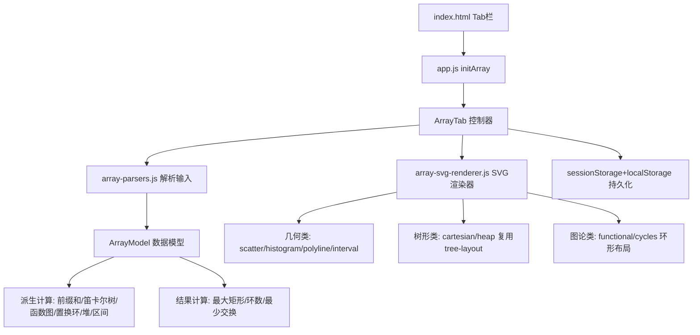

## 产品概述

在现有 Algo CP Tools 应用中新增「一维数组」可视化模块，将一维数组通过 8 种经典计算几何与图论模型进行可视化展示，辅助竞赛编程学习与分析。

## 核心功能

- **数组输入**：支持空格/逗号/换行分隔的数字数组输入，支持 `#`/`//` 注释
- **起始索引切换**：可在 0-based 和 1-based 之间切换，所有坐标轴标签、节点编号随之变化
- **几何与可视化模型（4 种）**：
- 点阵图/散点图：将 (i, A[i]) 映射为二维平面点
- 柱状图：以索引为横坐标、值为高度的矩形
- 折线图/前缀和曲线：前缀和 P[i] 描绘为折线
- 区间覆盖：元素解析为区间 [i-A[i], i+A[i]]
- **图论与树形模型（4 种）**：
- 跳转表/函数式图：有向边 i→A[i]，基环内向树森林
- 笛卡尔树：最值作根递归建树，中序遍历=原数组
- 完全二叉树/隐式树：索引 i 左子 2i 右子 2i+1
- 置换环：排列连边形成不相交简单环
- **派生数据展示**：中间面板根据模型类型展示有意义的数据（前缀和、边表、计算结果如最大矩形面积、环数、最少交换次数等）
- **状态持久化**：输入与设置自动保存，刷新后恢复

## 技术栈

- 纯前端 HTML + CSS + 原生 JavaScript（ES5 兼容，无构建工具，通过 `<script>` 按序加载）
- 全局命名空间 `window.AlgoCPTools` 模式（沿用现有架构）
- 自研 SVG 渲染器（Canvas 不适合静态代码导出，SVG 可导出源码且可缩放）
- sessionStorage + localStorage 双写持久化

## 实现方案

### 策略概述

新增一个「一维数组」Tab，内部通过模型选择按钮切换 8 种可视化类型。采用自研 SVG 渲染器统一处理所有可视化（现有 mermaid/graphviz/tikz 渲染器无法表达坐标系），树形类复用 `tree-layout.js` 计算坐标后转 SVG，图论类使用自定义环形布局。

### 关键技术决策

1. **单一 Tab + 模型选择器**：8 种模型放在一个 Tab 内，分为「几何类」和「图论树类」两组选择按钮，符合现有 App 的组织方式
2. **统一自研 SVG 渲染器**：`array-svg-renderer.js` 按 `vizType` 分派绘制逻辑，统一接口 `generateCode(model)` + `render(model, container)` 保持与现有渲染器一致
3. **三栏布局沿用**：左=输入面板，中=派生数据面板，右=可视化面板，与 RootedTreeTab 布局一致
4. **起始索引 base∈{0,1}**：所有坐标轴标签、派生节点编号按 base 显示；函数式图/置换环中 A[i] 视为目标索引

### 性能与可靠性

- SVG 渲染复杂度 O(n)，数组规模通常 ≤1000，无性能瓶颈
- 渲染前清空容器避免内存泄漏
- 解析失败时显示错误状态，不崩溃
- 置换环模型额外校验是否为合法排列，不合法时提示

### 避免技术债务

- 复用现有 `tree-layout.js` 进行树形布局计算
- 复用现有 CSS 变量与深色主题风格
- 沿用 `RootedTreeTab` 的状态管理模式（collectState/saveState/loadState/applyState）
- 新增样式使用 `.arr-*` 前缀避免与现有 `.rt-*` 冲突

## 架构设计



## 目录结构

```
algo-cp-tools/
├── index.html                          # [MODIFY] 新增Tab按钮、tab-array section、4个script引入
├── css/
│   └── main.css                        # [MODIFY] 新增 .arr-* 布局/SVG样式/模型选择按钮样式
├── js/
│   ├── app.js                          # [MODIFY] 新增 initArray() 初始化函数
│   ├── namespace.js                    # [无需修改] 现有命名空间已包含所有子空间
│   ├── models/
│   │   └── array-model.js              # [NEW] ArrayModel 数据模型与派生计算
│   ├── parsers/
│   │   └── array-parsers.js            # [NEW] parseArray 解析一维数组输入
│   ├── renderers/
│   │   └── array-svg-renderer.js       # [NEW] 统一SVG渲染器，8种可视化分派
│   ├── tabs/
│   │   └── array.js                    # [NEW] ArrayTab 控制器
│   └── utils/
│       └── tree-layout.js              # [无需修改] 复用于笛卡尔树/完全二叉树布局
```

### 文件详细说明

**index.html [MODIFY]**

- Tab 栏新增「一维数组」按钮（data-tab="array"）
- 新增 `<section id="tab-array">` 三栏布局：左输入面板（数组 textarea + base 选择 + 模型选择按钮 + 解析/清理按钮）、中派生数据面板（根据模型动态展示）、右可视化面板（SVG 输出 + 代码展开）
- 新增 4 个 `<script>` 引入 array-model.js、array-parsers.js、array-svg-renderer.js、array.js，版本号递增

**js/app.js [MODIFY]**

- 新增 `initArray()` 函数，仿照 `initRootedTree()`，从 `#tab-array` 创建 `NS.tabs.ArrayTab` 实例
- 在 `init()` 中调用 `initArray()`

**js/models/array-model.js [NEW]**

- `ArrayModel` 构造函数：持有 `values[]`、`base`（0或1）、`vizType`（8种之一）
- 派生计算方法：
- `getPrefixSums()` → 返回前缀和数组
- `getCartesianTree()` → 返回树结构（复用 TreeModel 或自定义 {nodes, edges, root}）
- `getFunctionalEdges()` → 返回 [{from, to}] 边集
- `getPermutationCycles()` → 返回环数组 [[idx...], ...]
- `getHeapTree()` → 返回完全二叉树结构
- `getIntervals()` → 返回 [{center, left, right}] 区间集
- 结果计算方法：
- `getMaxRectangle()` → 最大矩形面积（单调栈）
- `getCycleCount()` → 环数
- `getMinSwaps()` → 最少交换次数 = n - 环数
- `isPermutation()` → 校验是否为合法排列

**js/parsers/array-parsers.js [NEW]**

- `parseArray(text)` → `number[]`，支持空格/逗号/换行分隔，支持 `#`/`//` 注释，沿用 `tree-parsers.js` 的 `isComment` 逻辑

**js/renderers/array-svg-renderer.js [NEW]**

- 统一接口 `generateCode(model)` 返回 SVG 字符串，`render(model, container)` 返回 `Promise<string>`
- 按 `vizType` 分派：
- `scatter`：绘制坐标轴 + 网格 + 散点 (i, A[i])
- `histogram`：绘制坐标轴 + 网格 + 柱状矩形
- `polyline`：绘制坐标轴 + 网格 + 前缀和折线 + 端点标注
- `interval`：绘制数轴 + 区间覆盖矩形
- `functional`：环形布局有向图，标注节点编号
- `cartesian`：复用 tree-layout 计算坐标，绘制树形 SVG
- `heap`：按完全二叉树隐式布局绘制
- `cycles`：每个环独立环形布局，箭头方向标注
- 辅助函数：`drawAxes()`、`drawGrid()`、`drawPoints()`、`drawBars()`、`drawPolyline()`、`drawIntervals()`、`drawTree()`、`drawGraph()`

**js/tabs/array.js [NEW]**

- `ArrayTab` 构造函数，仿照 `RootedTreeTab` 结构
- 方法：cacheDom / bindEvents / parse / render / collectState / saveState / loadState / applyState / clearAll / setVizType / setBase / renderDerivedData
- 中间面板根据 vizType 动态渲染：前缀和表、边表、环列表、区间表、计算结果摘要

**css/main.css [MODIFY]**

- 新增 `.arr-layout` 三栏 grid（复用 .rt-layout 布局值）
- 新增 `.arr-panel` 面板样式（差异化背景色与 .rt-panel 区分）
- 新增 `.arr-model-tabs` / `.arr-model-btn` 模型选择按钮样式
- 新增 `.arr-base-toggle` 起始索引切换样式
- 新增 SVG 相关样式：坐标轴线、网格线、散点、柱状、折线、区间、树节点、有向边
- 新增 `.arr-derived-table` 派生数据表格样式

## 设计风格

采用与现有应用一致的深色赛博风格，新增「一维数组」Tab 面板使用独立色调区分。几何类模型可视化使用深色背景 + 亮色坐标轴与数据图形；图论类模型使用圆形/树形布局，节点带发光效果。整体保持与应用现有暗色主题（#0f172a 背景）的一致性，通过面板渐变色区分功能区域。

## 页面规划

单页面新增一个 Tab 内容区，三栏布局：

- 左栏（输入）：数组输入框、起始索引 0/1 切换、8 种模型选择按钮（分两组）、解析/清理按钮
- 中栏（派生数据）：根据模型动态展示前缀和/边表/环/区间/计算结果
- 右栏（可视化）：SVG 图形输出区 + 可展开的 SVG 源代码

## 区块设计

### 左栏 - 输入面板

- 顶部标题「输入」+ 渐变背景（靛蓝系）
- 模型选择区：两组按钮（几何类 4 个、图论树类 4 个），按钮带图标文字，选中态高亮
- 数组输入区：textarea，等宽字体，placeholder 示例
- 起始索引切换：0/1 两个按钮切换
- 操作行：解析按钮（主色）+ 清理按钮（幽灵按钮）
- 解析状态行：成功/失败提示

### 中栏 - 派生数据面板

- 顶部标题「派生数据」+ 渐变背景（翡翠绿系）
- 动态内容区：根据当前模型展示对应数据表格或计算结果
- 计算结果高亮卡片（如最大矩形面积、环数、最少交换次数）

### 右栏 - 可视化面板

- 顶部标题「可视化」+ 渐变背景（紫色系）
- SVG 输出区：白色背景圆角容器，内含坐标轴/网格/数据图形
- 可展开代码区：SVG 源代码，等宽字体高亮