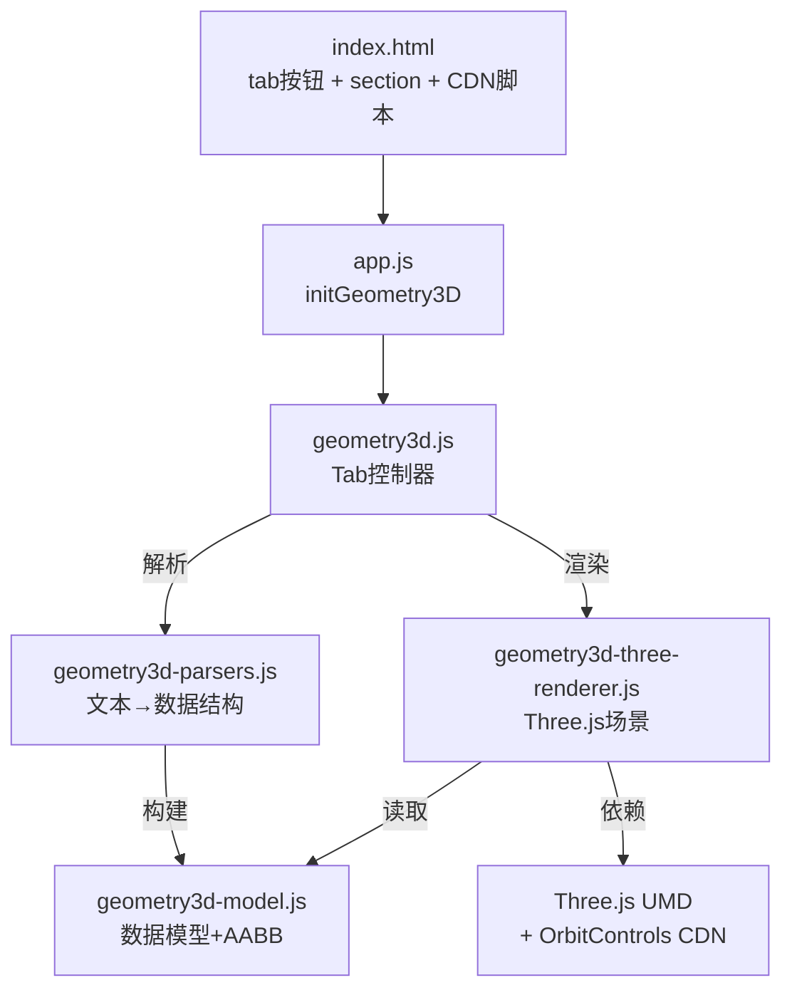

## 产品概述

在现有 Algo CP Tools 工具中新增一个三维几何可视化模块，支持输入点、线段、面、立方体四类几何实体，每行一个对象，通过 Three.js 进行交互式 3D 渲染（可旋转、缩放、平移）。

## 核心功能

- **点**：每行输入 `x y z` 三个坐标，渲染为 3D 空间中的小球
- **线段**：每行输入 `x1 y1 z1 x2 y2 z2`，行首 `>` 表示有向线段（带箭头）
- **面**：每行一个多边形面，平铺 `x1 y1 z1 x2 y2 z2 ... xn yn zn`（至少 3 顶点），半透明填充加描边
- **立方体**：每行输入 `x1 y1 z1 x2 y2 z2`（对角线两端点，轴对齐长方体），半透明填充加边线
- 多类实体可在同一场景中共存，输入框按类型分区（沿用 2D 几何折叠面板布局）
- 交互式 3D 视图：鼠标拖拽旋转、滚轮缩放、右键平移，含坐标轴与网格辅助线
- 解析状态反馈与统计结果展示（实体数、顶点数、包围盒尺寸、线段总长、面面积等）
- 输入状态持久化（sessionStorage + localStorage），支持示例数据加载与清理

## 技术栈选择

- **3D 渲染引擎**：Three.js r147（0.147.0）UMD 构建 + 内置 OrbitControls，通过 CDN 加载
- 选用 r147 而非最新版的原因：r148 起移除了 `examples/js` 目录（UMD 版 OrbitControls），r147 是最后一个提供 UMD OrbitControls 的版本，可保持与项目纯 `<script>` 标签加载方式一致，兼容 `file://` 协议打开
- CDN：`https://cdn.jsdelivr.net/npm/three@0.147.0/build/three.min.js` + `https://cdn.jsdelivr.net/npm/three@0.147.0/examples/js/controls/OrbitControls.js`
- **项目模式**：沿用现有 IIFE + 全局命名空间（`window.AlgoCPTools`）模式，无构建系统
- **样式**：复用现有 CSS 类（geom-layout / geom-panel / geom-input-block 等），新增少量 3D 画布容器样式

## 实现方案

### 整体策略

完全参照 2D 几何模块的四件套架构（Model → Parser → Renderer → Tab Controller），扩展为三维版本。新增 4 个 JS 文件，修改 index.html、app.js、main.css 三个现有文件。

### 实体数据结构

```javascript
points:   Array<{x, y, z}>                          // 三维点
segments: Array<{a:{x,y,z}, b:{x,y,z}, directed}>   // 线段（directed=有向箭头）
faces:    Array<Array<{x,y,z}>>                     // 面（顶点数组，凸多边形扇形三角化）
cubes:    Array<{a:{x,y,z}, b:{x,y,z}}>             // 立方体（对角线两端点，轴对齐）
```

### 关键技术决策

1. **Three.js UMD 而非 ES Module**：项目通过 `file://` 打开，ES Module 会触发 CORS 限制。UMD 构建设置 `window.THREE`，OrbitControls 挂载到 `THREE.OrbitControls`，所有文件保持 IIFE 格式
2. **WebGLRenderer 上下文复用**：在容器上持久化 renderer/scene/camera（`container._g3Ctx`），每次渲染只清除并重建场景对象，避免反复创建 WebGL 上下文导致浏览器上下文数量耗尽
3. **面三角化**：采用扇形三角化（fan triangulation），适用于凸多边形。CP 场景下面通常为凸，简单高效
4. **Tab 切换尺寸修复**：3D tab 从隐藏切换到显示时 canvas 尺寸为 0，需在 app.js 的 `setActiveTab` 中触发 3D tab 的 `resize()` 重新读取容器尺寸
5. **资源 dispose**：每次重建场景前 dispose 旧 geometry/material；提供 `dispose()` 方法在页面卸载时释放 WebGL 上下文

### 性能考量

- 实体数量在 CP 场景下通常 < 100，Three.js 渲染无性能瓶颈
- OrbitControls 动画循环使用 `requestAnimationFrame`，tab 不可见时不启动
- 面面积计算使用叉积法 O(n) per face，线段长度 O(1) per segment

## 架构设计



## 目录结构

```
algo-cp-tools/
├── index.html                    # [MODIFY] 新增tab按钮、3D section、Three.js CDN、4个新script标签
├── css/
│   └── main.css                  # [MODIFY] 新增.g3-canvas-wrap样式（3D画布容器高度/背景）
├── js/
│   ├── models/
│   │   └── geometry3d-model.js   # [NEW] 三维几何数据模型
│   ├── parsers/
│   │   └── geometry3d-parsers.js # [NEW] 三维几何输入解析器
│   ├── renderers/
│   │   └── geometry3d-three-renderer.js # [NEW] Three.js 3D渲染器
│   ├── tabs/
│   │   └── geometry3d.js         # [NEW] 三维几何Tab控制器
│   └── app.js                    # [MODIFY] 新增initGeometry3D + tab切换回调
```

### 文件详细说明

**`js/models/geometry3d-model.js`** [NEW]

- Geometry3DModel 构造函数，持有 points/segments/faces/cubes 四类实体数组
- prototype 方法：`reset()`, `setData(data)`, `isEmpty()`, `size()`, `allVertices(fn)`, `vertexCount()`, `getAABB()`（返回 3D 包围盒含 minZ/maxZ/depth）, `getBounds(padding)`, `segmentsLength()`（3D 欧氏距离）, `facesArea()`（叉积法计算面积）
- 导出到 `NS.models.Geometry3DModel`

**`js/parsers/geometry3d-parsers.js`** [NEW]

- 复用 2D 的 `isComment()` / `parseNumber()` 风格
- `parsePoints3D(text)`：每行 `x y z`，3 个数字
- `parseSegments3D(text)`：每行 `x1 y1 z1 x2 y2 z2`，行首 `>` 表示有向，6 个数字
- `parseFaces3D(text)`：每行平铺 `x1 y1 z1 ... xn yn zn`，至少 9 个数字，token 数须为 3 的倍数
- `parseCubes3D(text)`：每行 `x1 y1 z1 x2 y2 z2`，6 个数字（对角线两端点）
- `buildModel(data)` → `new Geometry3DModel().setData(data)`
- 导出到 `NS.parsers.geometry3dParsers`

**`js/renderers/geometry3d-three-renderer.js`** [NEW]

- 依赖 `window.THREE` 和 `THREE.OrbitControls`（UMD 全局）
- `render(model, container, options)`：创建/复用 WebGLRenderer + Scene + PerspectiveCamera + OrbitControls
- 绘制层次：GridHelper（XZ 平面）→ AxesHelper（RGB 三轴）→ 立方体（BoxGeometry + EdgesGeometry）→ 面（BufferGeometry 扇形三角化 + 半透明材质 + 边线）→ 线段（LineSegments + ArrowHelper）→ 点（SphereGeometry 小球 + Sprite 标签）
- 自适应相机：根据 `model.getBounds()` 计算 `OrbitControls.target` 和相机距离
- `dispose(container)`：释放 WebGL 资源
- options：`showGrid`, `showAxes`, `showIndex`, `indexBase`
- 导出到 `NS.renderers.geometry3dThreeRenderer`

**`js/tabs/geometry3d.js`** [NEW]

- Geometry3DTab 构造函数，ID 前缀 `g3-`
- 仿 Geometry2DTab：`cacheDom()`, `bindEvents()`, `collectState()`, `saveState()`, `loadState()`, `applyState()`, `clearAll()`, `loadSample()`, `parse()`, `renderResults()`, `render()`, `resize()`
- STORAGE_KEY = `'algoCpTools.geometry3d'`
- 渲染选项：显示网格 / 显示坐标轴 / 显示序号 / 序号从1开始
- 导出到 `NS.tabs.Geometry3DTab`

**`index.html`** [MODIFY]

- 第 22 行：移除 tab-placeholder，新增 `<button class="tab-btn" data-tab="geometry3d">三维几何</button>`
- 第 268 行后：新增 `tab-geometry3d` section（仿 tab-geometry2d 结构，ID 前缀 g3-）
- CDN 区：新增 Three.js UMD + OrbitControls 两个 script 标签
- 脚本区：新增 4 个 script 标签（model → parser → renderer → tab），版本号 `?v=26`
- app.js script 版本号递增为 `?v=26`

**`js/app.js`** [MODIFY]

- 新增 `initGeometry3D()` 函数（仿 `initGeometry2D`）
- `init()` 中调用 `initGeometry3D()`
- `setActiveTab()` 中增加：切换到 geometry3d 时调用 `NS.state.geometry3d?.resize()`

**`css/main.css`** [MODIFY]

- 新增 `.g3-canvas-wrap`：固定高度（如 440px）、深色背景（#0f172a）、圆角边框、overflow hidden
- `.g3-canvas-wrap canvas`：display block、width 100%

## 实现备注

- **file:// 兼容性**：Three.js r147 UMD 构建通过 `<script>` 加载，不使用 ES Module，保持与项目其他文件一致的加载方式
- **WebGL 上下文管理**：渲染器在容器上持久化 `_g3Ctx` 对象，避免每次 render 创建新 WebGLRenderer；旧场景对象在重建前 traverse 并 dispose geometry/material
- **Tab 切换**：app.js 的 `setActiveTab` 需在切换到 3D tab 后触发 `resize()`，使 Three.js 读取正确的容器宽高并 `renderer.setSize()`
- **坐标系统**：Three.js 默认 Y 轴向上；输入数据的 z 坐标映射到 Three.js 的 Y 轴（数学惯例 z 向上 → Three.js Y 向上），或直接使用 z 向上约定并在场景中旋转。采用直接映射 `input(x,y,z) → Three(x,z,y)` 保持数学惯例
- **版本号**：新文件统一 `?v=26`，app.js 递增为 `?v=26`，index.html CSS 保持 `?v=24` 或递增

## 设计方案

三维几何模块新增一个完整 Tab 页面，视觉布局完全沿用二维几何模块的双栏式设计（左输入 / 右可视化），保持应用整体风格一致性。主要新增视觉元素为右侧的 Three.js 3D 视口。

### 页面规划

仅一个页面（三维几何 Tab），复用现有应用框架。

### 区块设计（自上而下、自左而右）

**顶部导航栏**（复用现有）

- Tab 栏新增「三维几何」按钮，与现有 Tab 风格一致

**左侧输入面板**（geom-input，深紫色渐变背景）

- 标题区：「输入（多类实体可共存）」
- 点折叠面板：标题「点」+ 提示「x y z 每行」，内含 textarea，默认展开
- 线段折叠面板：标题「线段」+ 提示「x1 y1 z1 x2 y2 z2 每行；> 前缀=有向」
- 面折叠面板：标题「面」+ 提示「每行一个，平铺 x1 y1 z1 ... xn yn zn」
- 立方体折叠面板：标题「立方体」+ 提示「x1 y1 z1 x2 y2 z2（对角线）」
- 操作按钮行：解析 / 清理
- 状态提示区：解析成功/失败信息
- 结果统计区：实体总数卡片 + 分类数量表格 + 包围盒参数表格

**右侧可视化面板**（geom-viz，深紫红渐变背景）

- 标题区：「可视化」
- 渲染选项行：显示网格 / 显示坐标轴 / 显示序号 / 序号从1开始 / 渲染按钮
- 3D 视口区：深色背景（#0f172a）的 Three.js canvas 容器，固定高度 440px，圆角边框
- 视口内含：XZ 平面网格线（灰色半透明）、RGB 三轴坐标指示、半透明几何实体、实体序号标签

### 3D 视口视觉风格

- 背景：纯深色 #0f172a，与应用整体深色主题一致
- 网格：GridHelper 灰色半透明线，提供空间深度参考
- 坐标轴：AxesHelper RGB（X 红 / Y 绿 / Z 蓝），长度按场景自适应
- 点：靛蓝色（#6366f1）小球，白色描边
- 线段：靛蓝色实线，有向线段末端带同色箭头
- 面：绿色（#16a34a）半透明填充（opacity 0.15）+ 实线描边
- 立方体：橙色（#f59e0b）半透明填充（opacity 0.12）+ EdgesGeometry 描边
- 交互反馈：OrbitControls 鼠标拖拽旋转、滚轮缩放、右键平移，实时响应