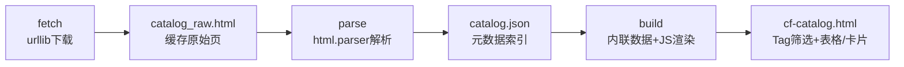

## 用户需求

下载 Codeforces Catalog 页面（https://codeforces.com/catalog），解析其分层目录树，生成一份结构化元数据索引；并制作一个 `cf-catalog.html` 展示页，支持多种展示模式（按 Tag 筛选 + 表格/卡片视图切换）。

## 产品概述

在 `article` 工程内新建 `cf/` 子模块，专注收录 Codeforces 上的算法教程/题解。先从官方 Catalog 页面抓取并缓存原始 HTML，再自动解析出每篇文章的元数据，最后渲染为一个可交互的本地索引页。所有新内容隔离在 `article/cf/`，不污染现有 `maspypy/` 与 `index.html` 体系。

## 核心功能

- 下载并缓存 Catalog 原始页面（离线可重复构建）
- 自动解析每篇文章的：作者、作者等级、标题、链接、相对年份（换算为绝对年份）、描述、Tag（即其祖先分类路径/目录树）
- 生成 `catalog.json` 元数据索引（按链接去重）
- 生成 `cf-catalog.html`：顶部 Tag 筛选（chips 多选/单选过滤）、表格视图与卡片视图切换、轻量客户端渲染（无第三方依赖，可直接 file:// 打开）
- 提供统一命令行工具，默认一键完成 fetch → parse → build

## 技术栈选择

- 解析/生成工具：Python 3 标准库（`argparse`、`urllib.request`、`html.parser`、`re`、`json`、`datetime`），与现有 `gen_index.py` 保持一致，零第三方依赖。
- 展示页：`cf-catalog.html` 采用纯 HTML + 内联 CSS + 原生 JavaScript，沿用 `index.html` 的深色主题与 BASE_DIR 约定，无需构建步骤，可直接用浏览器打开。

## 实现方案

采用「抓取缓存 → 解析 → 渲染」三段式流水线，由单一脚本 `build_catalog.py` 统管，子命令 `fetch` / `parse` / `build`，无参数默认依次执行三者。

- **下载（fetch）**：用 `urllib.request` 带 `User-Agent` 请求页面，写入 `catalog_raw.html`；失败时给出清晰报错，不静默空文件。
- **解析（parse）**：基于 `html.parser.HTMLParser` 自写解析器。维护一个「分类名栈」：进入含嵌套 `<ul>` 的 `<li>` 时，将其直接文本（分类名）压栈；离开时出栈。遇到含 `/blog/entry` 链接的叶子 `<li>` 即收一条文章：标题/链接取该 `<a>`，作者/等级取 `/profile` 链接文本与 `title` 属性，相对时间用正则 `(\d+)\s+(year|month|week|day|hour)s?\s+ago` 提取，年份由页脚 `Server time` 折算（如 "8 years ago" + 2026 → 2018），描述取行尾剩余文本，tags 取当前分类栈。按 `link` 去重写 `catalog.json`。
- **渲染（build）**：读取 `catalog.json`，将整份数据内联为 `const CATALOG = {...}`（规避 file:// 下 fetch 跨域），用原生 JS 渲染 Tag chips 与表格/卡片两种视图，链接使用绝对 `https://codeforces.com/...`。

**关键技术决策**：

1. 解析用标准库 `html.parser` 而非 BeautifulSoup，保持与工程一致的零依赖；目录树嵌套用「栈」还原 Tag 路径，鲁棒且无需外部选择器库。
2. 数据内联进 HTML 而非运行时 fetch，确保整目录可直接部署/本地打开，符合现有 `index.html` 的相对链接可移植惯例。
3. Tag 即目录树路径，天然满足用户「目录树 or Tag」诉求，无需额外维护清单。

**性能与可靠性**：Catalog 页面条目量级约数百，纯内存解析 O(N)，无瓶颈；年份换算仅针对相对字符串做近似折算并在 `time_raw` 保留原文，避免误差累积。下载带重试与超时，解析对缺失字段（描述/等级）做安全回退，保证单条脏数据不致中断整体。

## 实现注意事项

- 严格遵守 BASE_DIR 约定：`BASE_DIR = os.path.dirname(os.path.abspath(__file__))`，所有读写限定在 `article/cf/` 内，不触碰上级 `algo-cp-tools` 其它模块。
- 复刻 `gen_index.py` 的子命令式结构与深色主题配色，保持工程风格统一。
- 生成的 `cf-catalog.html` 顶部保留「返回主站」链接（指向 `../index.html`），与现有页一致。
- Tag 筛选支持多选（AND/OR 取并集过滤），并在空结果时给出友好提示，避免空白页误导。

## 架构设计



## 目录结构

## 目录结构说明

本次全部新增内容位于 `article/cf/`，复用 `article/gen_index.py` 的脚本风格与 BASE_DIR 约定。

article/
└── cf/
├── build_catalog.py   # [NEW] 生成工具主脚本。实现 fetch/parse/build 三个子命令（默认顺序执行）。fetch 用 urllib 下载 catalog 页并缓存为 catalog_raw.html；parse 用 HTMLParser 解析目录树生成 catalog.json；build 读 catalog.json 生成 cf-catalog.html。需沿用 BASE_DIR 限定作用域、子命令式 argparse、深色主题与内联 CSS 风格。
├── catalog_raw.html   # [NEW] 下载并缓存的 Codeforces Catalog 原始页面，供离线重复解析，避免重复联网。
├── catalog.json       # [NEW] 元数据索引文件。结构见下方关键结构，按 link 去重，含 updated/server_time/articles 字段。
└── cf-catalog.html    # [NEW] 最终展示页。内联 CATALOG 数据，含 Tag 筛选 chips 与表格/卡片视图切换，原生 JS 客户端过滤，可直接 file:// 打开。

## 关键代码结构

`catalog.json` 元数据索引结构（解析产出，供 build 与未来扩展复用）：

```
{
  "updated": "2026-07-11",
  "server_time": "Jul/11/2026 01:59:54 UTC+8",
  "source": "https://codeforces.com/catalog",
  "articles": [
    {
      "title": "How to read problem statements",
      "link": "https://codeforces.com/blog/entry/62730",
      "author": "Um_nik",
      "author_level": "Legendary Grandmaster",
      "time_raw": "8 years ago",
      "year": 2018,
      "description": "Collection of problems with solutions...",
      "tags": ["General Advice", "How to come up with solutions?"],
      "tags_str": "General Advice / How to come up with solutions?"
    }
  ]
}
```

## 设计风格

沿用现有 `index.html` 的深色科技风（背景 #0f1115、面板 #171a21、主色蓝 #4f8cff、辅助绿 #6ee7b7），保证工程视觉一致性；在 cf-catalog.html 上做适度升级：顶部为标题栏与「返回主站」链接；其下是 Tag 筛选区（圆角 chips，选中态高亮、未选半透明，hover 微动效）；主体为可切换的两种视图——表格视图（列：标题/作者/年份/Tag/链接，斑马纹与悬停高亮）与卡片视图（网格布局，每张卡片含标题、作者+等级徽标、年份、Tag 标签、描述摘要、跳转链接），切换时有平滑淡入过渡。整体克制、信息密度高、交互即时反馈，符合算法竞赛资源索引的实用定位。

## Agent Extensions

### Skill

- **agent-browser**
- Purpose: 在本地浏览器加载生成的 `article/cf/cf-catalog.html`，验证页面渲染、Tag 多选筛选与表格/卡片视图切换是否正常工作。
- Expected outcome: 确认筛选与视图切换交互无误，页面无 JS 报错，输出验证结果截图或结论。