# 算法与数学讲解（maspy 博客中文翻译）

> **作者（原文）**：maspy（[maspypy.com](https://maspypy.com/)）
> **来源分类页**：[https://maspypy.com/category/algorithm_math](https://maspypy.com/category/algorithm_math)
> **说明**：本文件由分类页中列出的博客文章链接下载后翻译整理而成。数学公式（$...$ 与 $$...$$）保持原样，未作改动。

---

## 目录

- [关于 eco4kb 的 dp 估计方法的正当性（えこってさんによるdpの推定手法の正当性について）](#am02-dp-est)
- [O(1) 模逆元、模幂（O(1) mod inv, mod pow）](#am03-modinv)
- [图的计数（グラフ数え上げ）](#am04-graph-count)
- [分割統治 + FFT 的常见形式（分割統治+FFT のよくある形のひとつ）](#am05-dc-fft)
- [重心分解、1/3 重心分解的图示（重心分解・1/3重心分解のお絵描き）](#am06-centroid)
- [选择 K 个的最优化的随机算法（$K$ 個を選ぶ最適化における乱択アルゴリズム）](#am07-rand-k)
- [关于幺半群作用的离散对数问题（モノイド作用に関する離散対数問題）](#am08-monoid-dlog)
- [基于分割统制的静态数列区间积查询（分割統治による静的列の区間積クエリ）](#am09-dc-query)
- [Stirling 数除以 $p$ 的余数的计算（Stirling 数を $p$ で割った余りの計算）](#am11-stirling-mod-p)
- [关于素数的上界估计（初等证明）（素数に関する上からの評価（初等的な証明））](#am12-prime-bound)
- [Dirichlet 级数与 Dirichlet 积（Dirichlet 級数と Dirichlet 積）](#am13-dirichlet)
- [FFT 与卷积（フーリエ変換と畳み込み / FFT による畳み込み）](#am16-fft)
- [Segment Tree 的学习 (2) 延迟传播（遅延伝搬 Segment 木のお勉強）](#am17-segtree2)
- [Segment Tree 的学习 (1)（Segment Tree のお勉強 (1)）](#am18-segtree1)
- [Euler Tour（Euler Tour のお勉強）](#am19-euler-tour)
- [Rolling Hash 与冲突概率的下界（Rolling Hash を殺す話 / 乱択と衝突確率）](#am20-rolling-hash)
- [Matroid 与贪心法（マトロイドを知っていれば一発）](#am21-matroid)
- [$a^n$ 的计算（べき乗の計算 / バイナリ法）](#am22-power)
- [最大公约数（ユークリッドの互除 / gcd の計算）](#am23-gcd)

---

<a id="am02-dp-est"></a>
## 关于 eco4kb 的 dp 估计方法的正当性（えこってさんによるdpの推定手法の正当性について）

### 概要

现在考虑的问题：
「存在未知的 $D$ 维方阵 $A, B$，行向量 $u$，列向量 $v$。对任意长度不超过 $L$ 的 $A,B$ 序列 $s$，都能得到 $u\cdot(s\text{ 的总积})\cdot v$。对于给定的长度为 $N$ 的 $A,B$ 序列 $s$，求 $u\cdot(s\text{ 的总积})\cdot v$」
— えこって (@eco4kb) July 14, 2025

由于取得了一定成果，在此介绍解法。
（slide bit DP 的递推式）目标是找到使
$AAv = c_{00} v + c_{01} Av + c_{02} Bv$
$ABv = c_{10} v + c_{11} Av + c_{12} Bv$
$BAv = c_{20} v + c_{21} Av + c_{22} Bv$
$BBv = c_{30} v + c_{31} Av + c_{32} Bv$
成立的 $c_{ij}$。
（若不够就增加项数）
— えこって (@eco4kb) July 16, 2025

自 2025 年 7 月中旬起，えこってさん（https://x.com/eco4kb, https://atcoder.jp/users/ecottea）开展了一项研究，旨在估计某一类 dp 的输出。据说由此已经能够 AC 若干问题（包括高难度问题）。另一方面，即使在“存在能用后述形式化中的矩阵来描述的解法”这一假设下，えこってさん手法的正当性至今尚未被证明。

本篇简单解说问题的形式化与手法的概要，并进一步证明手法的正当性。问题形式化与手法概要是えこってさん的原创，而正当性的证明据信是本文首次给出的结果。

### 简易版：BMBM 法

为说明动机，先讲述简易版问题。这部分在竞技编程中也广为人知，想必不少读者已有所了解。

考虑如下问题：

**【问题】** 设 $d$ 已知，存在未知的 $d\times d$ 矩阵 $A$，以及 $1\times d$ 矩阵 $u$、$d\times 1$ 矩阵 $v$。用 $a_i=uA^iv$ 定义数列 $\{a_i\}$。假设已知充分小情形下的 $a_i$ 值 $a_0,a_1,\ldots,a_m$。以 $n$ 为输入，求 $a_n$。

（输入示例）$d=2$，$a_0=0,a_1=1,a_2=1,a_3=2,a_4=3,a_5=5$。$a_{10}=?$
（输出示例）$a_{10}=55$

首先说明 $a_i=uA^iv$ 这个式子。这是典型的 dp 形态之一。

- 存在一个初始状态向量 $v$（$d$ 个状态各自的初始值）。
- $A$ 是表示 dp 转移的矩阵（$d$ 状态到 $d$ 状态，各自以适当系数相加）。
- 最后乘上 $u$。这表示在 $i$ 次 dp 转移后，把向量的各分量以适当的线性组合作为答案输出。

这个【问题】是著名问题，当 $m\geq 2d$ 时可在 $O(d\log d(\log d+\log n))$ 时间内求得答案。

首先对矩阵 $A$ 与向量 $v$，存在 $A^dv=\sum_{j=1}^dc_jA^{d-j}v$ 形式的关系式。这可由 $d+1$ 个向量 $(A^iv)_{0\leq i\leq d}$ 线性相关证得。或者由 Cayley-Hamilton 定理也能得到同样结论。

由此可知 $\{a_i\}$ 具有如下形式的线性递推：$a_i=\sum_{j=1}^d c_ja_{i-j}$。

在 $m\geq 2d$ 的前提下，用 Berlekamp-Massey 算法可在 $O(d\log^2 d)$ 时间内得到这样一个递推式（写“这样一个递推式”是因为同一数列可能对应多个递推式。例如数列 $a_i=2^i$ 满足 $a_i=2a_{i-1}$、$a_i=a_{i-1}+2a_{i-2}$、$a_i=4a_{i-2}$ 等。Berlekamp-Massey 算法在它们之中输出 $d$ 最小的那个）。

一旦知道 $\{a_i\}$ 满足的递推式，就可用 Bostan-Mori 算法在 $O(d\log d(\log d+\log n))$ 时间内求 $a_n$。

在日本的竞技编程中，把运用 Berlekamp-Massey、Bostan-Mori 的一连串流程统称为 BMBM 法。

- Library Checker 「Find Linear Recurrence」：https://judge.yosupo.jp/problem/find_linear_recurrence
- Library Checker 「Kth term of Linearly Recurrent Sequence」：https://judge.yosupo.jp/problem/kth_term_of_linearly_recurrent_sequence

用这个手法，所谓“能用矩阵快速幂求解”的许多问题，可以在不显式使用矩阵的情况下（有时还能以更好的复杂度）求解。虽然能证明矩阵的存在，但要把矩阵实际写出来往往比计算小情形的值更难，因此实用性很高。为把 dp 转移改写成矩阵而苦恼过的人，应能想象其便利。

这个手法也会被用作“不确认解法正当性就取得 AC”的手段。另一方面，即使对这种做法持否定态度的选手，只要能证明 dp 可用矩阵表示，那就是有正当性保证的解法，因此也被他们所支持。

### えこってさん的“字符串 dp 问题”

BMBM 法适用于“由某一个矩阵反复进行 dp 转移”的情形。把它推广到“由多种矩阵进行转移”的情形，正是えこってさん的研究（之一）。

为简单起见，就由 A, B, C 组成的字符串的情形叙述。

**【问题】** 设 $d$ 已知，存在未知的 $d\times d$ 矩阵 $A, B, C$，以及 $1\times d$ 矩阵 $u$、$d\times 1$ 矩阵 $v$。对由 A, B, C 组成的字符串 $S$，设 $uSv$ 是把 $S$ 替换为对应矩阵积所得的值（例如 $S$ 为 “ABCAA” 时 $uSv=uABCAAv$）。当已知所有充分短的 $S$ 对应的 $uSv$ 时，计算任意字符串 $S$ 对应的 $uSv$。

证明えこってさん针对此情形的手法的正当性，是本文的主要目标。以上述状况（存在未知矩阵）为前提。

以下记 $f(S)=uSv$。

**【定理 1】** 存在由字符串组成的集合 $\mathcal{T}=\{T_0,T_1,\ldots\}$，满足以下全部条件：
- $\mathcal{T}$ 由长度 $d-1$ 以下的字符串组成。
- $|\mathcal{T}|\leq d$
- 对任意长度 $d$ 以下的字符串 $S$，存在系数族 $(c^S_i)_i$ 满足 $Sv=\sum_i c^S_iT_iv$。

**【证明】** 对非负整数 $i$ 用 $V_i = \mathrm{span}(\{Sv\mid |S|\leq i\})$ 定义向量空间。例如 $V_2$ 是由 $v, Av, Bv, Cv, AAv, ABv, ACv, BAv, BBv, BCv, CAv, CBv, CCv$ 生成的向量空间。

它们满足：$V_{i+1}=V_i+AV_i+BV_i+CV_i$。因此存在某个 $k$ 使得 $V_0\subsetneq V_1\subsetneq \cdots \subsetneq V_k=V_{k+1}=V_{k+2}=\cdots$ 成立。由 $\dim V_k\leq d$ 得 $k\leq d-1$，再由（$\dim V_0$ 为 $0$ 或 $1$ 的简单分类讨论）可知 $V_{d-1}=V_d=V_{d+1}=\cdots$。

由 $\dim V_{d-1}\leq d$，$V_{d-1}$ 可由 $d$ 个以下的 $Tv$（$|T|\leq d-1$）生成。把它们作为 $\mathcal{T}$ 即满足定理。

虽然证明了定理中那样的 $\mathcal{T}$、$c^S_i$ 的存在，但实际上矩阵 $A,B,C,v$ 未知，没有计算它们的方法。下面用对当前问题设定（只能得到 $f(S)=uSv$ 的值）可用的形式重述。

**【定理 2】** 存在由字符串组成的集合 $\mathcal{T}=\{T_0,T_1,\ldots\}$，以及对每个长度 $d$ 以下的字符串 $S$ 的系数族 $(c^S_i)_i$，满足：
- $\mathcal{T}$ 由长度 $d-1$ 以下的字符串组成。
- $|\mathcal{T}|\leq d$
- 对任意字符串 $X$ 有 $f(XS)=\sum_i c^S_if(XT_i)$。

**【证明】** 由【定理 1】显然。

找到满足该条件的数据，正是えこってさん的想法。首先其存在已得证。

但这样仍无法确认所找到数据的正确性。因为只能得到充分短的 $S$ 的 $f(S)$，尤其是“对任意字符串 $X$”这部分是问题。下面解决这个问题。

**【定理 3】** 设 $w$ 为 $d\times 1$ 矩阵，则以下等价：
(1) 对任意字符串 $X$ 有 $uXw=0$。
(2) 对任意长度 $d-1$ 以下的字符串 $X$ 有 $uXw=0$。

**【证明】** 证明几乎与【定理 1】相同。对整数 $i$ 用 $W_i = \mathrm{span}(\{Sw\mid |S|\leq i\})$ 定义向量空间。

(1) 意味着对任意 $i$ 有 $uW_i=0$，(2) 意味着 $uW_{d-1}=0$。再由【定理 1】所示的 $W_{d-1}=W_d=W_{d+1}=\cdots$ 即显然。

综上得到如下结论：

**【定理 4】** 在【问题】的状况下，存在满足如下条件的组 $(\mathcal{T},(c^S_i)_{S,i})$：
- 长度 $d-1$ 以下的字符串集合 $\mathcal{T}=\{T_0,\ldots,T_{m-1}\}$（$m\leq d$）。
- 对每个长度 $d$ 以下的字符串 $S$ 的系数族 $(c^S_i)_{0\leq i<m}$。

满足：对任意长度 $d$ 以下的字符串 $S$ 以及长度 $d-1$ 以下的字符串 $X$，有 $f(XS)=\sum_i c^S_if(XT_i)$。

进一步，对这样的组还成立：对任意长度 $d$ 以下的字符串 $S$ 以及字符串 $X$，有 $f(XS)=\sum_i c^S_if(XT_i)$。

**【证明】** 存在性由【定理 2】给出，只需证最后的条件。

令 $w=Sv-\sum_ic^S_i T_iv$，则要证的是 $uXw=0$。由【定理 3】，该等式只要对长度 $d-1$ 以下的 $X$ 成立，则对任意 $X$ 成立即可。

由【定理 4】，关于【问题】例如可做如下解法：

找到满足【定理 4】的数据 $\mathcal{T}$, $(c^S_i)$。若事先用某种手段（暴力全搜索等）求出长度 $2d-1$ 以下的 $S$ 的 $f(S)$ 的所有值，则可作为简单的联立一次方程问题来求解。

当已算出这样的数据，考虑组 $(f(ST_i))_i$，则可求得表示“在 $S$ 末尾追加 1 个字符时的变化”的矩阵。特别地，取 $T_0$ 为空字符串（由上述证明可知可行），也能求得满足 $f(S)=uSv$ 的矩阵 $A,B,C,u,v$ 之一。

特别地，在适当预处理下，$f(S)$ 的计算可在 $O(d^2|S|)$ 时间内完成。

这就是えこってさん的手法，本文使其正当性在理论上得到了保证。不过我并不了解手法的细节，尤其最后叙述的解法部分在具体细节上可能有出入。

关于具体的实现方法、适用范围、进一步的一般化与高速化，本篇不做解说，请参考えこってさん的推文。

<a id="am03-modinv"></a>
## O(1) 模逆元、模幂（O(1) mod inv, mod pow）

### 概要

看过 QOJ 按题号顺序浏览、或看过典型训练题集的人，应该知道下面这个问题。

https://qoj.ac/contest/1167/problem/5

这要求（在必要时进行适当预处理后）高速计算 $x^{-1} \bmod p$，正如题名所示，可以 $O(1)$ 时间在线计算（当然预处理是 $o(p)$ 的）。

把它应用起来，我注意到 mod pow 也能 $O(1)$ 时间在线计算，于是实现了一下。

以下记 $p$ 为奇素数（设想其大小在 $10^9$ 量级）。

### O(1) inv

先证明。

设 $n$ 为正整数。对任意 $x\in [1,p)$，存在 $(a,b)$ 使得 $x \equiv a/b \pmod{p}$ 且 $0\leq |a| \leq 2p/n, 1\leq b\leq n$。进一步，通过 $O(n^2)$ 时间的预处理，可以在 $O(1)$ 时间内算出这样的 $(a,b)$。

考虑把分母不超过 $n$ 的有理数排列而成的 Farey 数列，就能取到 $b_i,c_i$ 使得 $c_1/b_1\leq x/p\leq c_2/b_2$ 且 $0\leq b_i,c_i\leq n$，并且 $b_1+b_2>n$ 且 $|b_1c_2-b_2c_1|=1$。

当 $b_1<b_2$ 时 $b_2> n/2$，于是取 $(b,c)=(b_1,c_1)$ 的话，

$$\left|\frac{x}{p}-\frac{c}{b}\right|\leq \left|\frac{c_1}{b_1}-\frac{c_2}{b_2}\right|=\frac{1}{b_1b_2}=\frac{2}{nb}$$

从而 $|bx-cp|\leq \dfrac{2p}{n}$。$b_2<b_1$ 的情形取 $(b,c)=(b_2,c_2)$ 也得到同样不等式。令 $a=bx-cp$ 即得所求的 $(a,b)$。

由以上证明可知，要求出 $(a,b)$，只需得到 $x/p$ 在分子分母不超过 $n$ 的有理数中的左右两侧最佳逼近分数即可。

分子分母不超过 $n$ 的有理数只有 $n^2$ 个以下，所以可以对所有这些做某种处理。又这样的两个有理数的差在 $1/n^2$ 以上，因此把 $[0,1]$ 分成 $n^2$ 个桶，对每个桶记录其前后的有理数，就能 $O(1)$ 时间回答查询。

据此，逆元按 $x^{-1} = (a/b)^{-1} = b\cdot a^{-1}$ 计算。若对 $|a|\leq 2p/n$ 范围的 $a$ 预计算逆元，则逆元查询变为在线 $O(1)$ 时间。预处理的时间・空间为 $O(n^2 + 2p/n)$，取 $n=p^{1/3}$ 即为 $O(p^{2/3})$。

在 QOJ 提交时，出现过完全相同的代码运行时间相差 2 倍以上的情况（submissions 914536, 914538），所以想计时的时候最好本地测（交互题的不稳定性会被放大吧）。

### O(1) log

以下设 $n=p^{1/3}$。

固定原根 $r$，考虑对数映射 $\log \colon \mathbb{F}_p^\times \longrightarrow \mathbb{Z}/(p-1)\mathbb{Z}; r^x\longmapsto x$。

与逆元时同样，若在 $1\leq |a| \leq 2p/n$ 范围内能计算 $\log a$，则 $\log$ 可 $O(1)$ 时间查询。由 $\log(ab)=\log(a)+\log(b)$，只需计算 $-1$ 与素数处的 $\log$ 即可。注意 $\log(-1)=(p-1)/2$。用素数定理估计，需要预计算的 $\log$ 的个数为 $2p/(n\log p)$。

在底固定、解 $Q=2p/(n\log p)$ 个离散对数的情形下，通过适当取 BSGS 法的桶大小，可使复杂度降为 $O(\sqrt{pQ})$ 时间。在 $n = p^{1/3}$ 的设定下，这是 $O(p^{5/6}/(\log p)^{1/2})$ 时间。在我的实现中，确认了在 $p=998244353$ 等情况下预处理约 $0.75$ 秒可完成。

Index Calculus 也是在底固定、有 $Q$ 个查询的条件下可期待加速的手法，但我没有实现。

另外，在 $\bmod 998244353$ 的设定下，由于 $p-1$ 是小素数的乘积，离散对数问题可高速求解。在我的实现（类似 Pohlig-Hellman 算法的简化版）中，确认了约 $0.1$ 秒可完成全部预处理。

### 追记

用如下类似 Index Calculus 简化版的方法，不利用 $p$ 的特殊性也能达到构建 $0.17$ 秒：

- 对小的 $i$ 用 BSGS 求解。
- 对大的 $i$，随机取 $k$ 求 $ir^k \bmod p$。若它能分解为小于 $i$ 的素数的乘积，则利用小情形的值就能计算 $\log(i)$。因式分解用足够小的素数试除，并对一定程度以下的值利用事先准备的筛来完成。

细节请参考后述实现例。

### 追记 2（hos.lyric さん的改进）

对 $i \geq \sqrt{p}$ 的 $\log(i)$，取 $p=ij+k$ 并利用 $\log(i) = \log(-k)-\log(j)$，即可 $O(1)$ 时间得到。因此要解的离散对数问题个数变为 $O(p^{1/2}/\log p)$ 个。用这个方法，构建达到了 $0.1$ 秒以下。

### O(1) pow

考虑给定 $a,b$ 求 $a^b\pmod{p}$ 的问题。对 $a=0$ 的情况分类讨论后，剩下的情形由 $a^b=r^{b\log a}$ 可归约到计算 $r$ 的幂的问题。

把指数替换为除以 $p-1$ 的余数并考虑平方分割，则这部分通过 $O(\sqrt{p})$ 时间的预处理可使查询为 $O(1)$ 时间。

在 $1\leq a<p$, $0\leq b<p-1$ 时，我的实现中每次查询进行 $2$ 次除法与 $5$ 次数组访问。如果找到了更好的方法，欢迎告诉我。

实现例：https://maspypy.github.io/library/mod/modfast.hpp

本地处理随机 $10^8$ 次查询时：

- 通常的反复平方法：$11.4$ sec
- 本文手法（不含预处理）：$3.7$ sec

大致有如此加速。

### 相关

逆元的计算，若是离线则可在 $O(Q+\log p)$ 时间内完成。例如 https://noshi91.hatenablog.com/entry/2019/10/18/182935

pow 在底固定时，用 $k$ 次幂根分割做预处理 $O(kp^{1/k})$、查询 $O(k)$ 时间也很方便。（https://maspypy.github.io/library/ds/power_query.hpp）

<a id="am04-graph-count"></a>
## 图的计数（グラフ数え上げ）

### 概要

处理“满足 xx 的 $N$ 顶点图有多少个？”这类问题。

即所谓的输入为常数个的计数问题。不处理“给定图，求满足条件的子图个数”这类问题。

特别是以竞技编程中曾直接考过或考过类似物为中心的。也有些导出方法能应用到“给定图，求满足条件的子图个数”这类出题。若还有其他重要例子，可能会随时补充。

另外，把“边数也作为参数”的计数问题也考虑在内，但本篇也不处理。不过在许多例子中，介绍的手法可以原样推广到也考虑边数的情形。

本篇使用如下术语：

- 关于图，即使未特别说明，也假设为简单图，即不含自环与重边。
- 图是 labeled（带标号）的，是指顶点集为 $\{0,1,\ldots,N-1\}$，两个图只要存在“边的有无不一致的二元组”就作为不同来计数。
- 图是 unlabeled（无标号）的，是指把同构的图视为同一来计数。
- 图是连通的，是指顶点集非空，且对任意两个顶点都存在连接它们的路径（注意也有不同的习惯）。

经常使用图的 EGF（指数型母函数 / exponential generating function）。当满足某性质的 $n$ 顶点图有 $a_n$ 个时，其 EGF 指 $A(x) = \sum_{n=0}^{\infty}a_n\dfrac{x^n}{n!}$。本篇即使不特别定义，“EGF $A(x)=\sum_{n=0}^{\infty}a_n\dfrac{x^n}{n!}$”这样的写法中，EGF 的字母与表示计数列的字母使用同一字母的大小写。

例如写“设 $n$ 顶点图的 EGF 为 $A(x)$”，就是指 $n$ 顶点图的个数为 $a_n$，且 $A(x)=\sum_{n=0}^{\infty}a_n\dfrac{x^n}{n!}$。

### 带标号无向图 $[1, 1, 2, 8, 64, 1024, \ldots]$

特别不加条件时，$N$ 顶点带标号无向图的个数为 $2^{\binom{N}{2}}$。因为要对所有 $\binom{N}{2}$ 对顶点决定是否连边。

OEIS：https://oeis.org/A006125

实现例：https://maspypy.github.io/library/graph/count/count_labeled_undirected.hpp

### 带标号无向连通图 $[0, 1, 1, 4, 38, 728, \ldots]$

设带标号无向图的 EGF 为 $A(x)$，带标号无向连通图的 EGF 为 $B(x)$。此时有 $A(x) = \exp B(x)$。

这是典型的 $\exp$ 用法。简单确认一下理由。

设 $a_{n,k}$ 为“连通分量恰有 $k$ 个，且各连通分量上标有 $0,1,\ldots,k-1$”的计数。有 $a_n = \sum_{k=0}^{\infty}\dfrac{a_{n,k}}{k!}$。这相当于：忘记给连通分量加的标号后，对所有 $k$ 求和。

来求 $a_{n,k}$。设标号为 $i$ 的连通分量大小为 $n_i$，则 $a_{n,k}$ 可分解为 $\sum_{n_0+\cdots+n_{k-1}=n}$ 型的和。要加的东西是：先把顶点集划分到各标号的成分中的多项式系数 $\dfrac{n!}{n_0!\cdots n_{k-1}!}$，再乘上把各顶点集作成连通图的方法数 $\prod b_{n_i}$。总之，

$$a_{n,k}=\sum_{n_0+\cdots+n_{k-1}=n}\frac{n!}{n_0!\cdots n_{k-1}!}b_{n_0}\cdots b_{n_{k-1}}$$

因此 $\sum_{n=0}^{\infty}a_{n,k}\dfrac{x^n}{n!}=B(x)^k$。

把它们乘以 $\dfrac{1}{k!}$ 相加，得到 $A(x)=\sum_{k=0}^{\infty}\dfrac{B(x)^k}{k!}=\exp B(x)$。

所要求的是 $B(x)$，而 $A(x)$ 已经求出。因此由 $B(x)=\log A(x)$ 即可计算答案。

OEIS：https://oeis.org/A001187

实现例：https://maspypy.github.io/library/graph/count/count_labeled_connected.hpp

### 带标号树 $[0, 1, 1, 3, 16, 125, \ldots]$

$N=0$ 时为 $0$ 个，$N>0$ 时为 $N^{N-2}$ 个。这称为 Cayley 公式。

OEIS：https://oeis.org/A000272（$N=0$ 时值为 $1$，似乎有把空图定义为树的习惯，相当可疑。）

实现例：https://maspypy.github.io/library/graph/count/count_labeled_tree.hpp

已知非常多证明。若熟悉形式幂级数的处理，用拉格朗日反演的证明很简洁。来证明带标号有根树的个数为 $N^{N-1}$。设带标号有根树的 EGF 为 $A(x)$，考虑从带标号有根树去掉根后又分解为带标号有根树，可得 $A(x)=x \exp A(x)$。对此做拉格朗日反演即得 $a_n=n^{n-1}$。

### 带标号森林 $[1, 1, 2, 7, 38,291, \ldots]$

设带标号树的 EGF 为 $A(x)$，带标号森林的 EGF 为 $B(x)$，则 $B(x)=\exp A(x)$，可算出 $b_n$。

OEIS：https://oeis.org/A001858

实现例：https://maspypy.github.io/library/graph/count/count_labeled_forest.hpp

### 带标号 $N$ 边 $N$ 顶点连通图 $[0,0,0,1,15,222, \ldots]$

$N$ 边 $N$ 顶点连通图等价于恰有一个环的连通图，称为 unicyclic graph 等。在日本竞程序圈子里也有“なもりグラフ”的俗称。

在唯一的环上适当给定起点与方向后切断，就得到有根树的序列。

于是设 unicyclic graph 的 EGF 为 $A(x)$，有根树的 EGF 为 $B(x)$，则环的顶点数为 $k$（$k\geq 3$）的 unicyclic graph 的 EGF 为 $\dfrac{1}{2k}A(x)^k$，从而 $A(x)=\dfrac12\sum_{k=3}^{\infty}\dfrac{1}{k}B(x)^k$。

注意求和范围是 $k\geq 3$，可知右边是 $\dfrac12 \log (1-B(x))-\dfrac12 B(x)-\dfrac14B(x)^2$，由此可算 $A(x)$。若熟悉 EGF 的复合，也可理解为“环的 EGF 与有根树的 EGF 的复合”。

OEIS：https://oeis.org/A057500

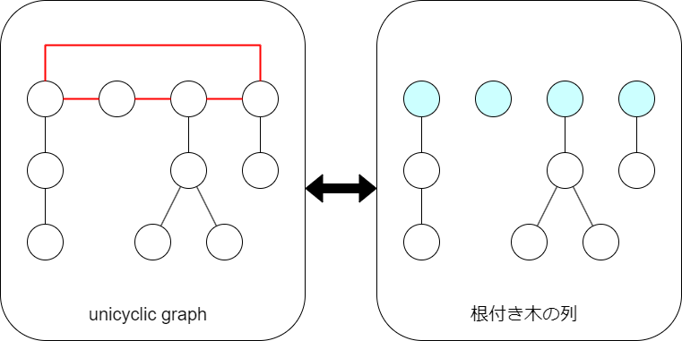
实现例：https://maspypy.github.io/library/graph/count/count_labeled_unicyclic.hpp

### 带标号无向连通欧拉图 $[0, 1, 0, 1, 3, 38, 720, \ldots]$

数“连通且所有顶点度数均为偶数”的图。

照例，去掉连通性条件、先数“所有顶点度数均为偶数”的图，再取 $\log$ 即可。

“所有顶点度数均为偶数”的图，只要取一棵生成树，就对应于对生成树以外所有边决定是否连接，因此有 $2^{\binom{n-1}{2}}$ 个。

OEIS：https://oeis.org/A033678

实现例：https://maspypy.github.io/library/graph/count/count_labeled_eulerian.hpp

### 带标号无向连通二分图 $[0,1,1,3,19,195,\ldots]$

二分图是指顶点全体可划分为两个独立集的图。注意仅仅是“可划分”，划分方法带有任意性。于是定义如下：

着色二分图，是指图 $G$ 以及把各顶点染成颜色 $0,1$ 的方法的组合，且相邻点颜色不同。

设着色二分图的 EGF 为 $A(x)$，连通着色二分图的 EGF 为 $B(x)$，连通二分图的 EGF 为 $C(x)$，则 $A(x)=\exp B(x)$ 且 $B(x)=2C(x)$。后者由“连通二分图的 $2$ 染色方法恰有 $2$ 种”可知。

因此 $C(x)=\dfrac12 \log A(x)$，只要能计算 $A(x)$ 即可。考虑色 $0$ 顶点 $n_0$ 个、色 $1$ 顶点 $n_1$ 个的情形，

$$a_n=\sum_{n_0+n_1=n}\dfrac{n!}{n_0!n_1!}2^{\binom{n}{2}-\binom{n_0}{2}-\binom{n_1}{2}}$$

由此 $\dfrac{a_n}{n!2^{\binom{n}{2}}}$ 可写成卷积，从而 $A(x)$ 可算。

OEIS：https://oeis.org/A001832

实现例：https://maspypy.github.io/library/graph/count/count_labeled_bipartite.hpp

### 带标号无向二分图 $[1, 1, 2, 7, 41, 376, \ldots]$

对带标号无向连通二分图的 EGF 取 $\exp$，就得到带标号无向二分图的 EGF。用上面的记号，所求即为 $\exp C(x)$。

由 $C(x)=\dfrac12 \log A(x)$，有 $\exp C(x)=\sqrt{A(x)}$，因此不需要 $\exp,\log$ 的计算，只要开 sqrt 即可。

OEIS：https://oeis.org/A047864

实现例：https://maspypy.github.io/library/graph/count/count_labeled_bipartite.hpp

### 带标号 2 边连通图 $[0, 1, 0, 1, 10, 253, \ldots]$

本篇中，把无桥的连通图称为 2 边连通图。我认为与英文 wikipedia 的定义一致，但由于后述 OEIS 中 $N=1$ 的值为 $0$，所以 $N=1$ 的情形可能存在多种习惯。

定义推导中出现的各种 EGF：

- $A(x)$：2 边连通图的 EGF。
- $B(x)$：有根 2 边连通图的 EGF（有根图指图与其一个点的组合，显然 $b_n=na_n$）。
- $C(x)$：连通图的 EGF。
- $D(x)$：有根连通图的 EGF。
- $E(x)$：有根连通图，且连接到根的所有边都是桥。

显然有 $b_n=na_n$ 以及 $d_n=nc_n$。

$D(x)=B(E(x))$ 成立，这是个有趣的论点。来确认一下。先请看图。

给定有根连通图，取出含根的那个 2 边连通分量，就确定了一个有根 2 边连通图。进一步，把连接到该分量内各顶点的桥、以及桥的另一侧收集起来，就对每个分量内顶点各确定一个“连接到根的所有边都是桥”的有根连通图。仔细看这个对应，就得到 $D(x)=B(E(x))$ 这个式子。我觉得标号的有无等混乱因素很多，所以仔细看下去。

在 $d_n$ 中，设根所在的 2 边连通分量大小为 $k$ 的个数为 $d_{n,k}$。固定 $k$，只需证 $\sum_{n=0}^{\infty}d_{n,k}\dfrac{x^n}{n!}=b_k\dfrac{E(x)^k}{k!}$。来证其 $k!$ 倍 $\sum_{n=0}^{\infty}k!d_{n,k}\dfrac{x^n}{n!}=b_k E(x)^k$。

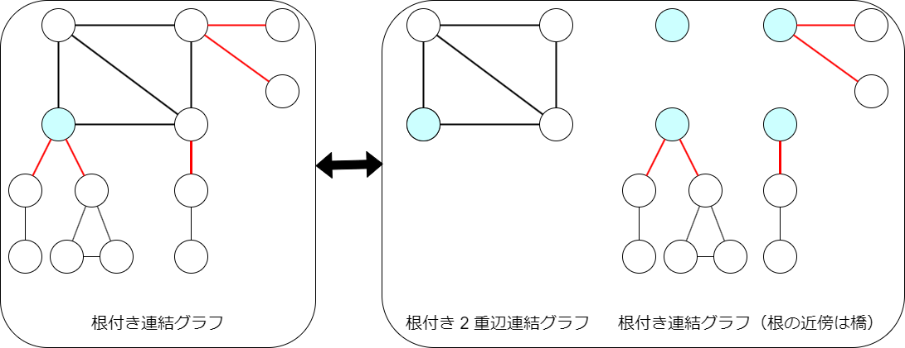
$k!d_{n,k}$ 对应于：对带标号有根连通图的根的 2 边连通分量再分配标号 $0,1,\ldots,k-1$。由上图的分解，这对应于：

- $k$ 顶点的带标号有根 2 边连通图
- 编号为 $0,1,\ldots,k-1$ 的有根连通图（根的邻域是桥）的组合，整体上带有顶点标号 $0,1,\ldots,n-1$

的组合。因为是带标号图上又带标号的复杂情况，请慎重思考。

固定各编号的有根连通图的顶点数 $n_i$，则后者的计数变为多项式系数 $\dfrac{n!}{n_0!\cdots n_{k-1}!}$ 与 $e_{n_0}\cdots e_{n_{k-1}}$ 的积，让 $n_i$ 变动可知这可写成 $[x^n]n!E(x)^k$。综上得到 $D(x)=B(E(x))$。

接下来最好能求出 $E(x)$。又有 $E(x)=x \exp D(x)$ 成立。这由“$E(x)$ 所讨论的图去掉根后，分解为有根连通图”可知。

目标是计算 $A(x)$。$A,B$ 之间有简单关系，所以算出 $B(x)$ 即可。$C(x)$ 已经算出，因此 $D(x)$ 也容易算出。$E(x)$ 可由 $E(x)=x\exp D(x)$ 算出。

总之，在 $D(x)=B(E(x))$ 的状况下，给定了 $D(x), E(x)$ 时只要求出 $B(x)$ 即可。这可通过“$E(x)$ 关于复合的逆元代入 $D(x)$”来算（$B,D,E$ 的 $0$ 次系数为 $0$）。

OEIS：https://oeis.org/A095983

实现例：https://maspypy.github.io/library/graph/count/count_labeled_bridgeless.hpp

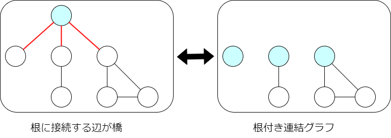
仅求 $b_N$（从而 $a_N$）的话，用拉格朗日反演也能在 $\Theta(N\log N)$ 时间内计算（上面的实现例中也包含这类实现）。

### 带标号 2 顶点连通图 $[0,0,1,1,10,238,\ldots]$

既有考虑有根图的情形，也有在无根图中特别看待顶点 $0$ 来讨论的情形，请注意不要混淆。

结果上，把下标错开一个会比较漂亮，这源于“求导”的含义。

- $A(x)$：2 顶点连通图的 EGF。
- $B(x)=A'(x)$：$b_n=a_{n+1}$ 这样数列的 EGF。
- $C(x)$：连通图的 EGF。
- $D(x)=C'(x)$：$d_n=c_{n+1}$ 这样数列的 EGF。
- $E(x)$：有根连通图的 EGF。
- $F(x)$：顶点数 $\geq 2$ 且顶点 $0$ 不是关节点的连通图的 EGF。
- $G(x)=F'(x)$：$g_n=f_{n+1}$ 这样数列的 EGF。

与 2 边连通分量不同，即使想取出含顶点 $0$ 的 2 顶点连通分量，它也不唯一，所以不好处理。另一方面，若加上“顶点 $0$ 不是关节点”的条件，就能做与 2 边连通情形相似的讨论，这次得到了 $G(x)=B(E(x))$ 这个式子。

讨论与 2 边连通的情形相同。因为特别看待标号为 $0$ 的顶点，所以是把标号 $1,2,\ldots,n-1$ 分配到 $k-1$ 个分量中，由于下标错开了 1（考虑的是 $B(x)=A'(x)$ 而非 $A(x)$、$G(x)=F'(x)$ 而非 $F(x)$），得到了简单的复合关系式。

剩下的只需要考虑“顶点 $0$ 不是关节点”的图的计数。

考虑任意连通图，以及去掉顶点 $0$ 后的连通分量分解。于是得到关系式 $D(x)=\exp G(x)$。

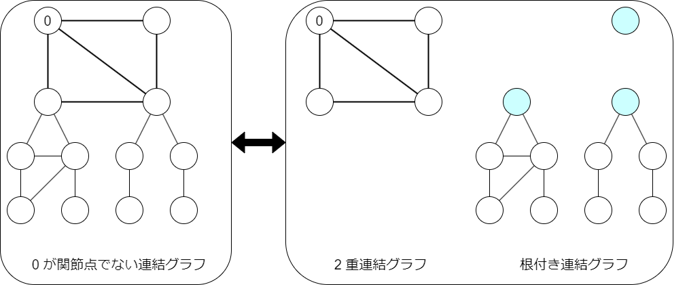
总之，计算步骤如下。先求 $C(x)$。则 $D(x), E(x)$ 可求。

由 $D(x)=\exp G(x)$ 得 $G(x)$。$E,G$ 已求，故由 $G(x)=B(E(x))$ 得 $B(x)$。从而 $A(x)$ 可求。

OEIS：https://oeis.org/A013922

实现例：https://maspypy.github.io/library/graph/count/count_labeled_biconnected.hpp

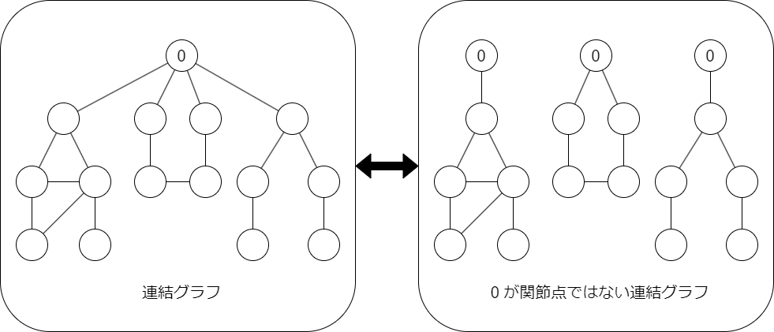
### 无标号无向图

需要把同构的图视为同一，一般认为这边的难度更高。

### 无标号有根树 $[0, 1, 1, 2, 4, 9, 20, 48, 115, \ldots]$

设 $A(x)$ 为无标号有根树的 OGF。即设 $a_n$ 为无标号有根树的个数，$A(x)=\sum_{n=0}^{\infty} a_nx^n$。

无标号有根树去掉根后，对应于有根树的 multiset。因此，要得到无标号有根树，只需决定各更小的无标号有根树分别用几个。由此得到

$$A(x)/x = \prod_{n=1}^{\infty}(1+x^n+x^{2n}+\cdots)^{a_n}.$$

选择使用顶点数为 $n$ 的无标号有根树的次数，对应于 $(1+x^n+x^{2n}+\cdots)$；而这样的树有 $a_n$ 个，所以取 $a_n$ 次幂。两边取对数得 $\log (A(x)/x) = \sum_{n=1}^{\infty}-a_n\log(1-x^n)$，所以

$$A(x)/x = \exp\biggl(\sum_{n=1}^{\infty}-a_n\log(1-x^n)\biggr).$$

由这个式子，再用 Relaxed Convolution 的技巧，就能在已知 $a_0,a_1,\ldots,a_n$ 时计算 $a_{n+1}$。总之，枚举 $a_0,\ldots,a_N$ 可在 $\Theta(N\log^2N)$ 时间内完成。

OEIS：https://oeis.org/A000081

有根树：https://maspypy.github.io/library/graph/count/count_unlabeled_tree.hpp

### 无标号树 $[0, 1, 1, 1, 2, 3, 6, 11, 23, 47, 106, \ldots]$

最近 Shirotsume さん做了讲解。

这里介绍稍有不同推导（基于 https://users.math.msu.edu/users/magyarp/math482/Otter-Trees.pdf，利用称为 dyssymmetry theorem 的手法）。

设 $a_n$ 为树的个数。
设 $b_n$ 为“树与其一个顶点（即有根树）”的个数。
设 $c_n$ 为“树与其一条边”的个数。
设 $d_n$ 为“树与其一条边及其方向”的个数。

这些计数都是作为无标号树的计数，按同构同一视。对带了根或方向的东西，也按保持它的同构同一视。

基本上应有 $d_n=2c_n$，但注意当所选边是树的中心时，两个方向的定向被视为相同。

如下成立：$a_n=b_n+c_n-d_n$。

以下按树的原始论文等，用树的中心来讨论，但用重心也能做同样讨论。

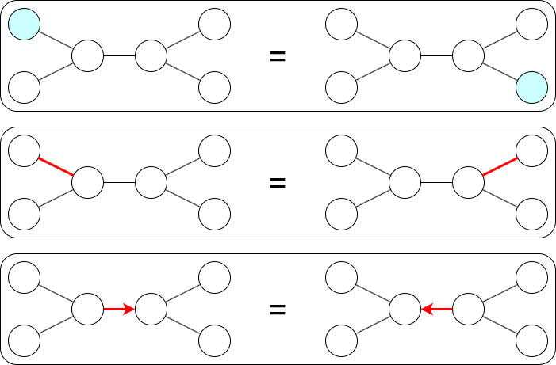
树有唯一的中心（它是 1 个点或 1 条边），由此 $b_n+c_n-a_n$ 与如下计数一致：

- 树，以及“顶点或边”的组合，且所选的顶点或边与中心不一致的个数。

来确认这与 $d_n$ 一致。

当所选顶点是不是中心的点时，从该顶点向中心的方向选一条边及其方向。当所选边是不是中心的边时，把该边向远离中心的方向定向。于是所有“边及其方向”的组合各出现一次，证得 $b_n+c_n-a_n=d_n$。

注意中心那条边的定向，也以“从顶点指向中心”的形式恰好出现一次。

设 $a_n,b_n,c_n,d_n$ 的 OGF 为 $A(x),B(x),C(x),D(x)$。

$B(x)$ 已经算出。

考虑从图中删去所选边，则 $c_n$ 等于“由两个树构成的无序对”的计数。由此得 $C(x)=\dfrac{1}{2}(B(x)^2+B(x^2))$。

考虑从图中删去所选边，则 $d_n$ 等于“由两个树构成的有序对”的计数。由此得 $D(x)=B(x)^2$。

因此得 $A(x)=B(x)+\dfrac12 (B(x)^2-B(x^2))$。

OEIS：https://oeis.org/A000055

实现例：https://maspypy.github.io/library/graph/count/count_unlabeled_tree.hpp

### 带标号有向图

### 带标号有向图 $[1,1,4,64,4096,\ldots]$

设 $n$ 顶点带标号有向图的个数为 $a_n$，则 $a_n=2^{n(n-1)}$。

假设图中没有自环、重边，但考虑相反方向各定向的边可以共存的情形。

### 带标号 DAG $[1,1,3,25,543,\ldots]$

把有向图中入度为 $0$ 的点称为 source。

设 $a_n$ 为 $n$ 顶点带标号 DAG 的个数。
设 $b_n$ 为 $n$ 顶点带标号 DAG 中 source 为 $0$ 个的个数。

source 为 $0$ 个的 DAG 除了空图外不存在，所以当然 $B(x)=1$。用别的方法算这个 EGF。

考虑容斥原理。指定 $k$ 个成为 source 的顶点时的计数，以 $(-1)^k$ 为权重相加即可。

这 $k$ 个成为 source 的顶点之间无边，其余 $n-k$ 个顶点之间构成 DAG，而这 $k(n-k)$ 条边可从 source 自由连出等，由此得到

$$b_n=\sum_{k=0}^n\binom{n}{k}(-1)^ka_{n-k}2^{\binom{n}{2}-\binom{k}{2}-\binom{n-k}{2}}.$$

这可以写成卷积形。把 $b_n$ 作为已知，求 $a_n$ 可通过“带着适当的 $2$ 的幂次系数、做一次形式幂级数逆元的计算”这类计算得到。

OEIS：https://oeis.org/A003024

实现例：https://maspypy.github.io/library/graph/count/count_labeled_dag.hpp

### 带标号强连通图 $[0,1,1,18,1606,\ldots]$

把有向图的强连通分量中，没有从其他分量进入的边的那个，称为 source strong component。

设 $a_n$ 为 $n$ 顶点带标号有向图的个数。
设 $b_n$ 为 $n$ 顶点带标号有向图中 source strong component 为 $0$ 个的个数。
设 $c_n$ 为 $n$ 顶点带标号强连通有向图的个数。

这次也有 $B(x)=1$。用别的方法算它。

考虑容斥原理。指定 $k$ 个成为 source strong component 的子集时的计数，以 $(-1)^k$ 为权重相加即可。先定义如下的 $d_n$。

设 $d_n$ 为 $n$ 顶点带标号有向图中，所有强连通分量都是 source strong component 的个数。但当强连通分量有 $k$ 个时，以 $(-1)^k$ 为权重计数。

于是 $D(x)=\sum_{k=0}^{\infty}(-1)^k\frac{C(x)^k}{k!}=\exp(-C(x))$。又与 DAG 时同样，

$$b_n=\sum_{k=0}^n\binom{n}{k}d_ka_{n-k}2^{\binom{n}{2}-\binom{k}{2}-\binom{n-k}{2}}$$

也成立。由 $A(x), B(x)$ 已知可算 $D(x)$，对其取 $\log$ 即可算 $C(x)$。

OEIS：https://oeis.org/A003030

实现例：https://maspypy.github.io/library/graph/count/count_labeled_strong_digraph.hpp

### 带标号锦标赛 $[1,1,2,8,64,1024,\ldots]$

锦标赛是指任意两个顶点对之间恰有一条有向边的图。

因为每条边的方向有 $2$ 种，所以有 $2^{\binom{N}{2}}$ 个锦标赛。

### 带标号强连通锦标赛 $[0,1,0,2,24,544,\ldots]$

设带标号锦标赛的 EGF 为 $A(x)$。
设带标号强连通锦标赛的 EGF 为 $B(x)$。

考虑锦标赛的强连通分量分解。一般把强连通分量汇总为一个顶点就得到 DAG，但锦标赛的情形得到的是“既是锦标赛又是 DAG”的图。因此，$k$ 个强连通分量上有全序，强连通分量之间按该序连边。

总之，要得到带标号锦标赛，只需把顶点全体划分为 $k$ 个子集，给它们适当排序，再在各子集内确定带标号强连通锦标赛即可。由此得 $A(x)=\sum_{k=0}^{\infty}B(x)^k=\dfrac{1}{1-B(x)}$。

$A(x)$ 已知，由此可算 $B(x)$。

OEIS：https://oeis.org/A054946

实现例：https://maspypy.github.io/library/graph/count/count_labeled_strong_tournament.hpp

### 参考文献

撰写本篇时，部分讨论参考了以下文献的描述。

- グラフの数え上げ ―母関数を礎にして，共立出版
- Handbook of Enumerative Combinatorics (Discrete Mathematics and Its Applications)，CRC Press

强连通有向图的计数参考了如下论文：

- https://arxiv.org/abs/1909.01550

<a id="am05-dc-fft"></a>
## 分割統治 + FFT 的常见形式（分割統治+FFT のよくある形のひとつ）

### 概要

说到“分割统制 FFT”，我偶尔看到有人特指类似 https://atcoder.jp/contests/abc213/editorial/2396 那种类型，但不清楚它有多通用。

我粗略地把“组合分割统制与 FFT 能求出答案的体系”的技巧全都看作分割统制＋FFT，若有术语难懂之处请指正。

虽然印象中不同问题要求的考察与实现会微妙地变化，但若能视为共通的模板模式，考察和实现都会轻松，很方便。

这里介绍可应用到多个问题的 2 个模式。

### 模式 1

设 $L_i, R_i, f_i$ 为低次的 Laurent 多项式，求

$$\sum_{i} \Bigl(\prod_{0\leq k < i}L_k\Bigr) f_i \Bigl(\prod_{i < k < N}R_k\Bigr)$$

的问题。考虑对区间求“答案・$L$ 的总积・$R$ 的总积”这个三元组，递归地用分割统制计算，即可在 $O(N\log^2N)$ 时间内求解。

推广来说，这些用矩阵也无妨。$L_i$ 为 $(a,a)$ 矩阵、$f_i$ 为 $(a,b)$ 矩阵、$R_i$ 为 $(b,b)$ 矩阵这样的类型。

#### 多项式的总积

相当于 $R_i$ 全为 $1$、$f_i$ 只有最后为 $1$ 的情形。

#### 有理式的总和

由 $\dfrac{X}{Y}+\dfrac{a}{b} = \dfrac{bX+aY}{bY}$，把“加上有理式 $\dfrac{a}{b}$”视为线性变换 $\begin{pmatrix}X\\Y\end{pmatrix} \longmapsto \begin{pmatrix}bX+aY\\bY\end{pmatrix}$，则有理式总和的分子・分母的计算，可看作形如 $\begin{pmatrix} b & a \\ 0 & b\end{pmatrix}$ 的矩阵的总积的计算。因此可作为上述模式的一个例子处理。

#### 其他问题例

- 路径图的情形成为 $\sum_i \prod_{0\leq k<i}f_k$ 形的计算。
- 会出现 $\sum_{L} c_Lx^{N-L} \prod_{i=0}^{L-1}(M-x-i)$ 这样的式子。取 $L_i(x) = M-x-i, R_i(x) = x$ 即可。

### 模式 2

给定形式 Laurent 级数 $f(x)$ 与低次 Laurent 多项式 $L_i, R_i$，对每个 $i$ 求

$$[x^0] \Bigl(\prod_{0\leq k < i}L_k\Bigr) f(x) \Bigl(\prod_{i < k < N}R_k\Bigr)$$

的问题。预先算出分割统制中出现的各区间的 $L$、$R$ 的总积，就能用分割统制。在答案的计算中，长度为 $n$ 的区间里感兴趣的 $f$ 的项只有 $O(n)$ 项（很高次・很低次的项可丢弃），因此复杂度可控制在 $O(N\log^2N)$ 时间。

#### 多点求值

对多项式 $f(x)$，有 $f(a) = [x^0]f(x^{-1})\cdot (1-ax)^{-1}$（参考：https://codeforces.com/blog/entry/100279）。

设 $F(x) = f(x^{-1})\prod_{a}(1-ax)^{-1}$，则 $f(a_i) = [x^0] F(x)\prod_{k\neq i}(1-a_kx)$。因此对应于模式中取 $L_i = R_i = 1-a_ix$ 的情形。

#### 对 prefix product 的多点求值

https://judge.yosupo.jp/problem/many_factorials（题解：https://suisen-kyopro.hatenablog.com/entry/2023/11/22/201600）

想要求很多“在 $x=n$ 处计算 $x(x+1)\cdots (x+k-1)$”这类查询。

把多点求值稍加改造，使得在求值的点的 prefix 上额外乘上适当的 1 次式即可。

- 这是关于 $(2,2)$ 矩阵 prefix product 的多点求值。

#### 其他问题

- 可归约到对各个 $i$ 求 $[x^0] F(x)f(x)^i$ 的问题。
- 这是求 prefix product 的系数问题，但 $L_i$ 由“对应 $i$ 的答案”动态决定。
- 用这个方法改善复杂度的内容，我写成了用户题解。
- 较难。把 $L_i$ 作为 $(2,2)$ 矩阵、$R_i$ 作为 $(1,1)$ 矩阵，就能套用模式。
- $(2,2)$ 矩阵积。

### 注意

一般化为矩阵时，模式 2 的积的顺序若照原样可能会有问题。


熨斗袋 (@noshi91) on X：
@maspypy_stars 相关地，我想把 maspy さん文章的 模式 2 推广到矩阵时，感觉如果不是 $R_{i+1} \dots R_{N-1} f L_0 \dots L_{i-1}$ 就不行，但 $L_0 \dots L_{i-1} f R_{i+1} \dots R_{N-1}$ 也能做吗？

<a id="am06-centroid"></a>
## 重心分解、1/3 重心分解的图示（重心分解・1/3重心分解のお絵描き）

画了些图。

### 重心分解

关于树的重心的定义与计算方法在此省略。

### 重心分解的图示

求树的一个重心，去掉重心后分成连通分量，如此反复。

每一步取一个重心作为根，画成根在最上方的图。

就得到了一棵“每个节点表示一棵有根树”的树结构。

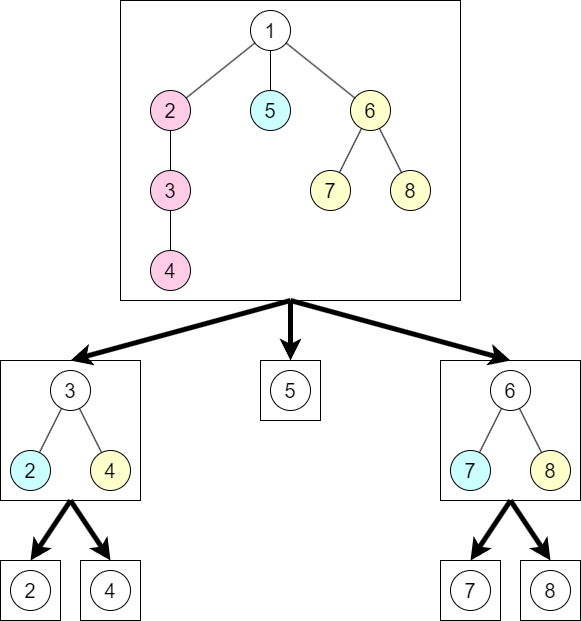
设原树的顶点数为 $N$。

每走向子节点，树的顶点数就变为一半以下，所以这棵树的深度为 $O(\log N)$。因此固定顶点 $v$ 时，包含 $v$ 的节点个数为 $O(\log N)$。各节点所表示的有根树的顶点数总和为 $O(N\log N)$。

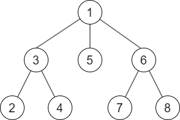
另外，上图中把各节点的根之间相连得到的树，有时也被称为重心分解。据笔者经验，在竞技编程中往往只出现为各节点的子树列表是重要的，而连接重心得到的树的结构本身（例如各顶点的父顶点是哪个等）常常不需要。不过也有以构建这棵树为题的出题（https://atcoder.jp/contests/abc291/tasks/abc291_h）。

### 对路径的计算的分割

以下若无特别说明，“路径”指边数在 1 条以上的。

重心分解在竞技编程中的主要用途是“计算树上所有路径的某种量”。例如

- https://judge.yosupo.jp/problem/frequency_table_of_tree_distance
- https://atcoder.jp/contests/yahoo-procon2018-final-open/tasks/yahoo_procon2018_final_c

等是代表例。

在某个节点所表示的树中，把路径按“是否经过根（重心）”分类考虑。不经过根的路径，可改说成“子节点所表示的树的路径”。因此各节点只需专注于经过根的路径的计算。若这个计算在 $n$ 顶点的节点上能以 $O(n)$ 时间完成，则整体 $O(N\log N)$ 时间；若以 $O(n\log n)$ 时间完成，则整体 $O(N\log^2N)$ 时间。

总之，做了重心分解后，就归约到“对 $n$ 顶点的有根树，以 $O(n)$ 时间等计算所有经过根的路径”这样的问题。

### 对经过根的路径的计算

在处理树上路径的问题中，把考察对象限定为经过根 $r$ 的路径的好处在于，任意路径 $uv$ 都可表示为 $ur, rv$ 的拼接。因此若能对所有 $u, v$ 预计算路径 $ur, rv$ 的某种值，就大约归约到如下的问题：

- 对各顶点，路径 $ur, rv$ 的值 $a_u, b_v$ 已确定。存在表示路径拼接的函数 $f$。对所有 $f(a_u, b_v)$ 做某种处理（求和等计算，或数出满足条件的个数）。

另一方面此时需注意，不能把 $(u, v)$ 取为任意顶点对。因为对于同侧子树中的 $(u,v)$，路径 $uv$ 不经过根 $r$。

若给各子树的顶点染上某种颜色（参照最初的重心分解图），就需要对应到

- 对所有颜色不同的顶点对 $u,v$，对 $f(a_u,b_v)$ 做某种处理

这类问题。

- 若是求和之类的计算，则从“任意两顶点对的总和”减去“同色两顶点对的总和”。
- 若是取 max 之类的计算，则“对两色分别保持 $a_u$、$b_v$ 的 max”。

等对策有时可行。

另一方面，若考虑无逆元的区间作用等问题，这个“颜色不同”的部分有时会成为弊端（https://suisen-kyopro.hatenablog.com/entry/2022/03/21/220009）。

考虑进一步二分颜色的分割统制有时能解决，但要应对最坏复杂度的恶化稍显麻烦。https://noshi91.hatenablog.com/entry/2022/03/27/042143 中利用 Huffman coding 处理了这个问題。

### 1/3 重心分解

https://codeforces.com/blog/entry/104997

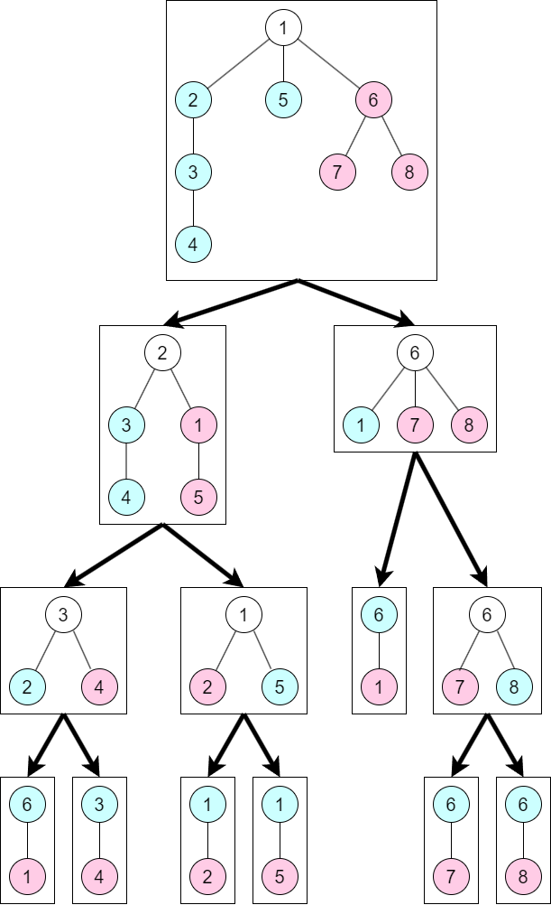
### 1/3 重心分解的图示

目标是：通过考虑各节点中“连接红点与蓝点的路径”，使所有路径恰好各出现一次。步骤如下：

- 若某节点持有的子树为 2 顶点，则把两点分别作为红・蓝，结束。
- 否则，取重心作为根做成有根树。把根周围的部分树按边大致均分地用 2 色涂色。把各色的顶点与根合并作为子节点。

考虑各节点中，不包含在子节点树里的路径是什么，可确认就是连接红点与蓝点的路径全体。因此在各节点考虑连接红点与蓝点的路径，就能把所有的路径恰好考虑一次。

关于“边大致均分”的部分，用简单贪心可实现 $[1/3,2/3]$ 的比例，这点在 https://codeforces.com/blog/entry/104997 中有解说。

由此可把“对所有路径的计算”转换为“对红色顶点 $u$、蓝色顶点 $v$ 的 $f(a_u,b_v)$ 的计算”。

考虑复杂度。把树结构视为边集合的分割。因每步边数变为 $2/3$ 以下，可知深度为 $O(\log N)$。因此每条边所属的节点有 $O(\log N)$ 个。由此各节点树的大小总和为 $O(N\log N)$。

### 对固定始点的路径的处理

另一方面，1/3 重心分解的缺点是：树的分割时顶点会分裂，因此关注单个顶点 $v$ 时，$v$ 出现的节点个数无法控制（例如考虑星型图，一个顶点会出现在所有节点中）。

这在处理“固定始点的所有路径”时成为障碍。

- https://atcoder.jp/contests/yahoo-procon2018-final-open/tasks/yahoo_procon2018_final_c
- https://judge.yosupo.jp/problem/vertex_add_range_contour_sum_on_tree

说明在 1/3 重心分解的框架下克服这个障碍的方法。请看下图，同时参考如下推文：

- https://x.com/noshi91/status/1640569780100034560?s=20

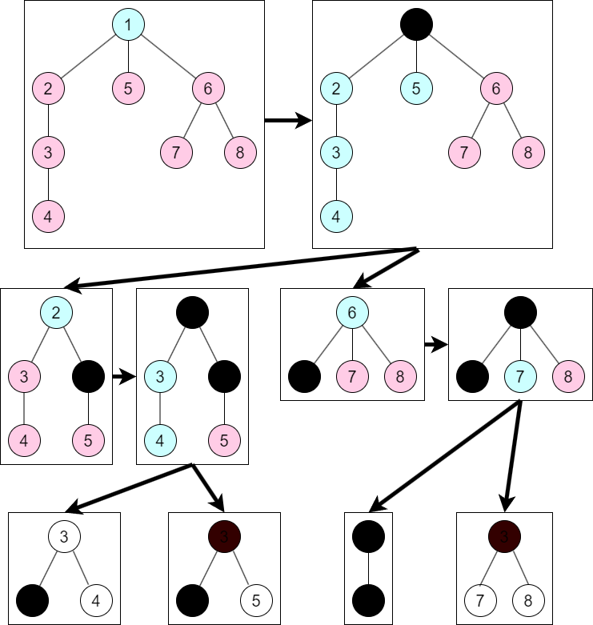
涂黑的顶点表示 virtual 顶点。另外，全画出来图会过大，所以在中途截断了。

重复如下操作：

- 取重心作为根。
- 若根是 real，则把根作为蓝点、其他 real 顶点作为红点来图示。把根改为 virtual 的东西作为子节点。
- 若根是 virtual，则按边数大致均分地用 2 色涂色。沿这个分割把树 2 分割。

请确认：各节点中 real vertex 之间连接的路径，成为该节点中红・蓝顶点连接的路径，或子节点中 real vertex 连接的路径。除“先把以根为端点的路径处理掉”这一点外，与通常的 1/3 重心分解相同。

上面最靠近叶的部分没有图示，请适当处理。

因为是 real 的顶点所在的节点有 $O(\log N)$ 个，所以即使是处理每个始点的路径的问题，也能达到与重心分解同等的复杂度。

另一方面，顶点作为 virtual vertex 出现的次数无法控制，因此当顶点属性有修改查询、且路径信息受到路径所经顶点的修改影响时，这个手法可能无法应用。

<a id="am07-rand-k"></a>
## 选择 K 个的最优化的随机算法（$K$ 個を選ぶ最適化における乱択アルゴリズム）

### 概要

这是对某篇文章手法的部分深挖。因为稍微积累了一些应用例，所以写成文章。

遗憾的是，当时没有给出复杂度阶的证明，HELP．→ 已解决。

### 简单的例子

为说明手法，考虑如下平凡问题。

给定 $N, K$ 以及整数列 $A = (A_0, \ldots, A_{N-1})$。选择互不相同的 $K$ 个下标 $i_1, i_2, \ldots, i_K$ 时，求 $A_{i_1} + A_{i_2} + \cdots + A_{i_K}$ 所能取到的最大值。

当然这只要排序后从大的开始加就能解，但先忘掉那个解法。

虽然复杂度较差，但作为自然的解法之一，考虑 dp 解法。如下定义 dp[i][j] 并适当计算，该问题可在 $\Theta(N^2)$ 时间内解出。

- dp[i][j]：从 $A_0, \ldots, A_{i-1}$ 中选出 $j$ 个时的总和最大值。

用随机算法给这个解法加速。

为简单起见，固定一个最优解，并像最优解唯一那样来描述。

记长度为 $N$ 且总和为 $K$ 的 $01$ 列全体的集合为 $S_{N,K}$。最优解可视为 $S_{N,K}$ 的一个元素。

把输入打乱。于是 $S_{N,K}$ 的所有元素都以等概率给出最优解。

适当决定可容许的误答概率 $\varepsilon > 0$。取宽度 $w$ 满足：

随机取 $S_{N,K}$ 中的 $01$ 列 $x = (x_0, \ldots, x_{N-1})$ 时，以至少 $1-\varepsilon$ 的概率成立：

对任意 $0\leq n\leq N$，有 $|\lfloor Kn/N\rfloor-\sum_{i<n} x_i|\leq w$。

这样取 $w$，只计算 dp[i][j] 中满足 $|\lfloor Ki/N\rfloor-j| \leq w$ 的部分，就能以至少 $1-\varepsilon$ 的概率算出最优解。由于每个 $i$ 只处理约 $2w+1$ 个 $j$，复杂度为 $\Theta(Nw)$。

以下是 $N=2K$ 时的数值计算。对 $\varepsilon = 10^{-4}, 10^{-5}, \ldots$，在误答概率不超过 $\varepsilon$ 的前提下求最小的 $w$。

决定 $(N, K, w)$ 后，失败概率 $\varepsilon$ 可用 dp 算出，所以做了这个（源代码）。

| $N$ | $K$ | $\varepsilon=10^{-4}$ | $10^{-5}$ | $10^{-6}$ | $10^{-7}$ | $10^{-8}$ | $10^{-9}$ |
|---|---|---|---|---|---|---|---|
| 100 | 50 | 11 | 12 | 13 | 14 | 15 | 16 |
| 1000 | 500 | 35 | 39 | 42 | 46 | 49 | 51 |
| 10000 | 5000 | 111 | 123 | 134 | 145 | 154 | 163 |
| 100000 | 50000 | 352 | 390 | 426 | 458 | 489 | 517 |
| 1000000 | 500000 | 1112 | 1235 | 1346 | 1449 | 1545 | 1636 |

由上表等，认为如下成立。

**【定理】** 设 $\varepsilon$ 为常数，则可取 $w = \Theta(\sqrt{N})$。

关于“随机游走的偏离期望的最大值在 $\sqrt{N}$ 阶”这类事实，我想是已知若干的，但本篇问题中不是单纯的 $01$ 列全体，而是带有总和为 $K$ 的限制，这点很麻烦，未能确认是否存在相近的结果。

→ 承蒙告知已有既存研究！非常感谢！（https://twitter.com/knewknowl/status/1691489279762161664）

与其说是随机游走，搜索关键词用 sampling without replacement 似乎更合适。稍微调查后，例如这篇论文的定理 2.4 中令 $n=N/2$，则给定 $w$ 时可把误答概率用常数 $c$ 估计为 $\exp (-cw^2/N)$ 以下。用本篇记号来说，固定 $\varepsilon$ 时可知 $w$ 可取 $\Theta(\sqrt{N})$，而若包含对 $\varepsilon$ 的依赖，则 $w$ 可取 $\Theta(\sqrt{N\log (\varepsilon^{-1})})$。

总之结论是：对如上表那样的 $(N, K, \varepsilon, w)$，存在误答概率不超过 $\varepsilon$、复杂度 $\Theta(Nw)$ 的解法。固定 $\varepsilon$ 时取 $w = \Theta(\sqrt{N})$，时间复杂度可说为 $\Theta(N^{1.5})$。

### 问题例

这些是能作为“与预期解不同的另解”使用本篇手法的问题。不触及预期解。

https://codeforces.com/contest/436/problem/E

这是优化“由 $0, 1, 2$ 组成、长度为 $N$、总和为 $W$ 的数列”的问题。

虽不是 $01$ 列而是 $012$ 列，但同样把 $w$ 取为 $\sqrt{N}$ 的常数倍左右，打乱后，只计算“选了 $n$ 个时总和落在 $[Wn/N-w, Wn/N+w]$”的部分，就能在 $\Theta(N^{1.5})$ 时间内解出。

本问题要求还原解，而且若用 $\Theta(N^{1.5})$ 内存，我的实现会 MLE。通过每 $\sqrt{N}$ 步保存一次 dp 表，还原时按区间重新计算 dp 表，达成了时间复杂度 $\Theta(N^{1.5})$、空间复杂度 $\Theta(N)$，确认用这个方法能 AC。

解答例：https://codeforces.com/contest/436/submission/218884165

换个说法，本问也就是长度为 $3$ 的 $N$ 个数列的 min-plus convolution 的结果的第 $K$ 项。长度为 $3$ 这一点并未特别用到，在“短的数列 $N$ 个”的状况下也能做类似的事。

https://codeforces.com/contest/739/problem/E

是 div1 的 3000 分题，所以难度相当高。在 $\sum a_i$ 与 $\sum b_i$ 已定、选择两个 $01$ 列 $a_i, b_i$ 最优的问题。

即使有两个数列也能做同样的事。随机打乱后，列 $a$ 或列 $b$ 的累积和的误差超过 $w$ 的概率分别不超过 $\varepsilon$，所以“某一方的误差超过 $w$”的概率不超过 $2\varepsilon$。

剩下的用简单 dp，就能以误答概率不超过 $2\varepsilon$、复杂度 $\Theta(Nw^2)$ 解出。不需要考察评价函数的结构等。

复杂度从朴素 dp 的 $\Theta(N^3)$ 降到 $\Theta(Nw^2)$。取 $w=\Theta(\sqrt{N})$ 则为 $\Theta(N^2)$ 时间。

另外，通过打乱，对任意输入都能把误答概率压小，这正是本篇手法的好处；但本来若测试用例是由某种随机生成的，分布不偏且只存在唯一最优解，那么不打乱输入也可能 AC。

解答例：https://codeforces.com/contest/739/submission/218639365

https://codeforces.com/contest/1799/problem/F

这也与上述问题同样，是选择两个 $01$ 列最优的问题。解法完全相同。

解答例：https://codeforces.com/contest/1799/submission/218644087

https://atcoder.jp/contests/past202005-open/tasks/past202005_o

这是优化“总和为 $M$ 的三个 $01$ 列的三元组”的问题。朴素 dp 似乎会变成 $\Theta(N^4)$，但同样会变成 $\Theta(Nw^3)$。

我最初看到这个手法是在这个问题的 QCFium さん的解说。本篇中作为 $\Theta(N^4)$ 解法的常数倍加速手法介绍，但由可取 $w=\Theta(\sqrt{N})$ 可知，这相当于从 $\Theta(N^4)$ 到 $\Theta(N^{2.5})$ 的阶的改善。

### 无法适用的情况

因为下标打乱是本质的，所以若下标的相邻等带有意义，则本手法无法适用。

话虽如此，若测试用例是由某种随机生成的、且分布不偏只存在唯一最优解，这种情况也可能发生。

（注：原文此处夹有一段 atcoder.jp 的 CDN 错误页面文本，疑似抓取残留，已省略。）

用适当的问题试了试，结果是 26AC / 2WA。测试用例的制作者真厉害。

由于是对随机用例可能有效的解法，在束手无策时作为“实现出来是假解法”也许还算可以。

https://codeforces.com/contest/1891/problem/E

成功例。是从数列选 $K$ 个的优化，但用本篇方法能 AC。

提交：https://codeforces.com/contest/1891/submission/230828988

因为是靠剪枝加速，原则上不能用于计数。若是求某个概率为小数等情形，类似想法可能有用。

### 相关文章

承蒙告知。

搜索到了看似文章的，但都似乎没有证明 https://t.co/m5TskFGV0L https://t.co/PYpMdEKyGz
— さんせん (@akakimidori) August 15, 2023

- https://codeforces.com/blog/entry/67664
- https://codeforces.com/blog/entry/50036

<a id="am08-monoid-dlog"></a>
## 关于幺半群作用的离散对数问题（モノイド作用に関する離散対数問題）

### 概要

本篇处理如下离散对数问题的变种。

设 $X$ 为幺半群，$S$ 为集合，且 $X$ 在 $S$ 上左作用。给定 $x\in X$ 以及 $s, t \in S$ 以及正整数 $N$。判定是否存在满足下式的非负整数 $n$ 并求其中最小者：$x^ns = t$ 且 $0\leq n < N$。

当幺半群的运算与作用、以及 $S$ 中元素的哈希都能在 $O(1)$ 时间计算时，目标是期望时间 $O(\sqrt{N})$ 解此问题。若想对任意非负整数求最小的 $n$，取 $N = |S|$ 即可。

左作用是指映射 $X\times S\longrightarrow S; (x,s) \longmapsto xs$，满足单位元平凡地作用、且 $(x_1x_2)s = x_1(x_2s)$。本篇范围内只出现对固定 $x$ 的 $x^n$ 形元素，所以不需要区分运算的左右（因此写了“左作用”，但“右作用”情形也一样）。

上面的问题，在特殊情形下包含如下所谓的“离散对数问题”（wikipedia）：

设 $X$ 为群，$x, y \in X$。判定是否存在满足 $x^n = y$ 的非负整数 $n$，若存在则求出。

具体取 $S = X$，把群运算本身视为作用、$s$ 取单位元即可。

离散对数的解说文章中似乎很多处理这个特殊情形，但我经常看到无法直接套用其形式化的竞技编程问题，所以构思了本篇的形式化与手法。例如，如下问题是本篇的直接适用范围：

给定 $m, a, b, s, t$。考虑 $f(x) = (ax+b)\bmod m$ 这个函数。$f^n(s) = t$（左边是 $n$ 次复合）是否存在满足的 $n$？若存在则求其中最小的。

这对应取 $X$ 为 $\mathbb{Z}/m\mathbb{Z}$ 上的仿射函数全体（运算为复合）、$S = \mathbb{Z}/m\mathbb{Z}$。

这个问题在假设 $X=S$ 的形式化下我觉得不好直接处理。另外，即使不假设 $\gcd(a,m) = 1$，也希望不利用同余式性质等而能直接适用的解法。

本篇的算法，是竞技编程中熟知的 baby step giant step 算法的变种，但在幺半群（不一定是群）的形式化下，需要注意不能假设 $x\in X$ 的逆元存在。

### 参考文献

问题：

- https://judge.yosupo.jp/problem/discrete_logarithm_mod
- https://atcoder.jp/contests/abc222/tasks/abc222_g
- https://atcoder.jp/contests/abc270/tasks/abc270_g
- 底与 mod 不互素的离散对数问题：https://habara-k.hatenadiary.jp/entry/2021/10/14/230035

### 算法

适当取 $m$，用 $T = \{x^it\mid 1\leq i \leq m\}$ 定义子集 $T\subset S$。用哈希表管理 $T$ 的元素。

若 $x^ns=t$，则对任意 $i$ 有 $x^{n+i}s = x^i t$，因此注意对 $k = \lceil (n+1) / m\rceil$ 有 $x^{km}s \in T$。

先求使 $x^{km}s \in T$ 的最小 $k$。这通过对 $s$ 不断作用 $x^m$ 来算。由 $k$ 的最小性，若 $n < (k-1)m$ 则 $x^ns\neq t$。对 $(k-1)m\leq n < km$ 的范围全搜索，若存在满足 $n < km$ 的解，则得到其中最小的解。

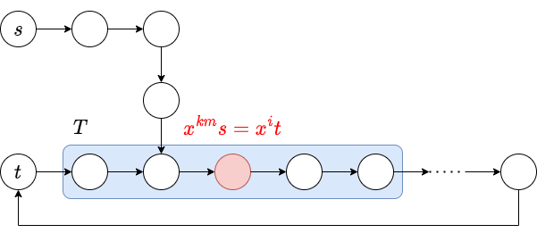
$x^ns = t$ 的 $n$ 存在、但用上面方法求不到解的，是如下图的状况。考虑以 $S$ 为顶点集、从 $s$ 向 $xs$ 连有向边得到的 functional graph。

由 $x^{km}s = x^it$ 可知能到达 $t$，所以 $t$ 是环上的点。因此 $x^{km}s = x^it$ 也是环上的点。

这种情形下，求使 $x^{lm}s \in T$ 的最小 $k<l$。若不存在这样的 $l$，则无解。取这样的 $l$ 时，由 $x^{km}s$ 在环上可知，必存在满足 $(l-1)m\leq n< lm$ 且 $x^ns = t$ 的 $n$。又由 $l$ 的最小性，不存在满足 $n < (l-1)m$ 的解。因此全搜索 $(l-1)m \leq n < lm$ 就得到解。

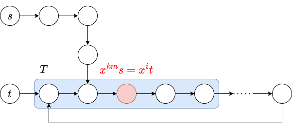
注意上面的讨论以“$x^ns=t$ 的 $n$ 存在”为前提（$t$ 不在环上的情形下，不存在满足 $(l-1)m\leq n < lm$ 的 $n$）。

综上得到如下算法。探索范围请配合约束 $n < N$ 适当确定：

- 预计算 $T = \{x^it\mid 1\leq i \leq m\}$ 的哈希值。
- 计算 $x^m$。
- 对 $k = 1, 2, 3, \ldots$ 依次检查 $x^{km}s \in T$ 是否成立。
- 对使 $x^{km}s\in T$ 的 $k$，检查 $(k-1)m\leq n < km$ 中的 $n$ 是否满足 $x^ns=t$。若找到这样的 $n$，它就是所求。另外，若这种全搜索失败 2 次，则无解。

由于 $n$ 的全搜索至多进行 2 次，上面的算法达到期望时间复杂度 $O\Bigl(m + \frac{N}{m}\Bigr)$。例如取 $m = \lfloor\sqrt{N}\rfloor$，则期望时间 $O(\sqrt{N})$。

若适当实现，算法中出现的计算次数更详细如下：

- 幺半群元素的积的计算：$O(\log N)$ 次
- 把幺半群元素作用到集合的计算：$O(\sqrt{N})$ 次

幺半群元素的积与作用的复杂度不同时，留意这一点的实现或许能改善复杂度（例如 $X$ 为全体 $n\times n$ 矩阵、$S$ 为全体 $n$ 元列向量的情形等）。

<a id="am09-dc-query"></a>
## 基于分割统制的静态数列区间积查询（分割統治による静的列の区間積クエリ）

### 概要

本篇处理如下形式的问题。

设 $X$ 为幺半群，$(x_0, \ldots, x_{N-1})$ 为 $X$ 的元素的数列。回答 $Q$ 个如下形式的查询：给定区间 $[a,b)$，求 $\prod_{a\leq i < b} x_i$（下标升序的总积 $x_a\cdots x_{b-1}$）。

不过，数列是静态的、查询是离线的。即 $x_i$ 在问题中固定，查询 $(a,b)$ 全部一起给出，以任意顺序求答案即可。

以下为简单起见，假设所有查询区间 $[a,b)$ 满足 $b-a\geq 2$。注意依实现可能需对长度为 $1$ 的查询分类处理。另外，除非特别说明，假设幺半群两个元素的积的计算量为 $O(1)$。但文章一部分也关注这不成立的情形。

文章后半关于特殊情形下复杂度改善的内容，因为没见过，所以写成文章。前半感觉是熟知的，但想不起具体资料，所以这里也解说。

### 基于分割统制的解法

设 `dfs(L,R)` 为回答所有满足 $[a,b) \subset [L, R)$ 的查询 $(a,b)$ 的函数，可如下设计：

```
def dfs(L, R):
    M = (L + R) // 2
    [ 计算满足 a < M 且 M < b 的查询的答案 ]
    dfs(L, M), dfs(M, R)
```

其中答案的计算，利用 $a < M < b$ 时有

$$\prod_{a\leq i < b} x_i = \biggl(\prod_{a\leq i < M}x_i\biggr)\biggl(\prod_{M\leq i < b}x_i\biggr)$$

可知：预计算

- 各 $L\leq a < M$ 对应的 $\prod_{a\leq i < M} x_i$
- 各 $M < b \leq R$ 对应的 $\prod_{M\leq i < b} x_i$

之后，对每个查询用 1 次幺半群积就能算出答案。从 $M$ 开始向 $L, R$ 计算累积积，这个预计算可用 $R-L$ 次幺半群积算得。由此可知，本问题可用 $O(N\log N + Q)$ 次幺半群积的解法解出。

| 解法 | 幺半群积次数 | 空间复杂度 |
|---|---|---|
| 分割统制 | $O(N\log N + Q)$ | $O(N+Q)$ |

实现例：https://judge.yosupo.jp/submission/125324

上面的实现中，为获取各 $[L,R)$ 内要计算的查询又花了 $O(Q\log N)$ 时间，所以复杂度为 $O((N+Q)\log N)$。用桶排序等适当处理查询，可使复杂度为 $O(N\log N + Q)$ 时间，但省略这种实现的说明。

以下“基于分割统制的解法”即指这种方法。从上面的实现例抽出主要部分如下：

```
  auto calc = [&](int L, int M, int R, vector<T>& query) -> void {
    static vector<int> dp(N + 1);
    // 累积积的计算
    dp[M] = unit;
    for (int i = M; i > L; --i) dp[i - 1] = op(A[i - 1], dp[i]);
    for (int i = M; i < R; ++i) dp[i + 1] = op(dp[i], A[i]);
    // 答的计算
    for (auto [q, a, b]: query) ANS[q] = op(dp[a], dp[b]);
  };

  auto dfs = [&](auto& dfs, int L, int R, vector<T>& query) -> void {
    if (R - L <= 1) {
      for (auto&& [q, a, b]: query) ANS[q] = A[a];
      return;
    }
    int M = (L + R) / 2;
    vector<T> query_L, query_R, other;
    for (auto&& [q, a, b]: query) {
      if (b <= M) query_L.emplace_back(q, a, b);
      if (M <= a) query_R.emplace_back(q, a, b);
      if (a < M && M < b) other.emplace_back(q, a, b);
    }
    calc(L, M, R, other), dfs(dfs, L, M, query_L), dfs(dfs, M, R, query_R);
  };
  dfs(dfs, 0, N, query);
```

### 与线段树的比较

线段树例如在 我的文章 中有解说。比较基于分割统制的解法与基于线段树的解法。

| 解法 | 幺半群积次数 | 空间复杂度 |
|---|---|---|
| 分割统制 | $O(N\log N + Q)$ | $O(N + Q)$ |
| 线段树 | $O(N + Q\log N)$ | $O(N)$ |

竞技编程中常有 $N, Q$ 同阶的情形，在这种情形下可知分割统制解法与线段树解法的时间・空间复杂度同阶。另外，分割统制解法有“数列静态且查询离线”的约束，一眼看去似乎分割统制解法优点少。

但是，在如下情形时，分割统制可能比线段树好很多：

- “两个幺半群元素的积”比“幺半群元素与 $x_i$ 的积”算得更快的情形

回顾分割统制解法，进行了如下次数的两种幺半群积：

- 幺半群元素乘 $x_i$ 的操作：$O(N\log N)$ 次
- 两个幺半群元素相乘的操作：$O(Q)$ 次

基于线段树的解法则为：

- 两个幺半群元素相乘的操作：$O(N + Q\log N)$ 次

因此，若“任意两个幺半群元素相乘”比“幺半群元素乘 $x_i$”的计算量大，则分割统制解法可能减少复杂度。例如有如下例子：

**问题例 1**（点击展开）

幺半群是次数低于 $K$ 的多项式全体（运算为 $\pmod{1-x^K}$ 下的积），且 $x_i = 1 + x^{A_i}$。任意两个幺半群元素相乘是 $O(K^2)$ 时间或利用 FFT 的 $O(K\log K)$ 时间，但乘 $x_i$ 的操作可 $O(K)$ 时间完成。注意，求查询答案处需要“任意幺半群积”型的计算，但答案计算只需要积常数项，所以这里也能 $O(K)$ 时间完成。整体可在 $O((N\log N + Q)K)$ 时间解出。
解答例：https://yukicoder.me/submissions/839527

**问题例 2**（点击展开）

求每个区间所张成的向量空间的问题。用基管理向量空间时，$d$ 维向量空间的和的计算需 $O(d^2)$ 时间，但向 $d$ 维向量空间添加 1 个元素的计算可 $O(d)$ 时间完成，所以这种情形也能加速。如下提交以 $d = \max \log A_i$ 达成了 $O(d\cdot N\log N + d^2\cdot Q)$ 时间。

（注：原文此处夹有一段 atcoder.jp 的 CDN 错误页面文本，疑似抓取残留，已省略。）

另外官方题解中，利用向量空间特有的考察而非单纯幺半群积，处理了 $O((N+Q)d)$ 时间的解法。

### 与 disjoint sparse table 的比较

disjoint sparse table（以下 DST）请参考 noshi91 さん的文章 等。与线段树时同样比较。

| 解法 | 幺半群积次数 | 空间复杂度 |
|---|---|---|
| 分割统制 | $O(N\log N + Q)$ | $O(N+Q)$ |
| DST | $O(N\log N + Q)$ | $O(N\log N)$ |

其实基于分割统制的解法与基于 DST 的解法几乎相同。更详细地说，可理解为：把分割统制解法中出现的向左右方向的累积积全部预计算，就是 DST。（不过一般 DST 实现中，会把分割 $[L,R)$ 的位置不取中点而取能被 $2$ 整除次数最多的位置等，以使所需预计算能用位运算方便访问。）

主要区别在是否把所有累积积放进内存，因此 DST 空间复杂度增大，但能处理在线查询，各有缺点・优点。

关于两种幺半群积“任意积”“与 $x_i$ 的积”的事项，分割统制与 DST 没有特别区别。

### 分割统制的剪枝

给分割统制的实现加上简单的剪枝。在累积积的预计算中，只计算查询到达的地方。具体实现例上，上面举的实现例几乎只加几行。

```
  auto calc = [&](int L, int M, int R, vector<T>& query) -> void {
    static vector<int> dp(N + 1);
    int min_a = M, max_b = M;
    for (auto&& [q, a, b]: query) min_a = min(min_a, a), max_b = max(max_b, b);

    // 累积积的计算
    dp[M] = unit;
    for (int i = M; i > min_a; --i) dp[i - 1] = op(A[i - 1], dp[i]);
    for (int i = M; i < max_b; ++i) dp[i + 1] = op(dp[i], A[i]);
    // 答的计算
    for (auto [q, a, b]: query) ANS[q] = op(dp[a], dp[b]);
  };
```

在幺半群积较慢等时，是个轻松的常数倍加速。

**问题例 2 中的比较**（点击展开）

- 无剪枝（2396ms）：https://atcoder.jp/contests/abc223/submissions/38769532
- 有剪枝（1806ms）：https://atcoder.jp/contests/abc223/submissions/38769510

### 剪枝带来的复杂度阶改善

查询区间有特殊的约束时，实现了剪枝的分割统制解法有时能改善复杂度阶。

#### 查询区间长度几乎为常数的情形

为简单起见，先假设查询区间长度为常数。即存在常数 $K$ 使所有查询区间 $[a,b)$ 满足 $b-a=K$。

这种情形下，要预计算的 $[L,R)$ 个数为 $O(N/K)$ 个，每个 $[L,R)$ 的预计算可在 $O(K)$ 时间完成，因此查询用的预计算（累积积的计算）变为 $O(N)$ 次。

| 解法 | 幺半群积次数 | 空间复杂度 |
|---|---|---|
| 分割统制 | $O(N\log N + Q)$ | $O(N+Q)$ |
| 分割统制（剪枝・特殊约束） | $O(N + Q)$ | $O(N+Q)$ |

$O(N+Q)$ 时间比用线段树或 DST 更好。不过这种情形用 SWAG 也能实现 $O(N+Q)$ 时间，连同两种幺半群积的事项也是同样复杂度。

为简单起见以“查询区间长度为常数”叙述了复杂度改善，但用同样方法，当查询区间长度的最大值・最小值之比被常数控制时也能达到 $O(N+Q)$ 时间。例如对某 $K$ 所有查询区间 $[a,b)$ 满足 $K\leq b-a \leq 2K$ 的情形。

#### 查询区间单调的情形

查询区间的列 $\{[a_q, b_q)\}$ 单调，是指取出的左端列 $\{a_q\}$ 与右端列 $\{b_q\}$ 都单调递增。这种情形累积积的计算也变为 $O(N)$ 次。

| 解法 | 幺半群积次数 | 空间复杂度 |
|---|---|---|
| 分割统制 | $O(N\log N + Q)$ | $O(N + Q)$ |
| 分割统制（剪枝・特殊约束） | $O(N + Q)$ | $O(N + Q)$ |

证明写起来麻烦，所以暂且参考如下推文及其回复。

> これ区間がqueue(l,rが単調増加)形のときO(N logN)のケース作れるのかな
> — よすぽ (@yosupot) February 10, 2023

> 再帰のある段階において左向きの累積和を L 個計算したいとして、L > X なる最大の 2 冪 X を持ってきて、X 個計算するものとしても計算量のオーダーは変わらない。このときどの要素も計算のために参照される回数が 1 回以下になるので、O(n)。
> — 熨斗袋 (@noshi91) February 10, 2023

我觉得证明了是 $O(N)$。

想证的事：从 $m$ 向左右伸出的长度总和为 $O(N)$。

大概可设 $N = 2^n$，证其不超过 $4N$。

伸出长度 $x$ 时，取满足 $2^k < x \leq 2^{k+1}$ 的 $k$，改为伸出长度 $2^k$。此设定下证其不超过 $2N$。
— maspy (@maspy_stars) February 10, 2023

我的证明与 noshi さん的证明说的是同一件事。

要说明累积积的计算整体 $O(N)$ 时间，只需说明各元素在累积积的计算中只出现 $O(1)$ 次即可，但这不成立。不过若适当定义累积积计算的 heavy part 之类（$N$ 为 $2$ 的幂时，取比取累积积的部分更小的最大 $2$ 的幂的长度），则可证任何元素在左向・右向的 heavy part 中至多出现 1 次。因此 heavy part 的长度总和不超过 $2N$，从而取累积积的部分的长度总和不超过 $4N$。

$N$ 不为 $2$ 的幂时，把取累积积的部分中所含最大的 $[l, M)$ 形子节点区间定义为 heavy part 等，也能做同样讨论。

也收到了归纳法的证明。

> 传达归纳法方针。只评估左向累积和的计算量，设 $f(l, r)$ 的计算量，对满足 $l < a \leq b < r$ 的查询 $[a, b)$ 中 $a$ 的最大值记为 amax，则被 $(r – l) + (amax – l)$ 的常数倍控制。按 amax 与 $(l+r)/2$ 的大小分类即可证。
> — 熨斗袋 (@noshi91) February 10, 2023

### 实现例

**问题例 1 中的实现例**（点击展开）
- 无剪枝（$O((N\log N+Q)K)$ 时间、1050ms）：https://yukicoder.me/submissions/839527
- 有剪枝（$O((N+Q)K)$ 时间、273ms）：https://yukicoder.me/submissions/839592

<a id="am11-stirling-mod-p"></a>
## Stirling 数除以 $p$ 的余数的计算（Stirling 数を $p$ で割った余りの計算）

### 概要

用下降幂 $(x)_n$、带符号第 1 类 Stirling 数 $s(n,k)$、第 2 类 Stirling 数 $S(n,k)$ 如下定义：

$$(x)_n = \prod_{0\leq i < n} (x-i) = \sum_{k=0}^{n} s(n,k)x^k$$

$$x^n = \sum_{k=0}^n S(n,k)(x)_k$$

这些的组合意义等，请参考例如：

https://ja.wikipedia.org/wiki/スターリング数

另外，对常数 $N$，枚举 $s(N, k)$ 或 $S(N, k)$ 都可以在 $O(N\log N)$ 时间内完成。

- https://judge.yosupo.jp/problem/stirling_number_of_the_first_kind
- https://judge.yosupo.jp/problem/stirling_number_of_the_second_kind

关于解法，在我的文章 [多项式・形式幂级数] 能快速计算的东西们 中也提到过。

本文解说在如下复杂度下求 $s(n,k), S(n,k)\pmod{p}$ 的方法：

- $O(\log_p n + p\log p)$ 时间计算
- 在 $O(p^2)$ 时间预处理的前提下，$O(\log n)$ 时间计算

竞技编程中也似乎出过几次题。

以下固定素数 $p$，整数与多项式的等式都视为 $\mathbb{F}_p$ 上（$\mod{p}$ 下）的等式。

### 下降幂的性质

对非负整数 $i, j$，如下成立：

$$(x)_p = x^p-x, \qquad (x)_{ip+j} = (x^p-x)^i(x)_j$$

$(x)_p = x^p-x$ 可由 Fermat 小定理与因式定理（在域 $\mathbb{F}_p$ 中）证明。$(x)_{ip+j}$ 把每 $p$ 项分组后使用 $(x)_p = x^p-x$ 即可。

### 第 1 类 Stirling 数的计算

第 1 类 Stirling 数 $s(n,k)$ 就是下降幂的系数 $[x^k] (x)_n$。令 $n = ip+j$ ($0\leq j\leq p-1$)，由上面讲过的下降幂性质，

$$s(n,k) = [x^k] (x^p-x)^i(x)_j = [x^{k-i}] (x^{p-1}-1)^{i}(x)_j=[x^{k-i}]\sum_{a=0}^{i}\sum_{b=0}^{j}\binom{i}{a}x^{(p-1)a}(-1)^{i-a}\cdot s(j,b)x^b$$

于是

$$X = \{(a,b)\mid k-i=(p-1)a+b, 0\leq a\leq i, 0\leq b\leq j\}$$

则 $s(n,k) = \sum_{(a,b)\in X} (-1)^{i-a}\binom{i}{a}s(j,b)$ 成立。

固定 $n,k$ 时，$X$ 至多是 $2$ 元集合。虽可能有对应于 $b=0, p-1$ 的 $2$ 元模式，但这种情形由 $s(0,p-1)=0$ 或 $s(j,0)=0$ ($j>0$) 可知，使 $s(j,b)\neq 0$ 的 $(a,b)$ 是唯一的。因此该情形下，使 $s(n,k) = (-1)^{i-a}\binom{i}{a}s(j,b)$ 成立的 $(a,b)$ 恰好存在一个。

### 第 2 类 Stirling 数的计算

由 $x^n = \sum_{k=0}^n S(n,k)(x)_k$ 求 $S(n,k)$。由下降幂性质可变形为

$$x^n = \sum_{i=0}^{\infty}\sum_{j=0}^{p-1} S(n,ip+j) (x^p-x)^i(x)_j$$

因此，$S(n,ip+j)$ 可用如下步骤计算：

- 求 $x^n$ 在 $x^p-x$ 进制展开下 $(x^p-x)^i$ 的系数 $g_i(x)$，即求满足 $x^n = \sum_{i=0}^{\infty} g_i(x)(x^p-x)^i$ 的次数低于 $p-1$ 的多项式 $g_i$。
- 由 $g_i(x) = \sum_{j=0}^{p-1} S(n,ip+j) (x)_j$ 求 $S(n,ip+j)$。

取整数 $a,b$ 使 $n = (p-1)a+(i+b)$ 且 $1\leq b\leq p-1$。

由 $x^{n-i-b}=\bigl((x^{p-1}-1)+1\bigr)^a = \sum_{k=0}^{a}\binom{a}{k}(x^{p-1}-1)^k$ 得

$$x^n = \sum_{k=0}^a\binom{a}{k}(x^{p-1}-1)^kx^{i+b}$$

成立。

- 对应 $k\geq i+1$ 的项，可被 $(x^{p-1}-1)^{i+1}x^{i+1}=(x^p-x)^{i+1}$ 整除，因此对 $(x^p-x)$ 进制展开中 $(x^p-x)^i$ 的系数没有贡献。
- 对应 $k\leq i – 2$ 的项，次数最高为 $(p-1)k+i+b\leq pi – 2(p-1)+b < pi$，因此对 $(x^p-x)$ 进制展开中 $(x^p-x)^i$ 的系数没有贡献。

于是，要求 $g_i(x)$，只需看 $k=i, i-1$ 的部分

$$\binom{a}{i}(x^p-x)^ix^b + \binom{a}{i-1}(x^p-x)^{i-1}x^{b+1}$$

做 $(x^p-x)$ 进制展开即可。因此可知：

- 若 $1\leq b < p – 1$，则 $g_i(x) = \binom{a}{i}x^b$
- 若 $b = p-1$，则 $g_i(x) = \binom{a}{i}x^{p-1}+\binom{a}{i-1}$

由此关于第 2 类 Stirling 数可得：

- 若 $1\leq b < p-1$，则 $S(n,ip+j) = \binom{a}{i}S(b,j)$
- 若 $b=p-1$，则 $S(n,ip+j) = \binom{a}{i}S(p-1,j) + \binom{a}{i-1}S(0,j)$

后者乍看是 $2$ 项之和，但依 $j=0$ 与否，恰有 $S(p-1,j)$ 与 $S(0,j)$ 中仅一方非零。无论如何，找到了使 $S(n,k) = \binom{a}{i}S(b,j)$ 恰好成立的一对 $(a,b)$。

### 总结

证明了以下事实：

- 给定 $n,k$ 时，使 $s(n,k) = (-1)^{i-a}\binom{i}{a}s(j,b)$ 成立的 $i,j,a,b$ ($0\leq b \leq j\leq p – 1$) 可在 $O(1)$ 时间内算出。
- 给定 $n,k$ 时，使 $S(n,k) = \binom{a}{i}S(b,j)$ 成立的 $i,j,a,b$ ($0\leq j\leq b\leq p-1$) 可在 $O(1)$ 时间内算出。

由此，$s(n,k)$ 与 $S(n,k)$ 可通过

- $n\leq p-1$ 情形的计算
- 二项式系数的计算

来求得。所有 $n\leq p-1$ 情形的 $s(n,k), S(n,k)$ 整体可在 $O(p^2)$ 时间预处理。不预处理时也能在 $O(p\log p)$ 时间计算。

### 二项式系数除以 $p$ 的余数的计算

虽然有名，顺便也讲一下。计算 $\binom{n}{k} = [x^k](1+x)^n$。

利用在域 $\mathbb{F}_p$ 中（或 $\mod p$ 下）$(1+x)^p = 1+x^p$ 成立。

把 $n,k$ 写成 $p$ 除的商与余数：$n = n_0 + pn_1, k = k_0 + pk_1$ ($0\leq k_0,n_0\leq p-1$)，则

$$\binom{n}{k}=[x^k](1+x)^n=[x^{k_0+pk_1}](1+x)^{n_0}(1+x^p)^{n_1} = \binom{n_0}{k_0}\cdot [x^{pk_1}](1+x^p)^{n_1} = \binom{n_0}{k_0}\cdot \binom{n_1}{k_1}$$

得到。这个性质作为 Lucas 定理而知名。

由此，在 $n < p$ 情形的二项式系数预处理基础上，$\binom{n}{k}$ 可在 $O(\log_pn)$ 时间计算。

<a id="am12-prime-bound"></a>
## 关于素数的上界估计（初等证明）（素数に関する上からの評価（初等的な証明））

### 概要

本文中总是用 $p$ 表示素数，$i, k, n$ 表示整数，$x$ 表示实数。特别地，直接写 $\sum_{p\leq x}$ 或 $\prod_{p\leq x}$ 等，表示对素数求和或求积。

记 $\pi(x) := \sum_{p\leq x}1$。也就是说，$\pi(x)$ 是不超过 $x$ 的素数个数。另外文中 big-O 记号是关于 $x\to \infty$, $N\to\infty$, $n\to\infty$ 等的。

本文证明以下事实：

**【素数个数的弱估计】** $\pi(x) = O\left(\frac{x}{\log x}\right)$

**【素数倒数和的弱估计】** $\sum_{p\leq x}\frac{1}{p} = O(\log\log x)$

关于该问题，例如存在如下更强的结论，但本文不证明：

**【素数个数的强估计（素数定理）】** $\lim_{x\to \infty}\pi(x)\div \frac{x}{\log x} = 1$

**【素数倒数和的强估计】** $\sum_{p\leq x}\frac{1}{p} = \log\log x + O(1)$

另外，进一步精细估计误差的命题也是已知的。

竞技编程的资料中也常介绍这些“强估计”，但因为结果强，证明常被省略，容易让人产生“素数个数的阶估计很难”的误解。然而（对于竞技编程语境中多数目的应该够用的）“弱估计”，用高中数学水平就能简单证明。

那开始吧。

### 二项式系数与素数

**【補題】** 对正整数 $N$ 如下成立：$$\prod_{N < p\leq 2N} p \leq \binom{2N}{N} \leq 2^{2N}$$

**【証明】**

$\binom{2N}{N} = \frac{(2N)!}{N!N!}$。当 $N < p\leq 2N$ 时，$p$ 整除分子 $(2N)!$，但不整除分母 $N!$。故知 $\binom{2N}{N}$ 是 $p$ 的倍数。又因满足 $N < p\leq 2N$ 的 $p$ 两两互素，于是 $\binom{2N}{N}$ 是 $\prod_{N < p \leq 2N} p$ 的倍数，左边不等式得证。

右边不等式由 $2^{n} = (1+1)^n = \sum_{k=0}^n \binom{n}{k}$ 知任意 $0\leq k\leq n$ 有 $\binom{n}{k}\leq 2^n$ 而得。

### 不等式估计 (1)

由上述不等式得 $\sum_{N < p \leq 2N} \log_2 p\leq 2N$。接下来基本就是照做。姑且认真做一遍。

与代数变形不同，解析的不等式估计或近似计算，即使是同一内容，式变形也有相当大的自由度，请当作只是一例来看。

取 $N = 2^k$，有 $\sum_{2^k < p \leq 2^{k+1}} \log_2 p\leq 2^{k+1}$。范围内 $p$ 满足 $k < \log_2 p$，故 $\sum_{2^k < p\leq 2^{k+1}}1\leq \frac{2^{k+1}}{k}$。对 $k = 1, 2, \ldots, n$ 求和，得如下估计：

$$\pi(2^{n+1}) \leq 1 + \sum_{k=1}^n\frac{2^{k+1}}{k}$$

也看一下素数倒数和。$2^k < p\leq 2^{k+1}$ 时 $\frac{1}{p} \leq \frac{1}{2^{k}}$，故 $\sum_{2^k < p\leq 2^{k+1}}\frac{1}{p}\leq \frac{1}{2^k}\sum_{2^k < p\leq 2^{k+1}}1\leq \frac{2}{k}$。对 $k = 1, 2, \ldots, n$ 求和，得如下估计：

$$\sum_{p\leq 2^{n+1}} \frac{1}{p} \leq \frac12 + \sum_{k=1}^n\frac{2}{k}$$

### 不等式估计 (2)

### 调和级数

有著名结果 $\sum_{k=1}^N\frac{1}{k} = \log n + O(1)$。用积分的方法很简洁。但关于这个也偶尔有误会，以为不知道积分就无法估计阶，所以这里用更初等的方法说明 $\sum_{k=1}^N\frac{1}{k} = O(\log N)$。取满足 $2^n\leq N < 2^{n+1}$ 的 $n$。

$2^i\leq k < 2^{i+1}$ 时 $\frac{1}{k}\leq 2^{-i}$。于是 $\sum_{k=2^i}^{2^{i+1}-1}\frac{1}{k}\leq \sum_{k=2^i}^{2^{i+1}-1}2^{-i} = 1$。对 $i=0, \ldots, n$ 累加，得 $\sum_{k=1}^{2^{n+1}-1}\frac{1}{k} \leq n+1$。

由此得 $\sum_{k=1}^N\frac{1}{k}\leq \sum_{k=1}^{2^{n+1}-1}\frac{1}{k} \leq n + 1\leq \log_2N + 1$。特别地 $\sum_{k=1}^N\frac{1}{k} = O(\log N)$。

### 素数倒数和

结合调和级数的不等式估计，得

$$\sum_{p\leq 2^{n+1}} \frac{1}{p} \leq \frac12 + \sum_{k=1}^n\frac{2}{k}\leq \frac12 + 2(\log_2n+1)$$

取 $x\in \R$，取满足 $2^n\leq x < 2^{n+1}$ 的 $n$，则

$$\sum_{p\leq x}\frac{1}{p} \leq \sum_{p\leq 2^{n+1}} \frac{1}{p}\leq \frac12 + 2(\log_2n + 1)\leq \frac12 + 2(\log_2\log_2x+1)$$

得证 $\sum_{p\leq x}\frac{1}{p} = O(\log_2\log_2 x)$。又由

$$\log_2\log_2x = \log_2\frac{\log x}{\log 2} = \log_2\log x – \log_2\log 2 = \frac{\log\log x}{\log 2} – \log_2\log 2$$

可知，本次证明的估计也可写成 $\sum_{p\leq x}\frac{1}{p} = \frac{2}{\log 2}\log\log x + O(1) \leq 2.886\cdot\log \log x + O(1)$。比最优估计弱了约 $3$ 倍。

### 素数个数

估计 $\pi(2^{n+1}) \leq 1 + \sum_{k=1}^n\frac{2^{k+1}}{k}$ 的右边。简单说，就是估计 $k = n$ 时的 $\frac{2^{n+1}}{n}$ 在总和里占了足够大的比例。令 $i = n – k$，例如如下处理：

$$\begin{align*}\sum_{k=1}^n\frac{2^{k+1}}{k} &= \sum_{i=0}^{n-1}\frac{2^{n-i+1}}{n-i} = \frac{2^{n+1}}{n}\sum_{i=0}^{n-1}\frac{n}{n-i}2^{-i}\\&=\frac{2^{n+1}}{n}\left(\sum_{i=0}^{n-1}2^{-i} + \sum_{i=1}^{n-1}\frac{i}{n-i}2^{-i}\right)\\&\leq \frac{2^{n+1}}{n}\left(\sum_{i=0}^{\infty}2^{-i}+\sum_{i=1}^{\infty}i 2^{-i}\right) = \frac{4\cdot 2^{n+1}}{n}\end{align*}$$

于是得 $\pi(2^{n+1})\leq 1 + \frac{4\cdot 2^{n+1}}{n}$。

取 $x\in \R$，取满足 $2^n\leq x < 2^{n+1}$ 的 $n$，则

$$\pi(x)\leq \pi(2^{n+1})\leq 1 + \frac{4\cdot 2^{n+1}}{n}\leq 1 + \frac{8x}{\log_2x-1} = \frac{8x}{\log_2 x} + O(1)$$

从而 $\pi(x) \leq \frac{8x}{\log_2x} + O(1)$，特别地 $\pi(x) = O(\frac{x}{\log x})$ 得证。

由 $\frac{8}{\log_2x} = \frac{8\log 2}{\log x} \leq 5.55\cdot \frac{x}{\log x}$，比最优估计弱了约 $6$ 倍。

### 其他评论

得到的估计虽弱，但属于“【補題】一发”那样的简单证明。在式变形的细节处应该还能改善估计。

本文处理的是“素数很少”方向的估计，但“素数很多”即 $\pi(x)\geq c\cdot \frac{x}{\log x}$ 这样的估计也能用初等方法做到。例如关注 $\binom{2N}{N}$，由 $p\leq 2N$ 的指数足够小就能估计，从而可证 $\pi(x) = \Theta\left(\frac{x}{\log x}\right)$ 以及 $\sum_{p\leq x} \frac1p = \Theta(\log\log x)$。有兴趣的话可以想一想。另外关于下界估计，也有利用由 Euler 积可知的 $\sum_{1\leq n\leq x}\frac{1}{n}\leq \prod_{p\leq x}\left(1-\frac{1}{p}\right)^{-1}$ 等方法。

### 参考文献

Introduction to Analytic Number Theory (Tom M. Apostol)

基本的想法（$\binom{2N}{N}$ 的考虑）是从这里学的。细微的式变形是写文章时自己想的，所以应该有些不同之处。

关于素数定理等“强估计”，本书中也有证明（不是在“估计二项式系数”这一思路的延长线上）。这是一本以数论函数的不等式估计为中心的有趣的书。具备高中数学程度的微积分知识，大部分就能读懂。

<a id="am13-dirichlet"></a>
## Dirichlet 级数与 Dirichlet 积（Dirichlet 級数と Dirichlet 積）

### Dirichlet 级数与 Dirichlet 积

定义域为 $\N = \{1,2,3,\ldots\}$ 的函数 $a, b\colon \N\longrightarrow \C$ 称为数论函数（arithmetic function）。

由 $c(n) = \sum_{ij=n}a(i)b(j)$ 确定的 $c\colon \N\longrightarrow \C$ 称为 $a, b$ 的 Dirichlet 积。本文记 $c = a * b$。这个积满足交换律、结合律、分配律等。

也可以说是关于幺半群 $(\N, \times)$ 的卷积运算。$(\N\cup\{0\}, +)$ 的卷积运算，换成形式幂级数后往往能看清性质；而 $(\N, \times)$ 的情形，一般用 Dirichlet 级数表示。也就是把数列 $\{a_n\}$ 换成

$$D_a(s) = \sum_{n=1}^{\infty} a_nn^{-s}$$

这样，Dirichlet 积就转换为级数的积：$c = a * b \iff D_c = D_aD_b$。

由 $i^{-s}\cdot j^{-s} = (ij)^{-s}$ 并扩张使之满足分配律来定义积。有时会考虑代入 $\text{Re}(s)$ 充分大的复数 $s$，但这次忽略收敛性等细节。

“$-s$”的符号是历史背景造成的，本文中并不重要。若嫌写式麻烦，全部换成“$+s$”也不会出问题。

另外虽用无穷数列来形式化，但基本处理是只把 $1\leq n\leq N$ 部分作为数组持有。

### Dirichlet 积的计算量

已知 $a$, $b$ 求 $c = a*b$ 时，计算 $c(1), \ldots, c(N)$ 可在 $O(N\log N)$ 时间内完成。要领如下：

```
c = [0] * (N+1)
for i in range(1, N+1):
  for j in range(1, N//i+1):
    c[i*j] += a[i] * b[j]
```

### 积性 Dirichlet 级数的情形

满足 $a(1) = 1$，且对互素的 $n,m$ 有 $a(nm) = a(n)a(m)$ 的 $a$ 称为积性的。由素数幂处的值 $a(p^k)$ 能还原所有 $a(n)$ 这一性质，使得约数个数、约数和、Euler 函数等是著名例子。

用 Dirichlet 级数的话说，对应于级数具有 Euler 乘积分解 $$D_a(s) = \prod_p \Bigl(\sum_{k}a(p^k)p^{-ks}\Bigr)$$。

#### $O(N\log\log N)$ 时间计算

$a$ 为积性时，$a*b$ 的计算可在 $O(N\log\log N)$ 时间内完成。利用 $a$ 被分解为稀疏函数的 Euler 乘积，反复做 in-place 的 $p$ 部分乘法。用 Dirichlet 积的话说，如下计算即可：

```
for p in primes:
  D_{a,p}(s) = sum a(p^k) p^{-ks}  (p-part of D_a)
  D_b(s) ← D_b(s) D_{a,p}(s)
```

具体：

```
c = b
for p in primes:
  for i in range(N//p, 0, -1):
    n = p * i
    # n = (p^k) * m 时，c[n] ← c[n] + a[p^k] * c[m] 更新
    q, m = p, i
    while True:
      c[n] += a[q] * c[m]
      if m % p != 0:
        break
      q, m = q * p, m // p
```

由于是 in-place 更新，要注意更新顺序。从大编号开始更新，以避免后续计算需要的部分被先覆盖。复杂度可分析为 $$\sum_{q=p^k\leq N}\Bigl\lfloor\frac{N}{q}\Bigr\rfloor=\sum_{p\leq N} \Bigl\lfloor\frac{N}{p}\Bigr\rfloor + O(N) = O(N\log\log N)$$（$q$ 为素数幂，$p$ 为素数）。

#### $O(N)$ 时间计算

当 $c$ 为积性时（特别地 $a, b$ 为积性时），若 $n$ 恰被素数 $p$ 整除 $k$ 次，即 $n = p^km$，则 $c(n) = c(p^k)c(m)$。利用此可对 $c(1), \ldots, c(N)$ 在 $O(N)$ 时间计算。

- 对素数幂 $p^k\leq N$，愚直地（$O(k^2)$ 时间）计算 $c(p^k)$。
- 对 $n = 2, 3, 4, \ldots$ 顺序，若不是素数幂，则令 $n = p^km$，由 $c(n) = c(p^k)c(m)$ 求得 $c(n)$。

需要预处理：持有整除各 $n$ 的 $p^k$。该预处理也可用线性筛在 $O(N)$ 时间内完成。

### Dirichlet 积与累积和

对数论函数 $a$，记 $A(n) = \sum_{i=1}^n a(i)$。本文以小写与大写对应，$a$ 的累积和记为 $A$，$b$ 的累积和记为 $B$，$c$ 的累积和记为 $C$。

首先确认以下。

**【命題 1】** 设 $c = a*b$，且对任意 $1\leq i\leq N$ 已算出 $a(i), b(i), A(i), B(i)$。则 $C(N)$ 可在 $O(\sqrt{N})$ 时间算出。

由 $C(N) = \sum_{n=1}^N \sum_{ij=n}a(i)b(j) = \sum_{ij\leq N}a(i)b(j)$ 变形。再令 $M = \lfloor \sqrt{N}\rfloor$，将 $\sum_{i,j}$ 变形为 $\sum_{i\leq M} + \sum_{i > M}$。

固定 $i \leq M$。由 $ij\leq N\iff j\leq \lfloor N/i\rfloor$，这部分可算作 $a(i)B(\lfloor N/i\rfloor)$。

当 $i > M$ 时，必须有 $j \leq M$。固定 $j$ 时，$i$ 的范围为 $M < i \leq \lfloor N/j\rfloor$，故 $b(j)\bigl(A(\lfloor N/j\rfloor) – A(M)\bigr)$ 就是固定 $j$ 的贡献。

累加这些，$C(N)$ 可在 $O(\sqrt{N})$ 时间算出。

$N$ 很大时，此计算中需要的 $a(i), b(i), A(i), B(i)$ 的下标相当稀疏（sparse）。再令 $M = \lfloor \sqrt{N}\rfloor$。

**【命題 2】** 设 $c = a*b$，且以下形式的值都已算出：

- 对 $1\leq i\leq M$ 的 $a(i), b(i)$
- 对 $1\leq i\leq M$ 的 $A(\lfloor N/i\rfloor)$, $B(\lfloor N/i\rfloor)$

则 $C(N)$ 可在 $O(\sqrt{N})$ 时间算出。

计算方法完全相同。再同样做下去，可得如下。

**【命題 3】** 设 $c = a*b$，且以下形式的值都已算出：

- 对 $1\leq i\leq M$ 的 $a(i), b(i)$
- 对 $1\leq i\leq M$ 的 $A(\lfloor N/i\rfloor)$, $B(\lfloor N/i\rfloor)$

则以下所有值在合计 $O(N^{3/4})$ 时间内可算：

- 对 $1\leq i\leq M$ 的 $c(i)$
- 对 $1\leq i\leq M$ 的 $C(\lfloor N/i\rfloor)$

计算前后统一数据的持有方式，以便反复进行同样的计算。算法几乎不变。

对可写成 $n = \lfloor N/i\rfloor$ 的 $n$，需要 $A(\lfloor n/j\rfloor)$ 这样的值，但由 $\lfloor n/j\rfloor = \lfloor N/ij\rfloor$ 成立，结果计算中处处只出现可写成 $\lfloor N/i\rfloor$ 的下标。$A(1), \ldots, A(M)$ 的值新被需要，但作为 $a(i)$ 的累积和很容易得到。

确认复杂度：

- 计算 $c(1), \ldots, c(M)$ 需 $O(M\log M) = O(N^{1/2}\log N)$ 时间
- 各 $C(\lfloor N/i\rfloor)$ 的计算，对每个 $i$ 需 $O(\sqrt{N/i})$ 时间

由 $\int_{1}^M\frac{1}{\sqrt{t}}dt = O(\sqrt{M})$ 等估计，可知合计为 $O(N^{3/4})$ 时间。

用 $\sqrt{n}$ 分段，自然得到 $O(N^{3/4})$ 这个复杂度，但其实这个复杂度还能轻松降下来。

**【命題 4】** 取 $K, L$ 使 $N\leq KL$。设 $c = a*b$，且以下形式的值都已算出：

- 对 $1\leq i\leq K$ 的 $a(i), b(i)$
- 对 $1\leq i\leq L$ 的 $A(\lfloor N/i\rfloor)$, $B(\lfloor N/i\rfloor)$

则以下所有值在合计 $O(K\log K + (NL)^{1/2})$ 时间内可算：

- 对 $1\leq i\leq K$ 的 $c(i)$
- 对 $1\leq i\leq L$ 的 $C(\lfloor N/i\rfloor)$

特别地，取 $K = \lceil (N/\log N)^{2/3}\rceil$, $L = \lceil N^{1/3}(\log N)^{2/3}\rceil$ 时，为 $O(N^{2/3}(\log N)^{1/3})$ 时间。

另外，此时间复杂度在下列条件下可进一步缩减：

- 若 $a, b$ 中一方为积性，则 $O(N^{2/3}(\log \log N)^{1/3})$ 时间
- 若 $a, b$ 双方都积性，则 $O(N^{2/3})$ 时间

单算一个 $C(N)$ 时以 $N^{1/2}$ 分段是最优阶，但算很多值时，以 $N^{2/3}$ 程度分段能改善阶。

算法同样：

- 计算 $c(1), \ldots, c(K)$ 需 $O(K\log K)$ 时间。
- 计算 $A(1), \ldots, A(K)$ 以及 $B(1), \ldots, B(K)$ 需 $O(K)$ 时间。
- 对每个 $1\leq i\leq L$，用（【命題 2】）$O(\sqrt{N/i})$ 时间计算 $C(\lfloor N/i\rfloor)$。对 $1\leq i\leq L$ 的合计时间为 $O((NL)^{1/2})$ 时间。

于是可知为 $O(K\log K + (NL)^{1/2})$ 时间。

另外若 $a, b$ 都积性，则 Dirichlet 积计算更快，可知上面整体为 $O(K + (NL)^{1/2})$ 时间。此情形取 $K = \lceil N^{2/3}\rceil$, $L = \lceil N^{1/3}\rceil$ 即可实现 $O(N^{2/3})$ 时间。

### 除法的计算

巧妙地回推同样的讨论，可知如下操作也可做。需要 $a_1\neq 0$。

**【命題 5】** 取 $K, L$ 使 $N\leq KL$。设 $a*b = c$，且以下形式的值都已算出：

- 对 $1\leq i\leq K$ 的 $a(i), c(i)$
- 对 $1\leq i\leq L$ 的 $A(\lfloor N/i\rfloor)$, $C(\lfloor N/i\rfloor)$

则以下所有值在合计 $O(K\log K + (NL)^{1/2})$ 时间内可算：

- 对 $1\leq i\leq K$ 的 $b(i)$
- 对 $1\leq i\leq L$ 的 $B(\lfloor N/i\rfloor)$

特别地，取 $K = \lceil (N/\log N)^{2/3}\rceil$, $L = \lceil N^{1/3}(\log N)^{2/3}\rceil$ 时，为 $O(N^{2/3}(\log N)^{1/3})$ 时间。

另外，此时间复杂度在下列条件下可进一步缩减：

- 若 $a, c$ 中一方为积性，则 $O(N^{2/3}(\log \log N)^{1/3})$ 时间
- 若 $a, c$ 双方都积性，则 $O(N^{2/3})$ 时间

这是【命題 4】的类似。利用【命題 1】中出现的式变形等，从小的 $b(i)$, $B(i)$ 开始顺序算。例如由 Dirichlet 积定义式可写 $$c(n) = a(1)b(n) + \text{更小 $b(i)$ 的贡献}$$ 从而可算 $b(1), b(2), \ldots, b(K)$。取累积和可得 $B(1), \ldots, B(K)$。由 $$C(n) = a(1)B(n) + \text{更小 $B(i)$ 的贡献}$$ 也可从小的（$i$ 大的）开始算 $B(\lfloor N/i\rfloor)$。

详细实现不介绍，请边解后述相关题边想细节。

【命題 2】的类似不成立。即只想要单点的值 $C(N)$ 时，算大的 $N$ 处的 $C(N)$ 也需要小的 $C(i)$ 的值，故复杂度为 $O(N^{2/3 + \epsilon})$ 形。

### 具体例子

代表性的 Dirichlet 级数有 $\zeta(s) = \sum_{n=1}^{\infty}n^{-s}$。另外它的平移 $\zeta(s-k) = \sum_{n=1}^{\infty}n^kn^{-s}$ 也常出现。仅这些的组合就能覆盖相当多的著名数论函数。

#### 约数函数的累积和

记 $\sigma_k(n) = \sum_{d|n} d^k$。特别地 $k=0$ 是约数个数，$k = 1$ 是约数和。Dirichlet 级数为

$$\sum_{n=1}^{\infty} \sigma_k(n)n^{-s} = \zeta(s)\zeta(s-k)$$

对 $\zeta(s)$ 或 $\zeta(s-k)$，把 $n$ 项看作常数时取第 $n$ 项、取前 $n$ 项累积和都可在 $O(1)$ 时间计算。因此它的前 $N$ 项总和由【命題 1】可在 $O(\sqrt{N})$ 时间算。

此例说到底只是计算 $\sum_{ij\leq N}i^k$，注意到至少一方在 $\sqrt{N}$ 以下去算而已，极为基本。对到目前为止的命题，想在简单情形复查逻辑时应该有用。

要枚举所有 $i$ 的 $\lfloor N/i\rfloor$ 项之前的总和时，由【命題 4】可在 $O(N^{2/3})$ 时间算。

#### Möbius 函数的累积和（Mertens 函数）

Möbius 函数 $\mu(n)$ 的累积和 $M(n) = \sum_{i=1}^n\mu(i)$ 称为 Mertens 函数。Möbius 函数在 Dirichlet 积中非常基本，相当于 $\zeta(s)$ 的逆元：$$\frac{1}{\zeta(s)} = \sum_{n=1}^{\infty}\mu(n)n^{-s}.$$

由【命題 5】可知 Mertens 函数 $M(N)$ 可在 $O(N^{2/3})$ 时间算出。

#### Euler 函数的累积和

对 Euler 函数 $\varphi(n)$，基本事实为：$n = \sum_{d|n}\varphi(d)$。即 $\zeta(s-1) = D_{\varphi}(s)\zeta(s)$ 成立。可知 $D_{\varphi}(s) = \frac{\zeta(s-1)}{\zeta(s)}$。

另外，此事也可由表示 $\varphi(n)$ 按质因数分解的计算法的 Euler 乘积 $$D_{\varphi}(s) = \prod_{p} (1 + (p-1)p^{-s} + (p^2-p)p^{-2s} + \cdots) = \prod_{p}\frac{1-p^{-s}}{1-p\cdot p^{-s}}$$ 验证。

对 $\zeta(s)$ 与 $\zeta(s-1)$ 应用【命題 5】，可知 $\sum_{i=1}^N \varphi(i)$ 可在 $O(N^{2/3})$ 时间算出。或者由 $D_{\varphi}(s) = \zeta(s-1)\cdot \frac{1}{\zeta(s)}$，用 Mertens 函数与【命題 4】也可。

#### 无平方数 (square-free number) 的计数

当不存在素数 $p$ 使 $p^2|n$ 时，称 $n$ 为无平方（square-free）。来计数不超过 $N$ 的无平方数。这就是求 Dirichlet 级数

$$f(s) = \prod_p (1 + p^{-s})$$

中 $n^{-s}$ 系数的累积和。由 $1 + p^{-s} = \frac{1-p^{-2s}}{1-p^{-s}}$ 得 $f(s) = \frac{\zeta(s)}{\zeta(2s)}$。于是 $f(s)\zeta(2s) = \zeta(s)$，所以若能以【命題 5】的形式管理 $\zeta(s)$ 或 $\zeta(2s)$ 即可。

$\zeta(2s)$ 只在平方数处有系数 $1$ 这一简单形式，故累积和作为平方数计数也容易做。因此，不超过 $N$ 的无平方数计数可在 $O(N^{2/3})$ 时间完成。

#### 稀疏的变形

也处理一个稍难的例。例如 $a(n) = \sigma_0(100n)$（$\sigma_0$ 为约数个数计数函数），求 $\sum_{n=1}^N a(n)$。

$\sigma_0(n)$ 与 $a(n)$ 可由 $n$ 的质因数分解计算。这说明 Dirichlet 级数 $D_{\sigma_0}$, $D_a$ 具有“Euler 乘积分解”。例如

- 令 $f_p(s) = 1 + 2p^{-s} + 3p^{-2s} + \cdots = \frac{1}{(1-X)^2}$（其中 $X = p^{-s}$），则 $D_{\sigma_0}(s) = \prod_{p} f_p(s)$

成立。$n$ 被 $p$ 整除 $k$ 次时乘上 $k + 1$ 这个计算步骤，对应项 $(k+1)p^{-ks}$。另外 $D_{\sigma_0}(s) = \zeta(s)^2$，利用该表示与 $\zeta(s) = \prod_p (1-p^{-s})^{-1}$ 也得同样结论。

$D_a$ 如何？$n$ 被 $p$ 整除 $k$ 次时的计算，对 $p\neq 2, 5$ 与 $\sigma_0$ 不变。因此 $D_a$ 可由 $D_{\varphi}$ 做稀疏变形来表示。

- 令 $g_2(s) = 3 + 4X + 5X^2 + 6X^3 + \cdots$（其中 $X = 2^{-s}$）
- 令 $g_5(s) = 3 + 4X + 5X^2 + 6X^3 + \cdots$（其中 $X = 5^{-s}$）

则 $D_a(n) = \prod_{p\neq 2, 5}f_p(s)\cdot g_2(s)\cdot g_5(s)$。

即 $D_{a}(s) = D_{\sigma_0}(s)\cdot \frac{g_2(s)g_5(s)}{f_2(s)f_5(s)}$。$F(s) = \frac{g_2(s)g_5(s)}{f_2(s)f_5(s)}$ 是非常稀疏的 Dirichlet 级数，只在 $n = 2^a5^b$ 处有非零值。

因此所有项的计算、累积和的计算都容易，$\sum_{n=1}^N \sigma_0(100n)$ 可在 $O(N^{2/3})$ 时间算。另外利用 $F$ 非常稀疏，可知 $\sigma_0$ 的累积和只需对形如 $n = \lfloor N/(2^a5^b) \rfloor$ 的 $n$ 进行，整体也可在 $O(\sqrt{N})$ 时间算。

作为“稀疏变形”，像这样少数素数部分的变形，或对所有 $p$ 在平方以上整除的数（powerful number）部分的变形，是典型例子。

### 相关题目

Project Euler 因内容性质所限，无法进一步给出提示与解答代码，敬请见谅。

- https://projecteuler.net/problem=193
- https://projecteuler.net/problem=351（有官方解说 PDF 的题）
- https://projecteuler.net/problem=401
- https://projecteuler.net/problem=432
- https://projecteuler.net/problem=448
- https://projecteuler.net/problem=484
- https://projecteuler.net/problem=530
- https://projecteuler.net/problem=556
- https://projecteuler.net/problem=625
- https://projecteuler.net/problem=643
- https://projecteuler.net/problem=715
- https://atcoder.jp/contests/xmascon19/tasks/xmascon19_d

### 问题例：Multiple Sequences (ARC 116 [C])

本文写作的直接契机就是此题。


C - Multiple Sequences（AtCoder）

适当替换记号，把 $A_i$ 换成比，可知它是如下题目：

记使自然数组 $(A_1, \ldots, A_M)$ 总积为 $n$ 的个数为 $f_M(n)$。求 $\sum_{n=1}^N f_M(n)$。

#### 解法 1：$O(N^{2/3}\log M)$ 时间解法

成立 $$\zeta(s)^M = \sum_{n=1}^{\infty} f_{M}(n)n^{-s}$$。即感兴趣的数列是 $\zeta$ 在 Dirichlet 积意义下 $M$ 次幂。

对 Dirichlet 级数，以【命題 4】的形式管理所需信息。$\zeta^i$ 总是积性的，故 Dirichlet 积计算每次 $O(N^{2/3})$ 时间。

若算 $M$ 次则复杂度糟糕，但 Dirichlet 积是结合的，故可用快速幂（重复平方），整体在 $O(N^{2/3}\log M)$ 时间算。

- 解答例：https://atcoder.jp/contests/arc116/submissions/21380847
- $O(N^{2/3}(\log N)^{1/3}\log M)$ 时间实现：https://atcoder.jp/contests/arc116/submissions/21380909
- $O(N^{2/3}(\log\log N)^{1/3}\log M)$ 时间实现：https://atcoder.jp/contests/arc116/submissions/21380909

在 AtCoder 代码测试环境，$N = M = 10^9$ 可在 3 秒算出。

#### 解法 2：$O(N^{2/3}\log N)$ 时间解法


记使 $2$ 以上的自然数组 $(A_1, \ldots, A_m)$ 总积为 $n$ 的个数为 $g_{m}(n)$。令 $G_m = \sum_{n=1}^Ng_{m}(n)$，则答案为 $\sum_{m}G_m\binom{M}{m}$。由 $2^m > N\implies G_m = 0$ 立即可知，只需对 $0\leq m\leq \log_2n$ 算 $G_m$。

这里成立 $\sum_{n=1}^{\infty}g_{m}(n)n^{-s} = (\zeta(s)-1)^m$。因为规则是“$2$ 以上的自然数”，用了 $\sum_{n\geq 2}n^{-s} = \zeta(s)-1$。

用二项式定理展开可知，只需算出对 $\zeta(s)^i$ ($0\leq i\leq \log_2 n$) 的 $N$ 项累积和。同样，把 $\zeta$ 一个个卷积上去即可。

- 解答例：https://atcoder.jp/contests/arc116/submissions/21380945（$O(N^{2/3}(\log\log N)^{1/3})$ 时间实现）

对 $N = M = 10^9$ 约 1 秒运行时间。与上法比更快，因为：


- 重复平方的乘法次数 $O(\log N)$ 次，比此解法的乘法次数 $O(\log M)$ 次常数倍更小
- 此解法的乘法对象始终是 $\zeta(s)$，故无需显式以数组持有它

### 参考文献

- wikipedia：Dirichlet convolution
- Min_25 さん：Sum of Multiplicative Function
- Min_25 さん：格子点の数え上げの高速化（别手法、すごい）
- hos-lyric さん：Xmas Contest 2019 D: Sum of (-1)^f(n) 解説
- 37zigen さん（yukicoder wiki）：トーティエント関数の和
- Nisiyama_Suzune さん（codeforces blog）：[Tutorial] Math note — Dirichlet convolution
- 我的过去文章：[数学] 畳み込み入門：Dirichlet積とゼータ変換・メビウス変換

<a id="am16-fft"></a>
## FFT 与卷积（フーリエ変換と畳み込み / FFT による畳み込み）

### 概要

在“用 Python 做竞技编程”的语境下，整理使用快速傅里叶变换的基础知识。

快速傅里叶变换本身在竞技编程之外也是重要的算法，但本文不打算应对那种需求。

本文不触及快速傅里叶变换的详细算法（已有大量解说）。作为替代，稍微整理了一下关于傅里叶变换的基础知识。这里是与使用语言无关的部分。

只想看 Python 实现的人，大部分可以跳过。

### 傅里叶变换的性质

#### 傅里叶变换的定义

详细内容本文不处理。

设 $K$ 为持有 $n$ 个 $1$ 的 $n$ 次根的域（竞技编程语境下 $K=\C$ 与 $K=\F_p$ 重要）。

对取值于 $K$ 的数列 $A = (a_0,a_1,\ldots,a_{n-1})$，定义其傅里叶变换 $\mathcal{F}_n(A) = (\hat{a}_0,\ldots,\hat{a}_{n-1})$。也有逆变换 $\mathcal{F}_n^{-1}$。这些映射 $\mathcal{F}_n, \mathcal{F}_n^{-1}$ 依赖于 $n$。

※ 一般化而言：

- 对有限 Abel 群 $G$ 与其对偶模 $\hat{G}$，定义 $\mathcal{F}_G\colon K[G]\longrightarrow K[\hat{G}]$
- 本文说明的是 $G = \Z/n\Z$ 的情形
- 竞技编程中 $G=(\Z/2\Z)^n$ 的情形也有名（阿达马变换）
- 含非 Abel 群的一般化，有由不可约表示作群环分解。有兴趣者请沿“有限群表示论”关键词学习。

#### 与卷积的关系

数列 $A = (a_0,\ldots,a_{n-1})$ 与 $B = (b_0,\ldots,b_{n-1})$ 的卷积 $C = (c_0,\ldots, c_{n-1})$ 由 $c_k = \sum_{i+j\equiv k\pmod{n}} a_ib_j$ 定义（即群 $\Z/n\Z$ 上的卷积，也称周期 $n$ 的循环卷积）。此时成立：

**【定理】（卷积定理）** $\mathcal{F}_n(C)$ 与 $\mathcal{F}_n(A)$ 和 $\mathcal{F}_n(B)$ 的点积一致：$\hat{c}_i = \hat{a}_i\cdot \hat{b}_i$。因此可由 $C = \mathcal{F}_n^{-1}(\mathcal{F}_n(A)\cdot \mathcal{F}_n(B))$ 计算卷积。

特别地，设对长度 $n$ 数列做傅里叶变换/逆变换的复杂度为 $F(n)$，则卷积可在复杂度 $3F(n) + \Theta(n)$ 下计算（基于定义的单纯算法复杂度为 $\Theta(n^2)$ 时间）。

### 快速傅里叶变换

本文不触及算法，但请一定学一学。

**【定理】（快速傅里叶变换）** 当 $n = \prod p_i$ 分解为自然数之积时，$\mathcal{F}_n$, $\mathcal{F}_n^{-1}$ 可在复杂度 $\Theta(n\sum p_i)$ 下计算。特别地取 $n = 2^k$ 时，复杂度为 $\Theta(n\cdot 2k) = \Theta(n\log n)$。

因此得到：

**【定理】（快速傅里叶变换的循环卷积）** 当 $n = \prod p_i$ 时，数列 $A = (a_0,\ldots,a_{n-1})$ 与 $B = (b_0,\ldots,b_{n-1})$ 的卷积 $C = (c_0,\ldots,c_{n-1})$ 可在复杂度 $\Theta(n\sum p_i)$ 下计算。

傅里叶变换本身对任意 $n$ 都能定义与计算。基于定义的单纯方法复杂度为 $\Theta(n^2)$，但当能分解为小质因数时复杂度大幅改善，那种情形就称为快速傅里叶变换。

从群表示的视角看，是利用子群塔 $\Z/n\Z=G_0\supset G_1\supset G_2\supset \cdots \supset G_k=0$ 与诱导表示来分解傅里叶变换（也可一般化到非 Abel 群）。

### 通常加法下的卷积（多项式之积）

上述卷积是 $\Z/n\Z$ 上加法相关者 $c_k = \sum_{i+j\equiv k\pmod{n}}a_ib_j$。想计算不取 $\pmod{n}$ 的情形，例如多项式之积即属此类。

对 $A=(a_0,a_1,\ldots)$ 与 $B = (b_0,b_1,\ldots)$，由 $c_k = \sum_{i+j=k}a_ib_j$ 定义 $C = (c_0,c_1,\ldots)$。进一步设

- $i\geq n_A \implies a_i = 0$
- $i\geq n_B \implies b_i = 0$

成立。令 $n_C = n_A + n_B-1$，则知 $i\geq n_C\implies c_i = 0$。

于是取 $n \geq n_C$，做 $\Z/n\Z$ 上的卷积（周期 $n$ 的循环卷积）。要点是：对 $i,j,k< n_C$ 有 $i+j\equiv k\pmod{n}\iff i+j=k$，故若记 $\Z/n\Z$ 上卷积计算结果为 $D = (d_0,d_1,\ldots,d_{n-1})$，则对任意 $i < n_C$ 有 $c_i = d_i$。

因此利用循环卷积，也能计算通常加法下的卷积。这是“把 $\Z$ 嵌入 $\Z/n\Z$！？”这一有趣想法。

特别地，选 $n$ 为不小于 $n_A+n_B-1$ 的最小 $2$ 次幂，得到：

**【定理】（快速傅里叶变换的卷积）** 有数列 $A = (a_0,a_1,\ldots)$ 与 $B = (b_0,b_1,\ldots)$，且成立 $i\geq n_A \implies a_i = 0$, $i\geq n_B\implies b_i = 0$。它们的卷积 $C = (c_0,c_1,\ldots)$（$c_k=\sum_{i+j=k}a_ib_j$）可在复杂度 $\Theta((n_A+n_B)\log(n_A+n_B))$ 下计算。

完全相同，也用多项式形表述一下：

**【定理】（快速傅里叶变换的卷积）** 多项式 $A, B$ 之积可在复杂度 $\Theta((\deg(A)+\deg(B))\log(\deg(A)+\deg(B)))$ 下计算。

题外话，竞技编程语境下，有时把上述步骤整体的“卷积计算”称为“快速傅里叶变换”的文献也偶见。正确的理解应是：快速傅里叶变换是卷积所用到的子算法。

### numpy.fft 的使用

#### 基本实现

基本的事还是好好读官方文档为好。

Discrete Fourier Transform (numpy.fft) — NumPy v1.19 Manual（numpy.org）

姑且做个简单实现。

FFT 中，除变换前数列外，还要指定在哪个周期（哪个 $\Z/n\Z$）变换。什么都不指定时，按与输入长度相同的周期做傅里叶变换。另外，虽称“快速”傅里叶变换，长度马虎的话也不快。这里以 $2$ 次幂长度实现。

细节：输入仅有实数时，与 numpy.fft.fft 相比，numpy.fft.rfft 性能稍好。

#### 与 numpy.convolve 的比较

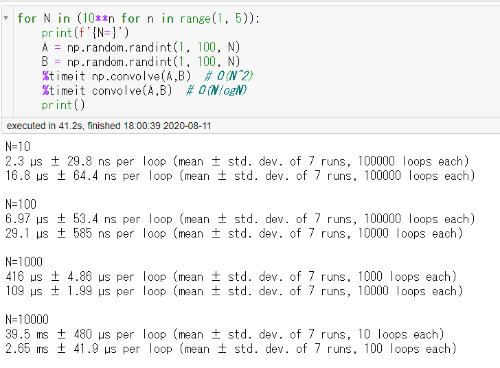
numpy 也有卷积用的函数 numpy.convolve。它的复杂度是 $\Theta(N^2)$。

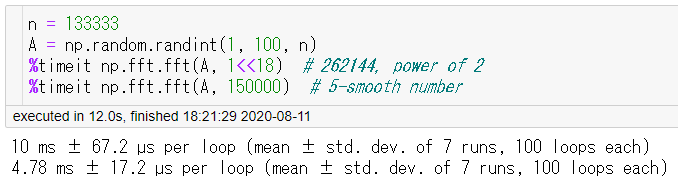
长度约 1000 起，基于 FFT 的方法更快。

#### $n$ 的选择

fft 所用的长度不一定要是 $2$ 次幂。下一个 $2$ 次幂很远时，选能分解为小素数的适当长度也可能性能更好。

### mod p 下的计算

设 $f,g$ 为 $n$ 次多项式，想计算积 $h = fg$。特别地，在竞技编程语境中常见要求 $\pmod{p}$ 下计算。$p$ 一般为 $10^9+7$ 或 $998244353$。

此时计算误差成为问题。当 $|f_i| < p$, $|g_j| < p$ 时 $|h_i| < np^2$，但 $n=10^5$ 且 $p=10^9+7$ 时 $np^2$ 约达 $10^{23}$，远超 64bit 浮点数能正确计算的范围。

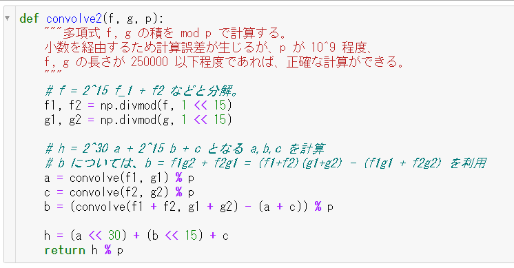
因此可用把上下各 $15$ bit 分开的技巧。

令 $f = 2^{15}f_1 + f_2$, $g = 2^{15}g_1 + g_2$，变形为 $fg = 2^{30}f_1g_1 + 2^{15}(f_1g_2+f_2g_1) + f_2g_2$。系数小的多项式之积，能用 64bit 浮点数的有效数字正确计算，把它们合起来回到 $fg$ 的计算。除卷积（多项式之积）外，也作为矩阵之积中轻松回避溢出的技巧可用。

$f_1g_2+f_2g_1$ 通常想来需 $2$ 次卷积，但用巧妙方法省了 $1$ 次。这与 Karatsuba 法做同一件事。

这样，应能应对竞技编程中要求 FFT 的大部分情形。

另外，FFT+$\bmod p$ 计算需 $3$ 次卷积，但对可取 $1$ 的 $n$ 次根的 $p$，在域 $\F_p$ 上应用 FFT（也称 NTT）的情形更快。以此为正解的问题大多是 $p=998244353$。numpy.fft 没有这个，所以要么接受慢 $3$ 倍，要么自己学 NTT 实现。

<a id="am17-segtree2"></a>
## Segment Tree 的学习 (2) 延迟传播（遅延伝搬 Segment 木のお勉強）

目标是把延迟传播 Segment Tree 从 $0$ 开始实现，认真自学了一遍。难得，所以写成文章。

### 目录

- 概要
- 参考文献
- 可视化
- 区间作用
- 区间积
- 1 点更新
- 取得要传播的下标

### 概要

前回 → Segment Tree 的学习 (1) 为前提。

能进行 1 点更新、区间作用、区间积获取的 Segment Tree。

所谓非递归实现

1-based index

不假设 $N=2^n$

 monoid $A$ 右作用于 monoid $X$。各自 monoid 的二元运算用积形写为 $$\begin{align*}A\times A\longrightarrow A;\quad (a,b)\mapsto ab,\\X\times X\longrightarrow X;\quad (x,y)\mapsto xy\end{align*}$$。作用写为 $$X\times A\longrightarrow X;\quad (x,a)\mapsto x^a$$ 的指数形。

 monoid：满足结合律 $(xy)z = x(yz), (ab)c = a(bc)$（也有单位元）。

右作用：满足 $(xy)^a=x^ay^a$, $x^{ab} = (x^a)^b$（另外假设单位元的作用是平凡的等）。

本文不处理 monoid、作用的具体例。左作用（$(ab)x = a(bx)$）也行，那个看喜好。是时系列顺序中后做的作用想用 $A$ 的运算挂在左右哪边。

写 $x_i$ 等则是 monoid $X$ 的元素。$a,b,c$ 等是 $A$ 的元素。给定 $X$ 的元素列 $[x_0,x_1,\ldots,x_{N-1}]$ 时，处理

- 改变 $x_i$ 的值
- 把 $x_L,\ldots,x_{R-1}$ 同时改为 $x_i^{a}$
- 计算 $\prod_{L\leq i < R} x_i$

的 Segment Tree。利用 $x_1^ax_2^ax_3^ax_4^a = (x_1x_2x_3x_4)^a$ 等成立，把对区间积的作用汇总计算，从而实现每查询 $O(\log N)$ 次运算（monoid 的运算或作用）。

作用也有依赖于元素数或两端下标者，但那种也能在此框架下处理。例如取 monoid $X$ 时，令 $Y = \N\times\N\times X$，把 $y_1=(L_1,R_1,x_1)$ 与 $y_2=(L_2,R_2,x_2)$ 的积定义为 $(L_1,R_2,x_1x_2)$ 的 monoid $X$（适当加单位元），就能把两端下标包含进作用的定义。当 $R_1 = L_2$ 不成立时虽应视为未定义、或视为处理的是范畴而非 monoid，但不管它继续。

边观察实现，特别是具体值上仔细可视化算法，目标是获得能立刻从 $0$ 实现的老练理解。

### 参考文献

- data-structures / Lazy Segment Tree https://scrapbox.io/data-structures/Lazy_Segment_Tree
- 延迟传播 Segment Tree 能做的操作与复杂度简洁总结。
- 关于延迟传播分段树的 https://beet-aizu.hatenablog.com/entry/2017/12/01/225955
- monoid、作用的例等。
- Efficient and easy segment trees https://codeforces.com/blog/entry/18051
- 假设了交换性。1-based, 非递归。
- 想默写延迟评价分段树的人 http://tsutaj.hatenablog.com/entry/2017/03/30/224339
- 0-based, 可交换, 递归。
- 非递归版延迟评价分段树的实现备忘 https://smijake3.hatenablog.com/entry/2018/11/03/100133
- 0-based, 可交换, 非递归。
- 分段树之上承载的结构不是 monoid 而是范畴 https://kimiyuki.net/blog/2018/12/06/categories-on-segment-tree/
- 如文章标题。

### 可视化

我的实现例：https://yukicoder.me/submissions/470340

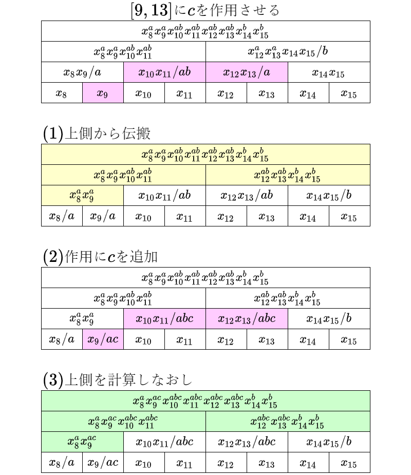
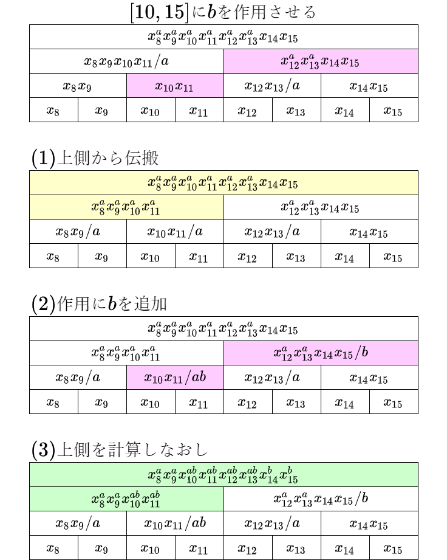
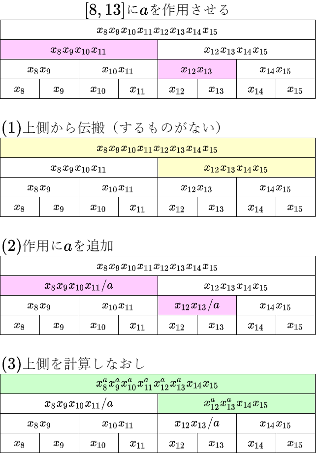
首先以 $N = 8$ 来做。在放代码前，先一味地可视化“做什么会怎样”吧（这点尤其非交换时不够充实，很困扰）。

#### 区间作用

省略作用元的单位元。把目标区间分割为 $O(\log N)$ 个区间，在那里追加作用元。这立刻能想象。此外还需前处理与后处理，需要如下 $3$ 步：

- （１）作用元的传播
- （２）作用元的追加
- （３）再计算

实际行为的图示，我个人觉得很有助于理解。其实只看这个就感觉能自己实现。

单元格的数据 $(x,a)$ 大致意味着对应区间积为 $x$、且作用元 $a$ 正作用着。不过，要包含该单元格上方的所有作用元一起评价，才能第一次得到正确值。可观察到越上段作用元的反映越完成，越下段作用元的反映越延迟。为何越上方越优先反映完？因为有如下区别：

- 某单元格从其正上方全部拿到信息很简单（$O(\log N)$ 个）
- 某单元格从其正下方全部拿到信息很难（$O(N)$ 个）

下段单元格没能持有最新作用元，但需要时能立刻从上方拿到。另一方面，若需要时才慌忙去拿下方信息，不知所需者在哪，所以更新某单元格时必须那一瞬把计算反映到上部（步骤（３））。

步骤（１）在作用元可交换时不需要。作用非交换时，须注意别让作用顺序迷路。因此，先把要追加作用的区间上部改写为没有作用元残留的状态，再追加作用元。保持“上方的”作用元比“下方的”作用元在时系列顺序上后追加的状态。

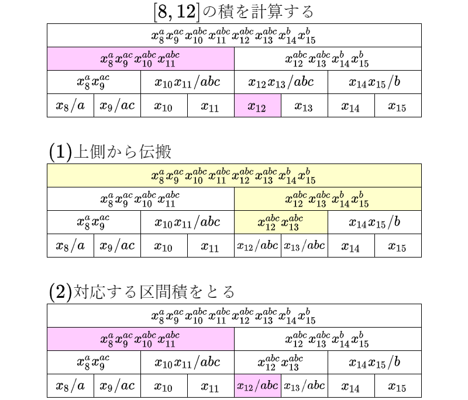
实现确认留后，区间积的计算、1 点更新的计算也先可视化。

#### 区间积

该做的很简单。对参照的区间，传播来上方的作用元。其余与普通（无延迟传播的）Segment Tree 相同。上例计算积 $x_8^ax_9^{ac}x_{10}^{abc}x_{11}^{abc}x_{12}^{abc}$。

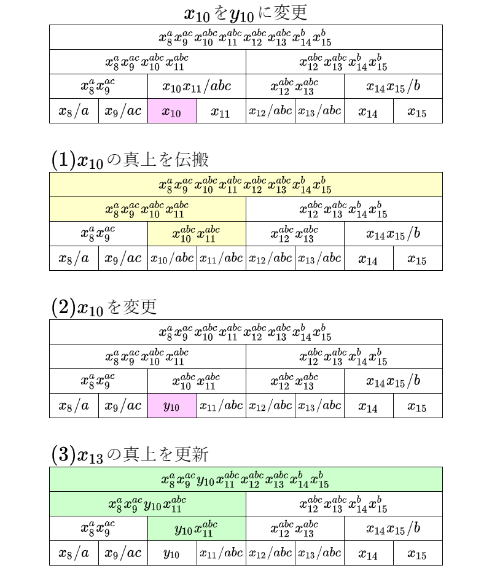
#### 1 点更新

只要把含目标点的区间里残留的作用元传播掉，其余只需从下段更新上去。（１）中传播时计算了 $x_{10}^{abc}x_{11}^{abc}$ 部分，但这里反正会被重算，所以也能省略（实现仅稍增）。

#### 取得要传播的下标

区间作用 （１）（３）

区间积 （１）

各自需要对目标单元格正上方的单元格群做作用元传播或再计算。只要知道那群单元格到底是什么，实现的难点就结束了。

以 $N=40$, $L=45$, $R=78$ 可视化一下。

作用元与积的计算对象是粉色单元格，传播或再计算的是黄色单元格。

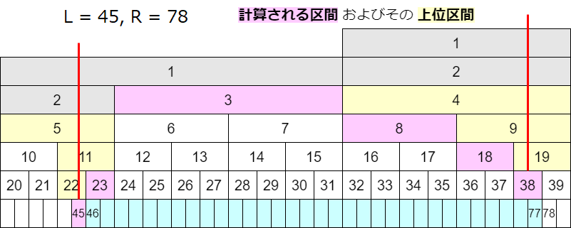
因非 $N=2^n$ 的图，例常一部分会进异常值。

排列在计算对象区间正上方的区间。其实只需看“左端、右端的计算对象区间”的正上方就够了。上图情形即 $45$ 号、$38$ 号单元格的正上方。

因此，只要能取得两端的计算对象区间即可。回想 Segment Tree 的区间积计算。只看下标迁移，是这样的感觉：

```
while L < R:
    if L & 1:
        (乘上单元格 L 的值)
        L += 1
    if R & 1:
        R -= 1
        (乘上单元格 R 的值)
    L >>= 1
    R >>= 1
```

特别地，确认到初次成为计算对象之前的迁移极简单。$L$, $R$ 都是一直除以 $2$ 直到变奇数。

因此，对区间 $[L,R)$ 作用 $a$ 时，例如如下即可：

```
L0 = L // (L & -L)  # L 除以 2 直到变奇数
R0 = R // (R & -R)  # R 除以 2 直到变奇数
(传播 L0 的正上方)
(传播 R0 的正上方)
while L < R:
    if L & 1:
        (对 L 追加作用元 a)
        L += 1
    if R & 1:
        R -= 1
        (对 R 追加作用元 a)
    L >>= 1
    R >>= 1
(再计算 L0 的正上方)
(再计算 R0 的正上方)
```

对某单元格的正上方，注意传播：从上到下顺序、再计算：从下到上顺序，实现即完成。再计算就是平时的。

```
while i > 1:
    i >>= 1
    (用 2i, 2i+1 的值计算 i 的值)
```

传播从上到下顺序进行。注意 $i$ 上方第 $n$ 个单元格是 $\lfloor\frac{i}{2^n}\rfloor$，这也只是简单循环：

```
h = (使 2^h <= i 成立的最大 h)
for n in range(h, 0, -1):
    (在 i >> n 处传播)
```

<a id="am18-segtree1"></a>
## Segment Tree 的学习 (1)（Segment Tree のお勉強 (1)）

延迟传播 Segment Tree 日后另文。→ Segment Tree 的学习 (2)

### 目录

- 概要
- 参考文献
- 实现・可视化
- 初始化
- 1 点更新
- 区间获取
- 不假设 $N=2^n$ 的情形
- 顺便

### 概要

处理 monoid 的数列。能进行 1 点更新、区间积获取的 Segment Tree。

所谓非递归实现

当作获取性能的手段来学，结果反而觉得这样更易懂。

1-based index

不假设 $N=2^n$

意外地文献少，自己画图前都不太能接受。

Segment Tree 文献丰富，但这边的条件也散乱、想细究的微妙没全齐（或前提了交换律、或没有实现解说等），为加深理解需在文献间游荡，花了时间。为自己也整理一次。

写 $x_i$ 等则是 monoid $X$ 的元素。给定 $X$ 的元素列 $[x_0,x_1,\ldots,x_{N-1}]$ 时，处理

- 改变 $x_i$ 的值
- 计算 $\prod_{L\leq i < R} x_i$

的 Segment Tree。边观察实现，特别在具体值上仔细可视化算法，目标是获得能立刻从 $0$ 实现的老练理解。

### 参考文献

- data-structures / Segment Tree https://scrapbox.io/data-structures/Segment_Tree
- Segment Tree 能做的操作与复杂度简洁总结。
- beet さん Segment Tree 文章汇总 https://beet-aizu.hatenablog.com/entry/2019/11/27/125906
- monoid 的例等使用例丰富。另外虽不是文章，实现参考了 beet さん的。
- Efficient and easy segment trees https://codeforces.com/blog/entry/18051
- 大体相同实现方针。代码说明仔细。注意多处假设了交换律。
- 蚂蚁本 p. 153
- 2 次幂, 递归, 0-based
- 想默写分段树的人 http://tsutaj.hatenablog.com/entry/2017/03/29/204841
- 与蚂蚁本（大概）相同实现的详细解说
- 非递归 Segment Tree 最棒！最爱的 Segment Tree https://hcpc-hokudai.github.io/archive/structure_segtree_001.pdf
- 与本文同方针。也有 $N\neq 2^n$ 的图，也处理二分探索。

### 实现・可视化

我的实现例：https://judge.yosupo.jp/submission/7795

首先以 $N = 8$ 来做。

#### 初始化

```
def build(self, seq):
    for i, x in enumerate(seq, self.N):
        self.X[i] = x
    for i in range(self.N - 1, 0, -1):
        self.X[i] = self.X_f(self.X[i << 1], self.X[i << 1 | 1])
```

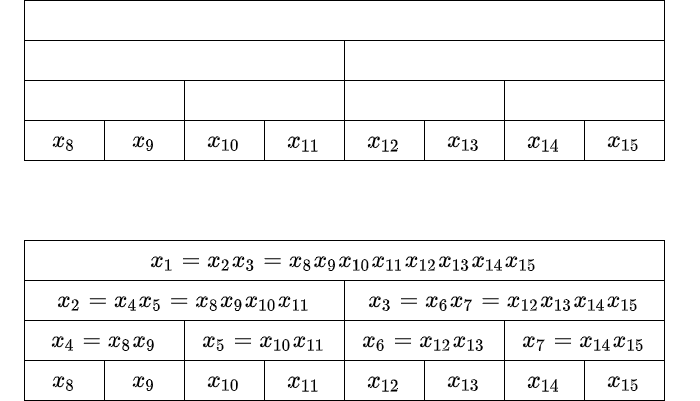
实际数据放在下标 $[N, 2N)$ 部分。设下标 $i$ 处数据为 $x_i$ 时，使 $x_i = x_{2i}x_{2i+1}$ 成立。可从后往前顺序算。

#### 1 点更新

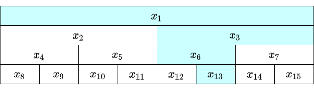
```
def set_val(self, i, x):
    i += self.N
    self.X[i] = x
    while i > 1:
        i >>= 1
        self.X[i] = self.X_f(self.X[i << 1], self.X[i << 1 | 1])
```

改写最下段适当位置，就此往上。对含某元素的区间，把下标不断除以 $2$ 即可迁移。

#### 区间获取

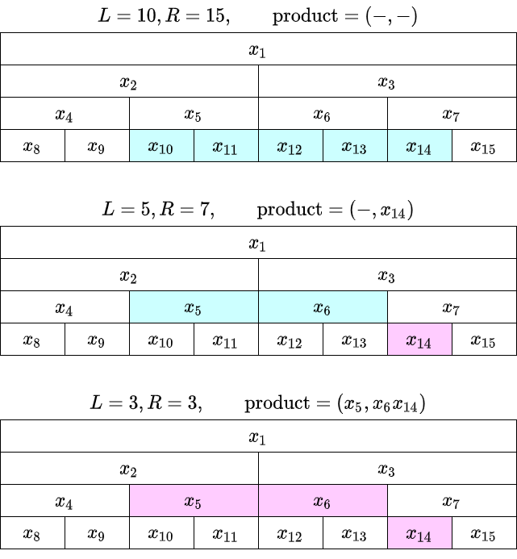
```
def fold(self, L, R):
    L += self.N
    R += self.N
    vL = self.X_unit
    vR = self.X_unit
    while L < R:
        if L & 1:
            vL = self.X_f(vL, self.X[L])
            L += 1
        if R & 1:
            R -= 1
            vR = self.X_f(self.X[R], vR)
        L >>= 1
        R >>= 1
    return self.X_f(vL, vR)
```

所谓非递归实现，是从外侧算进来。除“左侧已算的积、右侧已算的积”外，还持有“未计算的区间 $x_L,\ldots,x_{R-1}$”来循环。

$L$ 为奇数时当场算 $x_L$，$R-1$ 为偶数时当场算 $x_{R-1}$。其余部分两个两个的积已汇总进同一父节点，故把计算委让到上一段。虽没意识到，最终是左起奇数编号、右起偶数编号的 $x_i$ 被乘起来呢。

不假设交换律的实现中，注意积的顺序。例如上例中注意别把右侧积变成 $x_{14}x_6$。

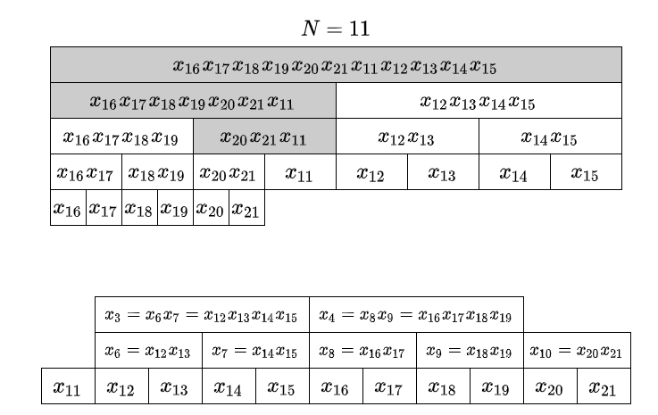
若假设交换律，则无需分左右持有计算过程，按喜欢的顺序从喜欢的方向不断追加到计算结果即可。

#### 不假设 $N=2^n$ 的情形

其实完全相同的代码就能动。初听时很惊讶。例如以 $N=11$ 画图。

上面的图见过，但觉得下面的图更适合理解（个人差异？）。

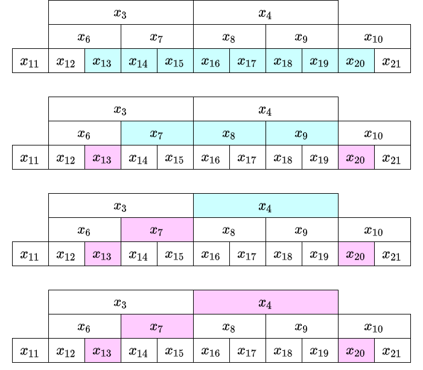
像至今那样，按 $x_i = x_{2i}x_{2i+1}$ 的规则填。填满所有格，但此时一部分 $x_i$ 会进不对应区间积的异常值（$x_{5}=x_{20}x_{21}x_{11}$ 等）。但这些值不被用于计算，所以其实不会坏。

回想区间积的计算。只是从最下段起，孤立的两端计算。两个两个能汇总的区间归约到上一段。虽说会产生一部分进异常值的地方，但两个两个汇总、其上正常值所在处的上方也进正常值，所以区间积计算正常运作。

### 顺便

$x_1 = x_{16}x_{17}x_{18}x_{19}x_{20}x_{21}x_{11}x_{12}x_{13}x_{14}x_{15}$ 呢。

无论 $N$ 如何，$x_1$ 都这样进全体元素的积。不过因积的顺序坏了，是异常值之类。

但若说可交换 monoid，则 $x_1$ 成为正常的全体元素积。记住的话，或许常有用？

续 → Segment Tree 的学习 (2)

<a id="am19-euler-tour"></a>
## Euler Tour（Euler Tour のお勉強）

整理自己学过的东西。

没有新颖性或强主张。

### 目录

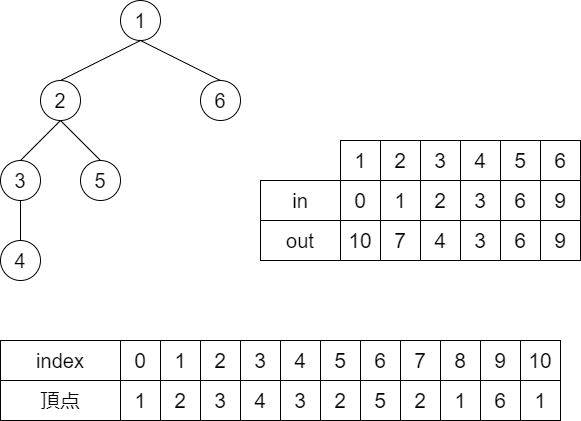
- Euler Tour
- 排列走过的边
- 各类查询
- 子树查询
- 路径查询
- LCA

### Euler Tour

- (1) 按 DFS 顺序探索，记录走过的顶点列（$1,2,3,4,3,2,5,2,1,6,1$）。
- (2) 对各顶点 $i$，记住最初经过的时刻与最后经过的时刻 $\mathrm{in}[i]$, $\mathrm{out}[i]$。

参考：
- 蚂蚁本 p. 294（虽没出现 Euler Tour 之名）由 Euler Tour 计算 LCA。

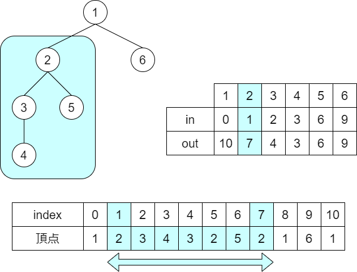
虽排列出现的顶点，但计算上更需要的是 $\mathrm{in}[i]$, $\mathrm{out}[i]$。例如看闭区间 $[\mathrm{in}[i], \mathrm{out}[i]]$，有“可知以 $i$ 为根的子树 $\mathrm{subtree}_i$ 的顶点”这一特征。于是能把对树的主要计算之一部分，改说成对区间的计算。

### 排列走过的边

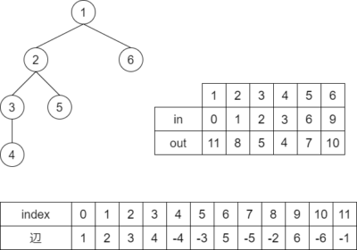

*66*
与蚂蚁本解说同样，“按顺序排走过的顶点”我以为是 Euler Tour 的基础。搜博客文章，这种说明似乎更多（不过找的话，下面讲的、以边为基础的解说也存在多个）。给顶点 $i$ 靠根侧的边编号为 $i$。从上往下经过时排 $+i$，从下往上经过时排 $-i$。

边 $1, -1$ 实际不存在，但作为对应“现在要开始探索！”“探索结束了！”这种“移动”而添加。$\pm v$ 恰好各记录 $1$ 次，那就是 $\mathrm{in}[i]$, $\mathrm{out}[i]$。

※ 即使排顶点的说明也会生成同样的 in, out 表，所以并非在做特别新、能算出新东西的事。

只是个人觉得这样更易懂。

首先很干净。所有边双向各出现 $1$ 次。子树范围易看，且表示子树的区间彼此完全包含或不相交，个人也更易意识。因 $\mathrm{in}[i], \mathrm{out}[i]$ 之间子树边出现 $2$ 次，子树边数等于 $\frac12(\mathrm{out}[i]-\mathrm{in}[i]-1)$ 也易懂（顶点数比它 $+1$）。另外例如下面的事实，也是直到想排列边才意识到的：

- Euler Tour 与对应的括号列，在适当意义下对应。
- $N$ 顶点标号树
- 对子树 $T$ 有 $\min(T) = \operatorname{root}(T)$
- 对不相交子树 $T_1, T_2$ 成立 $\max(T_1) < \min(T_2)$ 或 $\min(T_1) > \max(T_2)$（分大侧小侧）

来数有多少个，答案大概是 Catalan 数？
— maspy (@maspy_stars) April 20, 2020

从“排过的边”复原“排过的顶点”很简单，把各边的终点对应即可转换（边 $+i$ 对应顶点 $i$、边 $-i$ 对应顶点 $\mathrm{parent}[i]$）。反向稍费事（需看 in, out、前后顶点）。所以曾想“排所有顶点而成的列”几乎没优势？

### 各类查询

#### 子树查询


设所有顶点（边）都持有值。顶点 $i$ 的值记为 $v_i$、边 $i$ 的值记为 $e_i$（假设取值于可交换 monoid）。

能计算以顶点 $i$ 为根的子树的和。为不重复计算同一顶点，仅对向下的边持有值。

例如以空栏为单位元用 Segment Tree，就能做值的 1 点变更、子树获取。同样的事，用延迟传播 Segment Tree 也能对应子树更新吧。若是群，或许也能用累积和或 Fenwick Tree 替换。


如所见，这样持有 index 时，只用数组一半。“仅对向下的边持有值”刚说过，所以只用向下移动就能把数组变小。beet さん的文章中称为顶点属性的 Euler Tour。我不学无术，没实现过。

#### 路径查询

考虑从根到某顶点 $i$ 的路径时，能获取此路径上顶点・边的值的和。


各时刻，使累积和与计算对象一致。取值于群（可逆元可取）时这可行。不要求可交换性。可得 父 → 子 顺序的和（适当做也可得 子 → 父 顺序）。

#### LCA

蚂蚁本有，所以以为有名，但这是 Euler Tour 最费思量的用法。


想成“含两顶点的最小子树”不太行，改成“从 $i$ 向 $j$ 按 DFS 顺序移动时经过的、最靠根的顶点”这一绝妙改说，就归约为区间最小值计算。上例中以边 $-2$ 的终点，可算 $\mathrm{LCA}(3,6) = 1$。

不过看下面时，觉得“含两顶点的最小子树”这种看法也知道一下有用：

- Euler Tour 顺序取最大与最小的 LCA，与集合的 LCA 一致，所以 log 只有 1 个
— 熨斗袋 (@noshi91) April 17, 2020

“含所有顶点的子树”可改说为“含所有顶点的区间”，所以求“$n$ 点的 LCA”时，只需看最左与最右的即可。取 $n$ 个的 max 或 min 后再算 $2$ 点的 LCA，就能算 $n$ 点的 LCA。

<a id="am20-rolling-hash"></a>
## Rolling Hash 与冲突概率的下界（Rolling Hash を殺す話 / 乱択と衝突確率）

不提出新的数值设定或实现方法。

对冲突概率的下界，做了未见过的考察，故记之。

### 目录

- 前提知识
- Rolling Hash 是什么
- 对抗性输入与随机算法
- 基本评价
- 参考文献
- 对冲突概率的详细考察（本文主题）
- Appendix
- 参考
- 致谢

### 前提知识

本文为简单，设字母表为 $\Sigma = \{0,1,\ldots,\sigma-1\}$。若是英文字母，用 ASCII 码把字母对应到小于 $128$ 的整数，或平移对应到小于 $26$ 的整数，就能把字母视为整数。

### Rolling Hash 是什么

Rolling Hash 是把字符串 $S = S_0,S_1,S_2,\ldots$ 如下 Hash 化的手法：

**【Rolling Hash】** 以某方法取模 $m$、基数 $r$。字符串 $S = S_0,S_1,S_2,\ldots$ 的 Hash 值定义为 $\mathrm{hash}(S) = \sum S_i r^i\pmod{m}$。

计算的容易性，特别是适当预处理下任意子串的 Hash 值都能每件 $\Theta(1)$ 时间算出，这一点出色。对此 Hash 值，期待如下。

**【期待】** $\mathrm{hash}(S)$ 在 $\pmod{m}$ 下大概随机吧。因此对字符串 $S, T$ $(S\neq T)$，$\mathrm{hash}(S) = \mathrm{hash}(T)$ 的概率大概 $1/m$ 吧。

例如以下条件成立时这是正确的：

- $r$ 与 $m$ 互素。
- $N$ 为充分大的自然数，$S$, $T$ 是从长度 $N$ 以下字符串全体中完全随机选的。

顺便，连此主张的证明似乎都没见过，故本文末尾以附录记之。

### 对抗性输入与随机算法

此主张虽正确，但由此唱此 Hash 函数的万能性却不行。上述条件中，前提 $S, T$ 从任意字母列完全随机选。但例如“从世间书籍随机选的长度 $N$ 字符串”这种情形，输入字符串应有某种偏倚（例如元音 a, i, u, e, o 的出现比例会比 $1/\sigma$ 高）。对有偏倚的字符串群，上述概率分析未必成立。

特别这种概率分析中，作为 worst case 的、对（对抗性的/恶意的）输入的概率分析常被讨论。本文也以此为主题。

**【问题】** 攻击者可在确认 $m$, $r$ 的选择算法后，选字符串 $S$, $T$ $(S\neq T)$。把 $\mathrm{hash}(S) = \mathrm{hash}(T)$ 的概率压低（对可实现的概率做考察）。

无论多巧妙地定值，一旦使用的 $m, r$ 值被固定，那一刻就完全败北。那怎么办？解决这种问题的一般方法有随机算法。特别地讨论如下解决策。

**【随机算法】** 预先固定 $m$。随机取 $0\leqq r < m$。用此 $m, r$ 计算 Hash 值。

用随机化，即使对抗性攻击者也难故意造成 hash 冲突。

### 基本评价

**【定理１】** 把 $m$ 作素数用上述手法，则对任一长度 $N$ 的字符串 $S, T$ $(S\neq T)$，$\mathrm{hash}(S) = \mathrm{hash}(T)$ 的概率在 $\frac{N}{m}$ 以下。

证明如下。

$\mathrm{hash(S)}$ 等于某多项式 $f_S$ 的值 $f_S(r)$。Hash 冲突发生的条件可写为 $f_S(r)-f_T(r) = 0$。$f = f_S-f_T$ 是 $0$ 次以上的 $N$ 次以下多项式。在体中，$0$ 次以上的 $N$ 次以下多项式至多只有 $N$ 个根，故使 Hash 冲突的 $r$ 至多 $N$ 种。因此若随机取 $r$，其概率在 $\frac{N}{m}$ 以下。

注意1：在体中，$N$ 次多项式根在 $N$ 个以下，由因式定理可知。在实数或复数证过的人，请确认在任意体完全相同。$N$ 个解存在则 $f(x) = 0\iff c(x-a_1)\cdots(x-a_N) = 0$ 这样变形，再由是体知无其他解。

注意2：任意环不成立，例如环 $\Z/8\Z$ 中 $2$ 次方程 $x^2 -1 = 0$ 有 $4$ 个解 $x=1,3,5,7$。

### 参考文献

- （１）hos さん： 让 Hash 冲突的话
- （２）eto_nagisa さん：杀 Rolling Hash 的话
- （２’）相关题 → yukicoder No.3014 关于多项式 Hash 的教育性问题
- （３）keymoon さん：安全又爆速的 Rolling Hash 的话

以下举笔者所认要点。

- （１）结论上，述“即使 $\pmod{2^{64}}$ 的 Rolling Hash 随机取基数 $r$，也能以概率 $1$ 造成冲突”。这正缺上述定理中“ $m$ 为素数”的条件，可知能构造有很多根的多项式。可知好 Rolling Hash 的条件中，模为素数很重要。
- （２）对好 Rolling Hash 的要求更具体汇总。说明即使固定 $r$、并用多个 Hash 也会被攻击。还详细说明了进行攻击的具体算法。可知随机取基数 $r$ 很重要。
- （３）在满足以上 Rolling Hash 要求之上，提出了在 64bit 整数范围内性能好的 Rolling Hash 构造法。只想得好实现的话，这里举的是最捷径。

### 对冲突概率的详细考察（本文主题）

固定素数 $m$ 随机取 $r$ 时，考察对抗性输入的 Hash 冲突概率。此问题可改写如下。

**【问题】** 考虑 $N$ 次多项式 $f = \sum_{i=0}^N a_i x^i$（其中 $0\leqq |a_i| < \sigma$）。巧妙取 $f\neq 0$ 使根尽量多时，评价根的个数 $\mathrm{root}(N)$。

关于此问题，报告得到如下结果。

**【定理２】** 成立：
$$\biggl\lceil\frac{N+1}{\log_{\sigma}m}\biggr\rceil – 1 \leqq \mathrm{root}(N)\leqq N.$$

右边是【定理１】所得的自明评价。左边是本文的主结果，给出“固定模、随机取 $r$”情形的非自明性能界限。即，采用“固定 mod 与随机取 $r$”这一手法时，不得不接受冲突概率约 $\frac{N+1}{m\log_{\sigma} m}$ 的攻击。

来证明。如下定义集合 $A$, $A_+$：
$$A = \{f(x) = \sum_{i=0}^N a_ix^i\mid 0\leqq |a_i| < \sigma\},\qquad A_+ = \{f(x) = \sum_{i=0}^N a_ix^i\mid 0\leqq a_i < \sigma\}.$$

只需证存在 $k = \bigl\lceil\frac{N+1}{\log_{\sigma}m}\bigr\rceil – 1$ 个根的 $f \in A\setminus \{0\}$。特别地，证存在使对 $r=0,1,\ldots, k-1$ 有 $f(r) = 0$ 的 $f\in A \setminus \{0\}$。

用 $\mathrm{eval}\colon A_+\longrightarrow (\Z/m\Z)^k$，$\mathrm{eval}(f) = \bigl(f(0), f(1), \ldots, f(k-1)\bigr)$ 定义。成立 $|A_+| = \sigma^{N+1}$, $|(\Z/m\Z)^k| = m^k$，且由 $k$ 的取法成立 $|A_+| > |(\Z/m\Z)^k|$。因此某 $f_1, f_2\in A$（其中 $f_1\neq f_2$）满足 $\mathrm{eval}(f_1) = \mathrm{eval}(f_2)$。它们的差 $f = f_1 – f_2 \in A$ 满足条件。由此存在得证。

注意：非构造性的存在证明。虽证了存在，基于此证明方法的攻击或许困难。

题外话：出题 https://yukicoder.me/problems/no/1017 的翌日，惊讶地遇到了能用它的问题。

### Appendix

本文开头述，当无对抗性攻击者、输入完全随机时，成立如下期待。

**【期待】** $\mathrm{hash}(S)$ 在 $\pmod{m}$ 下大概随机吧。因此对字符串 $S, T$ $(S\neq T)$，$\mathrm{hash}(S) = \mathrm{hash}(T)$ 的概率大概 $1/m$ 吧。

给证明。这也似乎没见过证明…？

**【定理３】** 固定互素正整数 $m, r$。取正整数 $N$，令 $A_+ = \{f(x) = \sum_{i=0}^N a_ix^i\mid 0\leqq a_i < \sigma\}$。当 $N$ 充分大时，对 $f\in A_+$，$f(r)\in \Z/m\Z$ 均等分布。即对任意 $k$ 成立 $\lim_{N\to\infty}\frac{|\{f\in A_+\mid f(r) = k\}|}{|A_+} = \frac{1}{m}$。

本文当作附赠，只留方针说明。有稍难的行间，敬请见谅。

只需证使 $r^i \equiv 1\pmod{m}$ 的 $i$ 全体集合 $I$ 中 $\sum_{i\in I} a_i$ 均等分布。用多项式调查此分布。

对充分大的 $N$ 与 $f = 1 + x + \dots + x^{\sigma-1}$，只需评价 $\sum_{i\equiv k\pmod{m}}[x^i]f^N$。令 $g = x^{m-k}f^N$，只需评价 $\sum_{i\equiv 0\pmod{m}}[x^i]g$。

此值可用 $1$ 的 $m$ 次根全体 $\mu_m = \{e^{2\pi i\cdot (j/m)}\in\C \mid 0\leqq j < m\}$ 写为 $\frac{1}{m}\sum_{\zeta\in \mu_m}g(\zeta)=\frac{1}{m}\sum_{\zeta}\zeta^{m-k}f(\zeta)^N$。对 $N$，是公比为 $f(\zeta)$ 的等比数列的线性组合。复绝对值 $|f(\zeta)|$ 仅当 $\zeta = 1$ 时取最大值 $\sigma$。$N\to\infty$ 极限中其他 $\zeta$ 的贡献被忽略，得到 $N\to\infty$ 极限下的均匀分布。

### 参考

定理3收敛到均匀分布处，用特征函数似是标准（本质在做同样的事）。把 $i = 1,\ldots,N$ 的 $A_i$ 当作 $0,\ldots,\sigma-1$ 上独立均匀分布，则 $E[\exp(it (A_1 + \ldots + A_N))] = E[\exp(it A_1)]^N$，故 $t = 0$ 时为 $1$、$t = 1,\ldots,m-1$ 时收敛到 $0$。
— Mori (@Ryuhei_Mori) April 5, 2020

考虑 $0,1,\ldots, \sigma – 1$ 均匀变动的随机变量 $X$ 加 $N$ 个的分布。对随机变量 $X$，其矩母函数 $M_X(t) = E(e^{tX})$ 或特征函数 $\phi_X(t) = M_X(it)$，对独立随机变量 $X_1, \ldots, X_N$ 有 $M_{X_1+\cdots+X_n}(t) = \prod_i M_{X_i}(t)$ 的性质，是分析概率分布卷积的定石手法（与 Fourier 变换几乎相同，函数卷积转换为点积的）。

本次情形，由 $N$ 个和 $X = X_1 + \cdots + X_N$ 满足 $\phi_X(t) = \phi _{X_1}(t)^N$，也能简洁计算 $E(e^{i tX})$（相当于上述 $g(\zeta)$）。

### 致谢

讨论与文章细节，是与 noshi91 さん讨论中完成的。

<a id="am21-matroid"></a>
## Matroid 与贪心法（マトロイドを知っていれば一発）

问题文 → ■
自己的提交 → ■（竞赛外）
官方解说 pdf → ■

官方解说 pdf，特别是“知道 matroid 就一发”的部分，学了 matroid 基础、也看了别人处理本题的博客等，却很难抵达潇洒的理解（“学 ○○ 就懂”“证明显载于 ○○”都很难到手）。也许有同样的人，故以我的方式整理理解记之。

### 目录

- 解法概要
- matroid 的定义・与贪心法的关系
- 定义
- 贪心法
- 证明是 matroid
- 向量 matroid (vector matroid)
- 闭路 matroid (cycle matroid)
- 本题的 matroid (Bicircular matroid, Pseudoforest matroid)
- 由秩函数刻画
- 秩函数的定义
- matroid 与秩函数

### 解法概要

非主题，不深究。

把格子 $(x,y)$ 改写为看作连接顶点“$x$行”与顶点“$y$列”的边的二分图问题。归约为从各顶点最多选 1 条边、最大化边价值和的问题。

考虑可取边集合应满足的条件。按连通分量，成立（边数）$\leqq$（顶点数）是必要充分条件。

对图 $G = (V,E)$（$V$ 顶点集、$E$ 边集），考虑 $E$ 的子集族 $F = \{X\subset E\mid \text{$X$ 满足 (2)}\}$。此 $F$ 是 matroid，因此本次最大化问题可适用贪心策略。

- 1. 的二分图 → 这是定石之一，有经验的话或许考察 0 就能做。
- 2. 的边集合条件 → 必要性简单得出。满足此必要性的图结构简单，充分性的考察也不难。

3. 的部分在解说 PDF 中相当轻描淡写带过。

但个人调查 matroid 定义与具体例（Wikipedia、“Introduction to Algorithms”、几个竞编程博客），再在其上想证明，也相当不顺畅（特别难感到“多亏 matroid 理论省了思考”）。

- → “可适用贪心策略”毕竟是基础一般论。查 matroid 几乎必有证明。
- → “此 $F$ 是 matroid”却很难清爽懂。特别难感到“多亏 matroid 理论省了整个问题的思考”。
- → 证明是 matroid 时的思考模式稍整理出来了，想必也有在同处苦战的人，故记成文章。
- → 最终发现此 $M$ 本身也是有 Bicircular matroid、Pseudoforest matroid 等名字的 matroid。深学 matroid 的话也知道这种例，“知道 matroid（含此具体例）就一发”地写的解说或许就是这心情。

### matroid 的定义・与贪心法的关系

#### 定义

先大体抄 Wikipedia。有限集 $E$ 与 $E$ 的子集族 $F\subset 2^E$ 满足

- $\emptyset \in F$.
- $X\subset Y\in F \implies X\in F$.
- $X,Y\in F, |X|>|Y| \implies \exists x\in X\setminus Y, Y\cup\{x\} \in F$.

时，称 $(E,F)$ 为 matroid。

#### 贪心法

matroid 中的成本最大化问题，可用 Kruskal 法的要领解。更形式地：

- 给定成本函数 $c\colon E\longrightarrow \mathbb{R}_{+}$，对 $X\in F$ 想最大化成本和 $c(X) = \sum_{x\in X} c(x)$。
- 从 $X = \emptyset$ 开始。
- 从 $c(e)$ 大的 $e\in E$ 起顺序看，“若 $X\cup\{e\} \in F$ 则把 $X$ 改写为 $X\cup\{e\}$”重复。
- 对所有 $e\in E$ 做此操作所得 $X$ 即为最大化问题的解。

证明也不难。追证明同时与 Kruskal 法证明对照，我觉得 matroid 像是“抽出抽象化 Kruskal 法证明所需要素”的东西。

### 证明是 matroid

本文主题。学了上述 matroid 定义与性质，若终究不能判定或证明是否 matroid，则对具体问题适用困难。特别，交换性

- $X,Y\in F, |X|>|Y| \implies \exists x\in X\setminus Y, Y\cup\{x\} \in F$

的证明每次从零生出这种思考法，终究辛苦不断。

边确认几个 matroid 交换性的证明，边确认共同战略。

#### 向量 matroid (vector matroid)

觉得图比向量空间难的人，跳过读下例也好。

固定向量空间 $V$ 的有限子集 $E$，令 $F$ 为 $E$ 的线性无关子集全体。证是 matroid，特别证交换性。

对 $E$ 的子集 $X$，记 $X$ 生成的 $V$ 子空间为 $\mathrm{span}(X)$，$r(X) = \mathrm{dim} (\mathrm{span}(X))$。成立 $X\in F\iff |X| = r(X)$。

设 $X,Y\in F, |X|>|Y|$。此时 $r(X) > r(Y)$。

令 $X\setminus Y = \{x_1,x_2,\ldots,x_n\}$，考虑把这些元一个个加到 $Y$。即令 $Y_k = Y\cup\{x_1,\ldots,x_k\}$，考虑列 $[Y = Y_0\subset Y_1\subset Y_2\subset \cdots \subset Y_n = X\cup Y]$（注：这些不保证属 $F$）。由 $r(Y) < r(X) \leq r(X\cup Y)$，存在 $r$ 初次增大的瞬间：某 $k$ 使 $r(Y) = r(Y_{k-1}) < r(Y_{k})$。

此时 $x_k\notin \mathrm{span}(Y_{k-1}) = \mathrm{span}(Y)$，故 $Y\cup\{x_k\}\in F$。交换性得证。

#### 闭路 matroid (cycle matroid)

固定图 $G = (V,E)$，令 $F$ 为不含闭路的边集合全体。证是 matroid，特别证交换性。

对 $E$ 的子集 $X$，记子图 $(V,X)$ 的连通分量个数为 $r(X)$。

$X\in F$ 时，各连通分量是树。故各连通分量成立 $\text{顶点数} = \text{边数} + 1$，整体成立 $r(X) = |V| – |X|$。

设 $X,Y\in F, |X|>|Y|$。由 $|V| = r(X) + |X| = r(Y) + |Y|$ 得 $r(X) < r(Y)$。

令 $X\setminus Y = \{x_1,x_2,\ldots,x_n\}$，考虑一个个加到 $Y$。即令 $Y_k = Y\cup\{x_1,\ldots,x_k\}$，考虑列 $[Y = Y_0\subset Y_1\subset Y_2\subset \cdots \subset Y_n = X\cup Y]$。由 $r(Y) > r(X)\geq r(X\cup Y)$，存在 $r$ 初次减少的瞬间：某 $k$ 使 $r(Y) = r(Y_{k-1}) > r(Y_{k})$。

边 $x_k$ 连接子图 $(V,Y_{k-1})$ 中相异的 2 连通分量。$Y$ 与 $Y_{k-1}$ 在顶点连通分量分解上无变化。故 $x_k$ 在子图 $(V,Y)$ 中也连接相异的 2 连通分量，所以 $Y\cup\{x_k\}\in F$。交换性得证。

#### 本题的 matroid (Bicircular matroid, Pseudoforest matroid)

用几个图论用语：

- 树 (tree)：略。另外只有 1 顶点 0 边的图也是树。
- 伪树 (pseudo-tree)：边数等于顶点数的连通图。竞编程方言似也称“なもりグラフ”。但不是森图。
- 森 (forest)：各连通分量是树。
- 伪森 (pseudo-forest)：各连通分量是树或伪树。

固定图 $G = (V,E)$，证 $F = \{X\subset E\mid (V,X) 是伪森\}$ 是 matroid，特别证交换性。

对 $E$ 的子集 $X$，记子图 $(V,X)$ 中树分量的个数为 $r(X)$。

$X\in F$ 时，各连通分量成立（顶点数）$-$（边数） $\in \{0,1\}$。此值为 $1$ 与分量是树等价。故整体成立 $r(X) = |V| – |X|$。

设 $X,Y\in F, |X|>|Y|$。由 $|V| = r(X) + |X| = r(Y) + |Y|$ 得 $r(X) < r(Y)$。

令 $X\setminus Y = \{x_1,x_2,\ldots,x_n\}$，考虑一个个加到 $Y$。即令 $Y_k = Y\cup\{x_1,\ldots,x_k\}$，考虑列 $[Y = Y_0\subset Y_1\subset Y_2\subset \cdots \subset Y_n = X\cup Y]$。由 $r(Y) > r(X)\geq r(X\cup Y)$，存在 $r$ 初次减少的瞬间：某 $k$ 使 $r(X) = r(Y_{k-1}) > r(Y_{k})$。

边 $x_k$ 在子图 $(V,Y_{k-1})$ 中连接“同一树分量的 2 点”或“相异树分量的 2 点”。$Y$ 与 $Y_{k-1}$ 中树分量无变化。故 $x_k$ 在子图 $(V,Y)$ 中也连接“同一树分量的 2 点”或“相异树分量的 2 点”或“相异树分量与伪树分量”，所以 $Y\cup\{x_k\}\in F$。交换性得证。

### 由秩函数刻画

对 3 个 matroid 给了交换性证明。证明本身也极像。各自关注

- 生成的向量空间维数
- 连通分量个数
- 树分量个数

几乎能写同样证明。另外，matroid 皆是“仅允许向此量增大的方向添加元”的那种子集。

这样，作为证明是 matroid 的一个方针，似乎有“找好量并观察”（一个个添加～）这种模式。不是突然想“证交换性！”，而是想找表示 matroid 的“好量”，我觉得证明前的思路相当清晰了。

这里说的“好量”在 matroid 理论中称为秩函数，可用秩函数刻画 matroid。即，“找好量观察以证 matroid 性”这一方针，理论上知对任意 matroid 适用。

#### 秩函数的定义

$E$ 为有限集。$r\colon 2^E\longrightarrow \mathbb{Z}_{+}$ 对任意 $X,Y\subset E$ 满足

- $r(X)\leq |X|$.
- $X\subset Y\implies r(X)\leq r(Y)$.
- $X\subset Y\implies r(X\cup\{x\}) – r(X) \geq r(Y\cup\{x\}) – r(Y)$.

时称为秩函数。最后条件称劣模（submodular），也有其他易解的等价改说（这里采用了与上述证明直接相连的条件）。

另外上述 matroid 性证明中出现的 $r$，全是秩函数或其变种（变号平移常数）。例如闭路 matroid 中，把“连通分量个数”改为“$|V| – $连通分量个数”重设为 $r$，就成了秩函数。

#### matroid 与秩函数

如下对应，有限集 $E$ 上的 matroid 与秩函数一一对应：

- $F\subset 2^E$ 是 matroid。此时 $r(X) = \max\{|Y|\mid Y\subset X, Y\in F\}$ 定义秩函数。
- $r\colon 2^E\longrightarrow \mathbb{R}$ 是秩函数。此时 $F = \{X\in 2^E\mid r(X) = |X|\}$ 定义 matroid。

后半从秩函数到 matroid 的对应，模仿上面重复 3 次的证明模式即可证。本文以“matroid 性证明的手段”为兴趣中心，故逆对应省略（不难）。

另外，所得 matroid 的两种刻画（主要部分）

- 满足交换性：$\forall X,Y\in F, |X|>|Y|, \exists e\in X\setminus Y,\ldots$
- 存在秩函数：$\exists r\colon 2^E\longrightarrow \mathbb{Z}_{+}, \forall X,Y\in E,\ldots$

对照看，“$\forall, \exists$”的顺序被调换也很有趣。一般，比起 $\forall$ 命题，$\exists$ 命题若成立往往更易简洁证明。因只需聚焦一个实例讨论。这意义下，把证明 matroid 性的手段，从交换性成立移到秩函数存在，也觉自然。

另一方面，当需要证明某 $F\subset 2^E$ “不是 matroid”的手段时，由秩函数的刻画反而难处理，想证“存在交换性的反例”或许更简洁。因只需聚焦一个实例讨论。

<a id="am22-power"></a>
## $a^n$ 的计算（べき乗の計算 / バイナリ法）

整理 $a^n$ 的计算。本文大部分不仅限实数的幂，适用于所有定义了满足结合律的积的东西。实数以外，矩阵的幂、多项式的幂等居多吧。

另外，python 有内置函数 pow()，基本的 $a^n$ 或 $a^n \pmod{m}$ 等计算无需自己实现。

### 目录

- 二进制法
- 递归实现
- 循环实现
- 关于复杂度
- 通过预处理减少复杂度
- 平方分割・k 次根分割的方法
- 原始根的使用
- 周期的使用
- Fermat 小定理・Euler 定理
- $\mathbb{F}_p$ 上矩阵的幂与周期

### 二进制法

#### 递归实现

计算 $a^{101}$ 如下：

- 计算 $a^{101}$，令 $x = a^{50}$，算 $ax^2$ 即可。
- 计算 $a^{50}$，令 $x = a^{25}$，算 $x^2$ 即可。
- 计算 $a^{25}$，令 $x = a^{12}$，算 $ax^2$ 即可。
- 计算 $a^{12}$，令 $x = a^6$，算 $x^2$ 即可。
- 计算 $a^6$，令 $x = a^3$，算 $x^2$ 即可。
- 计算 $a^3$，令 $x = a$，算 $ax^2$ 即可。

因此给定 $a$ 的值，重复 $2$ 种计算 $x\mapsto x^2$, $x\mapsto ax^2$ 合计 $6$ 次，就能算 $a^{101}$。

因不断利用更小值情形的计算结果，用递归函数实现简洁。

```
def power(a, n):
    if not n:
        return 1
    x = power(a, n >> 1)
    x *= x
    return a * x if n & 1 else x
```

#### 循环实现

计算 $a^{101}$ 如下：

- 二进制下，$101 = 64 + 32 + 4 + 1$ 分解。因此 $a^{101} = a^{64}\cdot a^{32}\cdot a^{4}\cdot a$ 可算。
- 反复用 $a^{2n} = (a^{n})^2$，则 $a^2$, $a^4$, $a^8$, $a^{16}$, $a^{32}$, $a^{64}$ 能顺序算出。

边循环这 $2$ 种计算边同时处理，就成下面这样：

```
def power(a,n):
    x = 1
    while n:
        if n & 1:
            x *= a
        n >>= 1
        a *= a
    return x
```

### 关于复杂度

介绍了 $2$ 种实现，但本质复杂度都不变。把 $n$ 看二进制，bit 立着时算 $1$ 次、位数增 $1$ 时算 $1$ 次乘法。乘法次数、if 分支次数两种实现都一致。因做 $2$ 进制位数 $1$～$2$ 倍的乘法，复杂度为 $O(\log n)$。（此时把两数之积的操作成本视为常数。实际处理巨大位数自然数等时情况会变。）

while 循环比递归调用成本低，故后者性能稍优。我多写前者。（后者同时更新 $2$ 种值，印象上稍费脑 w）

另外乘法次数不变，但例如矩阵幂 $A^n$ 计算时若 $A$ 是稀疏矩阵，则前者每次积的成本更便宜。

### 通过预处理减少复杂度

反复做 $n$ 次幂计算时，依条件可减少复杂度。

#### 平方分割・k 次根分割的方法

例如，对同一 $a$ 算各种 $1\leqq n\leqq 10^7$ 的 $a^n$。此时有如下方法：

- 对 $1\leqq k\leqq 10^3$ 预计算 $a^k$。
- 对 $1\leqq k\leqq 10^4$ 预计算 $a^{1000k}$。

合计做 $10^4 + 10^3$ 次预处理。在此预处理下，$a^n$ 的计算如
$$a^{1234567} = a^{1234000} \cdot a^{567}$$
这样进行。仅用二进制法需 $30$ 次以上乘法，这里只需区区 $1$ 次乘法。

一般地，取使 $AB \geq N$ 的 $A, B$，做 $O(A+B)$ 次计算，就能对 $1\leq n\leq N$ 的 $a^n$ 每件 $O(n)$ 算。如上定死 $A = 1000$ 等多数情形足够。另外在 $AB\geq N$ 条件下使 $A+B$ 最小在 $A = \sqrt{N}$ 达到，故取 $A = \lfloor \sqrt{N} \rfloor$ 等有理论妥当性。特别那种情形称为平方分割。最终

- 基于 $O(2\sqrt{N})$ 的预处理，每件 $n$ 次幂用 $1$ 次乘法计算

成功了。另外同样想法做 $k$ 次根分割，则

- 基于 $O(kN^{1/k})$ 的预处理，每件 $n$ 次幂用 $k-1$ 次乘法计算

也可能。有预处理量・内存容量与每件 $a^n$ 计算量的权衡，依目的选 $k$ 也好。$k$ 次根分割最极端的情形是 $k = 1$。全预计算的话，全无乘法取值…理所当然（笑）

#### 原始根的使用

平方分割的预处理有 $a$ 的值被固定的缺点。

若想对小的素数 $p$ 为模的各种 $a,n$ 算 $a^n \pmod{p}$，则可用别的方法。此想法在 $p$ 为素数幂时（也有原始根）或合数时（用中国剩余定理归约到素数幂）也可用，但本文省略。

例如考虑算 $a^n\pmod{13}$。$\pmod{13}$ 中，除 $0$ 外所有整数都与某 $2^k$ 同余。

| $k\pmod{12}$ | 0 | 1 | 2 | 3 | 4 | 5 | 6 | 7 | 8 | 9 | 10 | 11 |
| $2^k\pmod{13}$ | 1 | 2 | 4 | 8 | 3 | 6 | 12 | 11 | 9 | 5 | 10 | 7 |

$2^k$ 出现 $1$ 到 $12$ 所有整数，成立 $2^{12} \equiv 1\pmod{13}$。一般地取素数 $p$ 时，存在某 $r$ 使所有 $1\leqq a\leqq p-1$ 都可表为 $r^k$ 形。此 $r$ 称为原始根。

只要有上表，$a^n\pmod{13}$ 的计算人都能一瞬。例如算 $123^{4567}\pmod{13}$，如下即可：
$$
123^{4567} \equiv (123 \pmod{13})^{4567\pmod{12}} \equiv 6^7 \equiv (2^{5})^7\equiv 2^{35}\equiv 2^{11}\equiv 7\pmod{13}.
$$
更一般的对 mod，计算这样的表（$O(p)$ 预处理），则对任意 $a, n$ 的 $a^n\pmod{p}$ 都能 $O(1)$ 计算时间算。

### 周期的使用

#### Fermat 小定理・Euler 定理

mod 下计算时，反复同样操作常成周期数列。

特别关于幂，Fermat 小定理 $p\nmid a\implies a^{p-1}\equiv 1$ 有名。此定理可一般化到合数模，成立 $\gcd(a,n) = 1\implies a^{\phi(n)} \equiv 1\pmod{n}$（Euler 定理）。

因此，算 $\gcd(a,n) = 1$ 情形的 $a^n\pmod{m}$ 时，只需在 $\pmod{\phi(m)}$ 下求 $n$ 的值即可。一般地 $a^n\pmod{m}$ 计算是 $O(\log n)$，但 $n$ 变大时，先取余数可成 $O(\log m)$，有时是本质改善。也易与平方分割等组合吧。

另外，指数里套指数的巨大数计算也简单。例如算 $X = 98^{76^{54321}}\pmod{1000}$。首先 $X$ 显然被 $2^3$ 整除，故由中国剩余定理只需算 $X\pmod{125}$。再由 Euler 定理成立 $98^{100}\equiv 1\pmod{125}$，算 $X\pmod{125}$ 只需求使 $76^{54321}\equiv k\pmod{100}$ 的 $k$、再算 $98^k\pmod{125}$。$76^{54321}\pmod{100}$ 的计算本质是在 $\pmod{25}$ 求，可由 $54321\pmod{20}$ 的值算出。汇总，按如下顺序得计算结果：

- 由 $54321\equiv 1\pmod{20}$ 得 $76^{54321}\equiv 76^{1}\equiv 1\pmod{25}$。
- $76^{54321}$ 是 $4$ 的倍数，故与上结果合 $76^{54321}\equiv 76\pmod{100}$。
- 因此 $X\equiv 98^{76}\pmod{125}$。用二进制法算得 $X\equiv 86\pmod{125}$。
- 与 $X$ 是 $8$ 的倍数合，$X\equiv 336\pmod{1000}$。

### $\mathbb{F}_p$ 上矩阵的幂与周期

（这里是给代数相当强的人？）
另外矩阵计算等情形，mod 下的周期比（Fermat 小定理等）复杂。

例如 $A\in \mathrm{GL}(2,\mathbb{F}_p)$ 时，矩阵的 Jordan 标准形如
$$\begin{pmatrix}a&1\\0&a\end{pmatrix},\qquad \begin{pmatrix}a&0\\0&b\end{pmatrix}$$
等，考察其幂在 $\pmod{p}$ 下有何种周期。前者矩阵 $p$ 次幂成对角矩阵，与 Fermat 小定理合周期可评价为 $p(p-1)$ 的约数。后者矩阵，由 Fermat 小定理不能说 $p-1$ 周期…。矩阵的固有值未必在 $\mathbb{F}_p$ 取到，一般是 $\mathbb{F}_{p^2}$ 的元，故保证周期 $p^2 – 1$。这样，依固有值在 $\mathbb{F}_p$ 的几次扩张取到、或是否有幂零部分，周期多种多样，“矩阵幂周期”难一概而论。非找周期不可时，由上考察对 $p^2-1$ 或 $p(p-1)$ 的约数幂试一试，或能高效探索。

<a id="am23-gcd"></a>
## 最大公约数（ユークリッドの互除 / gcd の計算）

计算 $x,y$ 的最大公约数 $\mathrm{gcd}(x,y)$（最大公约数英语为 greatest common divisor，故略为 gcd）。

另外 $x=y=0$ 时，任意整数都是 $x,y$ 的公约数。故公约数最大值不存在，$\mathrm{gcd}(0,0)$ 通常不定（从理想论视角，也有定义为 $0$ 的）。

### 目录

- 数学背景
- 复杂度
- 实现
- 相关：最小公倍数
- 相关：ax+by=d 的整数解
- 相关：a mod N 的逆元
- 相关：中国剩余定理

### 数学背景

$d$ 整除 $n$ 时写 $d\mid n$。成立：
$$
d\mid x \text{ 且 } d\mid y \iff d\mid x \text{ 且 } d\mid x – ky
$$
这由 $d$ 的倍数间和・差仍是 $d$ 的倍数简单证得。进一步由此定理知 $\mathrm{gcd}$ 的性质 $\mathrm{gcd}(x,y) = \mathrm{gcd}(x, y-kx)$ 成立。利用此，可如下算 $2$ 数的最大公约数：
$$
\mathrm{gcd}(345,100) = \mathrm{gcd}(100,45) = \mathrm{gcd}(45,10) = \mathrm{gcd}(10,5) = \mathrm{gcd}(5,0) = 5.
$$
此计算方法称 Euclid 的互除法。反复把大数替换为被小数除的余数。

### 复杂度

设 $a>b>0$，且 $a$ 被 $b$ 除的余数为 $c$。由
$$
a \geq 2b \implies b+c \leq b+b \leq \frac23(a+b),\qquad
a \leq 2b \implies b+c \leq b+(a-b) \leq \frac23(a+b)
$$
知 Euclid 互除法推进 $1$ 步，两数之和变为 $\frac23$ 倍以下。因此 $\gcd(x,y)$ 计算在 $O(\log(x+y))$ 可做。因第一次除法两者都降到 $\min(x,y)$ 以下，也可 $O(\log \min(x,y))$。（由上证明，计算次数上界可评价为 $\log_{1.5}(x+y)$，此底 $1.5$ 精密化可改善到黄金比 $\frac{1+\sqrt{5}}{2} = 1.618$。）

我们熟悉的 $2, 3$ 位整数，由质因数求最大公约数看似简洁，但位数变大时 Euclid 互除法性能压倒性高，计算机连数百位数的 gcd 都能瞬时算。

### 实现

gcd 函数在 math・numpy 等库也有，但这里自做一个。

```
def gcd(a, b):
    while b:
        a, b = b, a % b
    return a
```

```
def gcd(a, b):
    return gcd(b, a % b) if b else a
```

举了循环实现、递归实现 $2$ 种，但处理内容相同。另外函数调用开销部分，循环实现性能更好。（若函数单次处理足够重，调用负担相对可忽略，但本次只做 $1$ 次除法，故调用差异相对多。性能另文打算处理测量结果等。）

### 相关：最小公倍数

$2$ 数 $a,b$ 的最小公倍数写为 $\mathrm{lcm}(a,b)$（least common multiple）。与 $\mathrm{gcd}$ 间有如下关系：
$$ \mathrm{lcm}(a,b) = \frac{ab}{\mathrm{gcd}(a,b)}.$$
这由考虑质因数分解证得（$3$ 数以上的最大公约数・最小公倍数间无此关系）。

因此 $\mathrm{lcm}(a,b)$ 也能 $O(\log(a+b))$ 算。

```
def lcm(a,b):
    return a // gcd(a,b) * b
```

gcd 当然是 $a,b$ 的约数，故能在积之前插入除法。特别处理 64 位整数等时，先取积（即使最小公倍数在 64 位整数范围内可取）也可能溢出。

### 相关：ax+by=d 的整数解

当 $d = \mathrm{gcd}(a,b)$，由 Euclid 互除法能算 $ax + by = d$ 的解之一。这高中数学也常涉及。也称“扩展互除法”。

```
def extgcd(a, b):
    """
    返回使 ax + by = gcd(a,b) = d 成立的 (x,y,d)
    """
    if b == 0:
        return (1, 0, a)
    q, r = a // b, a % b
    x, y, d = extgcd(b, r)
    s, t = y, x - q * y
    return s, t, d
```

实现时，能否正确写 $s, t$ 的式是要点。这里考虑

- 给定使 $bx + ry = d$ 成立的 $x,y$，求使 $(qb+r)s + bt = d$ 成立的 $s,t$

即可。由系数比较令 $x = qs + t$ 且 $y = s$ 成立即可，故如上实现。另外 $x,y$ 可能返回负数（一般一方正一方负），依用途注意返回值处理。

### 相关：a mod N 的逆元

$a,N$ 为整数且 $\mathrm{gcd}(a,N) = 1$ 时，使 $ax \equiv 1\pmod{N}$ 的 $x$ 称为 $a\bmod N$ 的逆元。如上，由 Euclid 互除法能算满足 $ax + Ny = 1$ 的整数 $(x,y)$。此 $x$ 当然满足 $ax\equiv 1\pmod{N}$，故这就是逆元。不想要 $x < 0$ 时，负数则加 $N$ 的处理即可。

```
def inv_mod(a, N):
    """
    返回使 ax = 1 mod N 的 x
    """
    return extgcd(a, N)[0]
```

另外 $N$ 为素数时，由 Fermat 小定理可用 $a^{N-2} \bmod N$ 算 $a$ 的逆元。设 $a < N$，互除法计算量 $O(\log a)$、Fermat 小定理方法 $O(\log N)$。几乎无需区分用，但只对付小 $a$ 时互除法计算量更少（应用上，需要算的不是单一 $a$ 而是 $1$ 以上 $n$ 以下所有 $a$ 的逆元时，也能 $O(n)$ 算）。

### 相关：中国剩余定理

设 $a_1$, $a_2$ 为整数，$m_1$, $m_2$ 为互素整数。此时满足
$$ x \equiv a_1\pmod{m_1},\qquad x\equiv a_2\pmod{m_2} $$
的整数 $x$ 在 $\bmod m_1m_2$ 下唯一确定。这称中国剩余定理。

来算 $x$。满足第 1 条件的 $x$ 可写 $x = a_1 + m_1y$。巧妙调 $y$ 使 $x\equiv a_2\pmod{m_2}$ 成立。
$$ x \equiv a_2\pmod{m_2} \iff a_1 + m_1y\equiv a_2\pmod{m_2} \iff m_1y\equiv a_2-a_1\pmod{m_2} $$
故若 $m_1 \bmod m_2$ 的逆元为 $z$，则 $y = (a_2 – a_1)z$ 满足条件。

```
def CRT(a_1, a_2, m_1, m_2):
    """
    返回满足 x = a_1 mod m_1, x = a_2 mod m_2 的 x
    """
    y = (a_2 - a_1) * inv_mod(m_1, m_2) % m_2
    return a_1 + m_1 * y
```
