# Slope Trick 讲解（maspy 博客中文翻译）

> **作者（原文）**：maspy（[maspypy.com](https://maspypy.com/)）
> **来源分类页**：[https://maspypy.com/category/algorithm_math](https://maspypy.com/category/algorithm_math)
> **说明**：本文件由分类页中列出的博客文章链接下载后翻译整理而成。数学公式（$...$ 与 $$...$$）保持原样，未作改动。

---

## 目录

- [slope trick (1) 解说编（slope trick (1) 解説編）](#st1-slope1)
- [slope trick (2) 问题编（slope trick (2) 問題編）](#st2-slope2)
- [slope trick (3) 凸共役（slope trick 的凸共轭）](#st3-slope-conj)

---

## slope trick (1) 解说编（slope trick (1) 解説編）

续 → [slope trick (2) 问题编](#st2-slope2)

为顾及剧透，把能用此题的题整理到了别文 [slope trick (2) 问题编](#st2-slope2)。

关于具体实现代码，必要时请参考 [slope trick (2) 问题编](#st2-slope2)中的解答例。

日本竞技编程界没见过这个叫法，所以依 codeforces blog 文章称为 slope trick。

看过去题时发现，能用它的题常被当作 boss 题放置，或 AC 人数少，或解说用了别的思路而显得难懂。感觉几乎没见过作为典型技巧介绍的中文文章，所以我这边简单整理一下。

### 目录

- 参考文献
- ei1333 さん的实现例
- 分段线性凸函数
- 数据的持有方式
- 可实现的操作

### 参考文献

- https://codeforces.com/blog/entry/47821
- https://codeforces.com/blog/entry/77298

（感觉叫 slope trick 的东西与竞技编程界所称的相近）
Rote, G. (2018). Isotonic regression by dynamic programming. In 2nd Symposium on Simplicity in Algorithms (SOSA 2019). Schloss Dagstuhl-Leibniz-Zentrum fuer Informatik.
（相当新的论文，但也相近）
— 熨斗袋 (@noshi91) March 13, 2021

### ei1333 さん的实现例

- https://ei1333.github.io/library/structure/others/slope-trick.hpp
- https://ei1333.github.io/library/structure/others/generalized-slope-trick.hpp

### 分段线性凸函数

slope trick 是一种良好地管理如下连续函数 $f\colon \R\longrightarrow \R$ 的技巧：

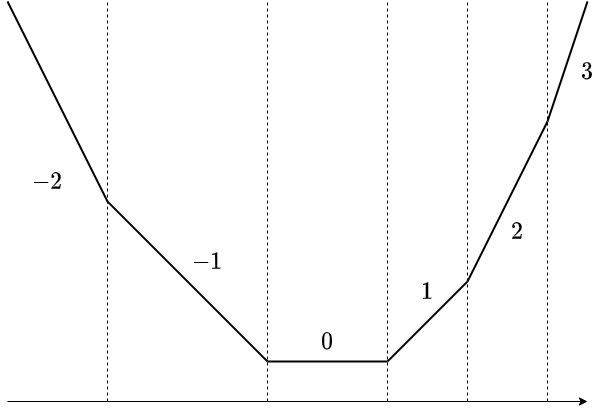
**【条件】** $f$ 的图像，是从左起依次连接斜率为 $l, l+1, \ldots, r-1, r$ 的线段而成的折线。（※ 表述略粗略。）

就是这样的东西。连接了斜率为 $-2, -1, 0, 1, 2, 3$ 的线段。虽说线段，两端是半直线，但麻烦，也含这些统称为“线段”。

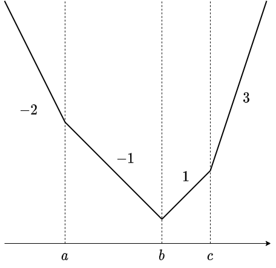
另外，为方便也考虑长度为 $0$ 的线段。

上图中，视为按此顺序连接了：

- $(-\infty, a]$ 上斜率为 $-2$
- $[a,b]$ 上斜率为 $-1$
- $[b,b]$ 上斜率为 $0$
- $[b,c]$ 上斜率为 $1$
- $[c,c]$ 上斜率为 $2$
- $[c,\infty)$ 上斜率为 $3$

的线段。结果，斜率跳变的情形也包含在考察对象中。

以下把这样的函数称为分段线性凸函数。虽要求斜率的整数性，严格说仅“分段线性凸”还不够，但本文中应不会混乱。敬请注意。

#### 具体例

以下函数是分段线性凸函数：

- $|x|$ 的平移 $f(x) = |x-a|$
- 形如 $f(x) = \max(0, x-a)$ 的函数。以下记为 $(x-a)_{+}$。
- 形如 $f(x) = \max(0, a-x)$ 的函数。以下记为 $(a-x)_{+}$。

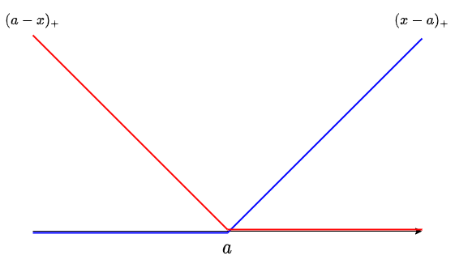
特别把重要的后两个可视化一下。它们是 $|x-a|$ 的左半、右半那样的函数，且成立 $|x-a| = (x-a)_{+} + (a-x)_{+}$。

另外，分段线性凸函数的和也是分段线性凸函数，因此例如 $f(x) = \sum_{i} |x-a_i|$ 这样的函数也是分段线性凸函数。

### 数据的持有方式

slope trick 是把分段线性凸函数替换为斜率变化点的多重集来管理，从而使特定函数操作能简洁进行。

数据的细节似乎有几种模式，例如 https://codeforces.com/blog/entry/77298 中也有用变化点与 $x\to\infty$ 处样子来描述函数的尝试。这次介绍我自己想来觉得处理简单的。

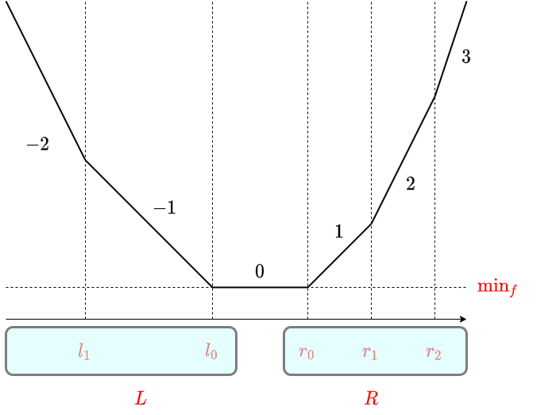
对分段线性凸函数 $f$，持有如下 $3$ 个信息：

- $\text{min}_f$：$f$ 的最小值
- $L$：斜率 $\leq 0$ 的部分中，斜率变化点全体的多重集
- $R$：斜率 $\geq 0$ 的部分中，斜率变化点全体的多重集

以下总以 $l_0$ 表示 $L$ 的最大值、$r_0$ 表示 $R$ 的最小值。另外 $L$ 或 $R$ 为空时，定 $l_0 = -\infty$, $r_0 = \infty$（也可显式放入哨兵）。作为“多重集”的持有方式，设想用优先队列，使总能取到 $l_0, r_0$。

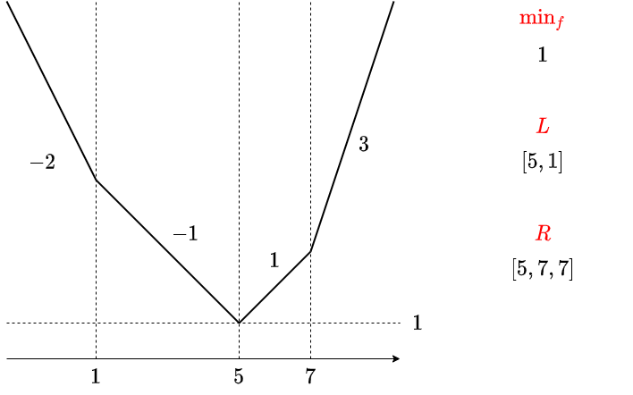
斜率变化 $2$ 以上的地方的例子。

#### 还原

这样持有数据后，$f(x)$ 可如下表示：

$$f(x) = \text{min}_{f} + \sum_{l\in L} (l-x)_{+} + \sum_{r \in R} (x-r)_{+}$$

实际上，只需验证左右两边：

- 处处斜率相等
- 在 $x\in [l_0,r_0]$ 处的值相等

两者都容易。

### 可实现的操作

记 $N = |L|+|R|$。此时可实现如下操作与复杂度。

#### 最小值的获取：$O(1)$ 时间

答 $\min_{x\in \R} f(x)$ 及其实现的 $x$，可在 $O(1)$ 时间。本来就是管理 $\text{min}_f$，最小值直接返回即可。取最小值的 $x$ 范围是斜率为 $0$ 的区间 $[l_0, r_0]$，这只读优先队列头部即可，故也 $O(1)$ 取得。

#### 加常数函数 $a$：$O(1)$ 时间

只需给 $\text{min}_f$ 加 $a$。当然。

#### 加 $(x-a)_+$：$O(\log N)$ 时间

加它时，斜率变化点处增加 $a$。另外斜率最小值不变、最大值 $+1$，故 $L$ 大小不变，$R$ 大小增 $1$。因此把多重集 $L\cup R\cup \{a\}$ 从小到大切成 $|L|$ 个、$|R|+1$ 个，重新作为 $L$, $R$ 即可。例如如下步骤更新：

- 把 $a$ push 进 $L$。
- 从 $L$ pop 一个值，push 进 $R$。

$a > l_0$ 时最初的 push 是浪费，也可按 $a$ 与 $l_0$ 大小关系分支。或者用优先队列的 push/pop 合并方法，在 $a > l_0$ 时也几乎无浪费。例如 python 标准库 heapq 可用 heappushpop / heappush 各调一次实现。

$L$, $R$ 的更新方法已知，接下来考虑 $\text{min}_f$ 的更新。虽因 $a$ 的位置出现分支而显得麻烦，其实简单。关注更新前 $f$ 中 $L$ 的最大值 $l_0$。

其实更新后 $l_0$ 仍是给最小值的点。确实，$a$ 的插入使 $l_0$ 前后的斜率变为 $+0, +1$ 中某一种变化。更新前 $l_0$ 是斜率为 $-1, 0$ 的边界点，故更新后是斜率为 $-1, 0$ 或 $0, 1$ 的边界点。于是 $\text{min}_f$ 的变化等于 $f(l_0)$ 的变化，故

$$\text{min}_f \leftarrow \text{min}_f + (l_0-a)_+$$

最小值的更新也完成。

#### 加 $(a-x)_+$：$O(\log N)$ 时间

相同。

- $\text{min}_f\leftarrow \text{min}_f + (a-r_0)_+$
- 把 $a$ push 进 $R$
- 从 $R$ pop 一个值，push 进 $L$

即可。

#### 加 $|x-a|$：$O(\log N)$ 时间

由 $|x-a| = (x-a)_+ + (a-x)_+$ 成立，把上面 $2$ 个操作任意顺序都做即可。

#### 累积 min：$O(1)$ 时间

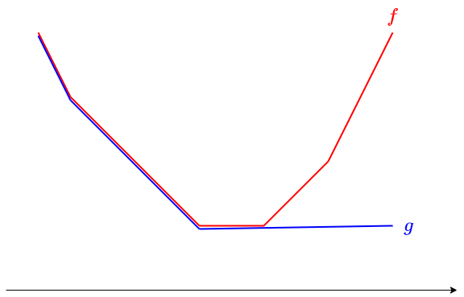
即把 $f$ 替换为 $g(x) := \min_{y\leq x} f(y)$ 的操作。

只需把 $R$ 换成空集。

#### 右侧累积 min：$O(1)$ 时间

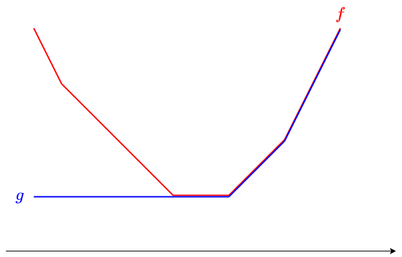
把 $f$ 替换为 $g(x) := \min_{y\geq x} f(y)$ 的操作。

只需把 $L$ 换成空集。

### 扩展

给数据结构再持有附加信息，可做更多操作。具体地，除了 $\text{min}_f$, $L$, $R$ 外，再持有给左侧统一加的值 $\text{add}_L$、给右侧统一加的值 $\text{add}_R$。

插入或取出时，注意实际值与放入 $L$, $R$ 的值的差分来进行操作。这样，对左集合、右集合全体的加算可在 $O(1)$ 时间做。

来确认可做哪些操作。

#### 平移：$O(1)$ 时间

有分段线性凸函数 $f(x)$ 时，考虑求 $g(x) = f(x-a)$ 的函数 $g$。

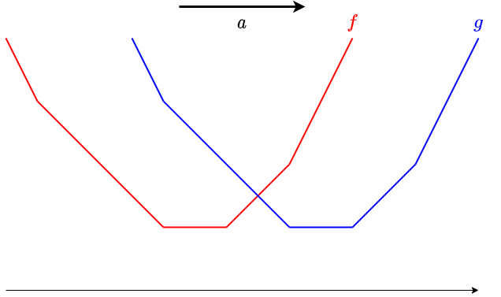
只需给集合 $L$, $R$ 统一加 $a$。

#### 滑动最小值函数：$O(1)$ 时间

名字这样行吗。是取 sliding window minimum 的操作。

$a \leq b$ 时，计算由 $$g(x) = \min_{y\in [x-b,x-a]} f(y)$$ 确定的 $g$。其实这对应于分别对左集合、右集合平移。

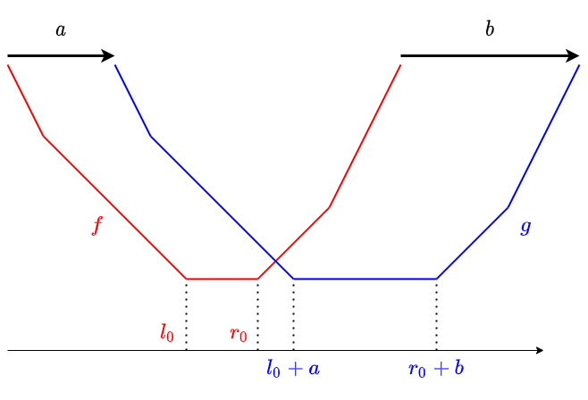
$a$ 以上 $b$ 以下所有平移取 min，几何上想也合理吧。为保险用数式理解。

- 若 $x\leq l_0 + a$，则 $x-a\leq l_0$，故在 $[x-b,x-a]$ 上 $f$ 单调递减。于是 $g(x) = \min_{y\in [x-b,x-a]}f(y) = f(x-a)$
- 若 $x\geq r_0 + b$，则 $x-b\geq r_0$，故在 $[x-b,x-a]$ 上 $f$ 单调递增。于是 $g(x) = f(x-b)$
- 若 $l_0+a\leq x\leq r_0+b$，则 $[x-b,x-a]\cap [l_0,r_0]\neq \emptyset$，故 $g(x) = \text{min}_f$

得以验证。

另外，平移可视为此处的 $a = b$ 情形。

累积 min 操作可视为 $b = \infty$ 情形。不过，$\infty$ 多次加加减减运算可疑，且把 $\infty$ 替换为足够大常数实现时也有溢出与误差之忧，所以还是直接把 $R$ 置空的实现更好。

续 → [slope trick (2) 问题编](#st2-slope2)

## slope trick (2) 问题编（slope trick (2) 問題編）

以下假定已读过解说编。所用记号等是共通的，不再重新说明。

前 → [slope trick (1) 解说编](#st1-slope1)

### 目录

- ABC 127 [F] Absolute minima
- 第2回 ドワンゴからの挑戦状 予选 [E] 花火
- UTPC 2012 [L] じょうしょうツリー
- KUPC 2015 [H] 壁壁壁壁壁壁壁
- ARC 070 [E] NarrowRectangles
- 其他问题

### ABC 127 [F] Absolute minima

F - Absolute Minima（AtCoder）

直接实现解说编所述内容即可。

解答例：https://atcoder.jp/contests/abc127/submissions/20969428

此问题情形下，也可视为“向集合添加元素并取得中位数”。为添加一个元素，使 $L\cup R$ 增加 $2$ 个元素。也存在把优先队列操作次数减半的解法，但无需区分元素个数奇偶，实现或许更简洁。

（每次插入 $2$ 个，使得中位数无论元素个数奇偶都总以 $l_0, r_0$ 呈现，很漂亮，我很喜欢）

### 第2回 ドワンゴからの挑戦状 予选 [E] 花火

E - 花火（AtCoder）

虽是 AC 人数仅 3 人的 boss 题，却相当简单。这里就所有 $t_i$ 互异的情形说明（同时刻烟花的处理很简单，请想一想）。结果归约为如下问题。

给定数列 $p_1, p_2, \ldots, p_N$。巧妙构造单调递增数列 $a_1, a_2, \ldots, a_N$ 使 $\sum_{i}|p_i – a_i|$ 最小。

例如取 $a_i$ 从 $-A, -(A-1), \ldots, A-1, A$ 中选，则立刻想到 $O(NA)$ 时间的 DP 解法。记选到 $a_i = x$ 时的成本最小值为 $\dp_i(x)$，则例如如下要领可算所有 $\dp_i(x)$：

$$\dp_{i}(x) = |x-p_i| + \min_{y\leq x} \dp_{i-1}(y)$$

仔细看此式，其实它只是 slope trick 做就完事的问题。不是把 DP 计算结果看作“计算各点值的表”，而是看作“在计算一个函数”。这个函数始终是分段线性凸函数，用 slope trick 管理后其余就简单了。

结果如下即可求得答案：

- 从常数函数 $f(x) = 0$ 开始。
- 对 $i=1,2,\ldots$ 顺序，重复以下：
  - 把 $f(x)$ 换成累积 $\min$。
  - 给 $f(x)$ 加上 $|x-p_i|$。
- 最后输出 $f$ 的最小值。

解答例：https://atcoder.jp/contests/dwango2016-prelims/submissions/20969672

另外此问题中，一加上 $|x-p|$ 就取累积 min 并初始化 $R$，故无需持有 $R$。

解答例 2：https://atcoder.jp/contests/dwango2016-prelims/submissions/20969720

### UTPC 2012 [L] じょうしょうツリー

L - じょうしょうツリー（AtCoder）

首先，预先按深度加上值，把问题读成：从父向子作成广义单调递减列。考虑树 dp。

记把子树 $v$ 变成“じょうしょうツリー”，且顶点 $v$ 的值变为 $x$ 的操作中最小成本为 $f_v(x)$。记 $v$ 的全体子节点为 $C(v)$，则易知

$$f_v(x) = |x-a_v| + \sum_{w\in C(v)}\min_{y\leq x}f_w(y)$$

用 slope trick 管理所有这些函数 $f_v$。另外记 $g_v(x) = \min_{y\leq x} f_v(y)$。

- $g_v$ 可由 $f_v$ 在 $O(1)$ 时间算出（丢弃右侧集合）。
- $f_v$ 是 $\sum_{w\in C(v)}g_w$ 加上 $|x-a_v|$。

$\sum_{w\in C(v)} g_w$ 的处理是问题。

一般地，考虑给分段线性凸函数 $f$ 加上分段线性凸函数 $g$。记 $f, g$ 的数据大小为 $N_f$, $N_g$（请各自定义为持有的 $L$, $R$ 元素数之和等）。

分段线性凸函数 $g$ 具有 $g(x) = \text{min}_{g} + \sum_{l\in L_g} (l-x)_{+} + \sum_{r \in R_g} (x-r)_{+}$ 这样的表示。因此，给 $g$ 加算等价于：

- 加算 $(x-a)_+$
- 加算 $(a-x)_+$
- 加算 $\min_g$

各约做 $N_g$ 次。于是可知，给 $f$ 加 $g$ 在时间复杂度 $O(N_g\log(N_f+N_g))$ 内可做。

用 weighted union heuristic 计算 $\sum_{w\in C(v)} g_w$，可知本问题的树 dp 整体可在 $O(N\log^2N)$ 时间算。另外此问题也无需持有右侧集合 $R$。

解答例：https://atcoder.jp/contests/utpc2012/submissions/20970281

看解答例的 merge 部分可知，因 $R$ 为空，分段线性凸函数的加算与合并优先队列的操作完全一致。因此用 meldable 优先队列，也可在 $O(N\log N)$ 时间解。官方解说大概就是做这种事？

### KUPC 2015 [H] 壁壁壁壁壁壁壁

H - WAAAAAAAAAAAAALL（AtCoder）

还是先试着把立刻想到的 DP 写成式。把加固材料移动这一操作，理解为对每 $i$ 决定从位置 $i$ 向 $i-1$ 移动的货物个数 $n_i$（正则为向左移，负则为向右移 $|n_i|$ 个）。

记 $n_i = x$ 已定，使位置 $i-1$ 之前加固材料足够时的最小成本为 $f_i(x)$。

则可知成立 $$f_{i+1}(x) = |x| + \min_{A_i – y + x \geq B_i}f_i(y)$$。令 $C_i = A_i – B_i$ 改写为 $$f_{i+1}(x) = |x| + \min_{y\leq x + C_i} f_i(y)$$。

初始状态为 $f_0(x) = \begin{cases}0 & (x=0)\\\infty & (x\neq 0)\end{cases}$，所求为 $f_{N}(0)$。

$f_0$ 看似不是分段线性凸函数，但可视为 $L = R = [0,0,0,\ldots]$（在 $x=0$ 处斜率变化无限次）而作为分段线性凸函数处理。

$g_i(x) = \min_{y\leq x+C_i} f_i(y)$ 如何计算？令 $z = y – C_i$，则 $g_i(x) = \min_{z\leq x} f_i(z + C_i)$，故 $g_i$ 是 $f_i$ 平移后取累积 min。

结果，从 $f_i$ 算 $f_{i+1}$ 的步骤可分解为：

- 平移 $-C_i$
- 取累积 $\min$
- 加算 $|x|$

这些全部可由 slope trick 简洁处理。因含平移操作，实现时也持有 $\text{add}_L$, $\text{add}_R$。

最后想算的是 $f_N(0)$。这通过把 $f_N$ 分解为 $(a-x)_{+}$, $(x-a)_+$ 可在 $O(N)$ 时间算。

首先，别忘了从 $L = [0,0,0,\ldots]$（足够多）开始。放入约 $2N$ 个就够。

解答例：https://atcoder.jp/contests/kupc2016/submissions/20983323

另外此问题也无需持有 $R$。

解答例：https://atcoder.jp/contests/kupc2016/submissions/20983382

### ARC 070 [E] NarrowRectangles

E - NarrowRectangles（AtCoder）

我个人觉得，在 4 题 ARC 的第 3 题中最难。把 dp 表视为函数的想法，当时对我非常新颖，是留下强烈印象的喜欢的题。

不过，基于到此的解说，我想已经相当好解了。还是考虑自然的 dp。记把前 $i$ 个矩形连起来、且第 $i$ 个矩形左端 $x$ 坐标为 $x$ 时到那里为止的最小成本为 $f_i(x)$。记矩形宽为 $w_i = r_i – l_i$。

立刻可知可写为 $$f_{i}(x) = |x-l_i| + \min_{[x, x+w_i]\cap[y,y+w_{i-1}]\neq \emptyset}f_{i-1}(y)$$。几乎是题面原话。区间相交条件可改写为 $x-w_{i-1}\leq y\leq x + w_i$，于是 $$f_i(x) = |x-l_i| + \min_{y\in [x-w_{i-1}, x+w_i]} f_{i-1}(y)$$。

这个操作，可通过给左集合、右集合加常数来完成。持有 $\text{add}_L$, $\text{add}_R$ 即可实现。

解答例：https://atcoder.jp/contests/arc070/submissions/20983784

### 其他问题

- ARC 123 [D] Inc, Dec – Decomposition
- ABC 217 [H] Snuketoon

## slope trick (3) 凸共役（slope trick 的凸共轭）

### 概要

本文对凸函数的凸共轭（Legendre-Fenchel 变换）及其性质做一个简要整理。进一步，把它与 slope trick 对凸函数的处理结合起来，导出一个新的凸函数处理方式，称为 slope trick 的凸共轭。这个叫法是本文首次提出，至于今后会流行什么名字目前还不清楚。

### 凸函数的凸共轭

wikipedia：https://ja.wikipedia.org/wiki/%E5%87%B8%E5%85%B1%E5%BD%B9%E6%80%A7

#### 定义

设 $f\colon \R\longrightarrow \R\cup\{\infty\}$（但恒不为恒等无穷大）。用下式定义 $f$ 的凸共轭 $f^{\star}$：

$$f^{\star}(p) := \sup_{x} (px-f(x))$$

从 $f$ 得到 $f^{\star}$ 的操作也称为 Legendre-Fenchel 变换。几何上看，$f^{\star}(p)$ 相当于：在 $f$ 的图像下方、考虑斜率为 $p$ 的直线中 $y$ 截距尽可能大的那条。

#### Fenchel 的双共轭定理

下面的事实成立：

- $f^{\star}$ 是凸函数
- 当 $f$ 为凸函数且满足适当条件时，有 $f = (f^{\star})^{\star}$

关于“条件”这里省略，但下文要讲的闭区间上的分段线性凸函数满足该条件。

$f^{\star}$ 的凸性，由 $f^{\star}$ 是线性函数（从而是凸函数）的 $\sup$ 这一点可知。$f = (f^{\star})^{\star}$ 方面，$f \geq (f^{\star})^{\star}$ 是从定义直接可得的平凡不等式（请自行验证）。反方向的不等式，几何上意味着凸函数的图像可以由它的整个包络线还原出来。

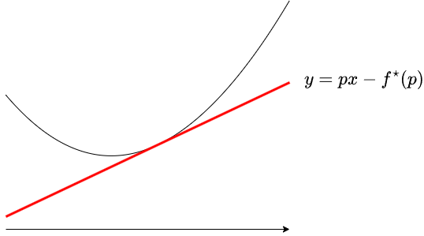
#### 极小卷积（infimal convolution / min-plus convolution）

以下，$f,g$ 等都表示“满足适当条件”的凸函数。

用下式定义 $f,g$ 的极小卷积 $f \mathop{\Box} g$：

$$\bigl(f\mathop{\Box} g\bigr)(x) = \inf_{y}\bigl(f(x-y)+g(y)\bigr)$$

与凸共轭的关系如下：

$$\bigl(f\mathop{\Box} g\bigr)^{\star}(p) = f^{\star}(p) + g^{\star}(p)$$

$$\bigl(f + g\bigr)^{\star}(p) = (f^{\star} \mathop{\Box} g^{\star})(p)$$

也就是说，取凸共轭后，加法与卷积会互换。

简单证明一下。由凸共轭的性质 $(f^{\star})^{\star} = f$，只需证上式。

$$\begin{align*}\bigl(f\mathop{\Box} g\bigr)^{\star}(p) &= \sup_x\bigl(px {}-{} f\mathop{\Box}g(x)\bigr) = \sup_{x,y}\bigl(px-f(x-y)-g(y)\bigr) \\&= \sup_{x,y}\bigl(\bigl(p(x-y)-f(x-y)\bigr) + \bigl(py-g(y)\bigr)\bigr) \\&= \sup_{x,y}\bigl(\bigl(px-f(x)\bigr)+\bigl(py-g(y)\bigr)\bigr) = f^{\star}(p)+g^{\star}(p)\end{align*}$$

#### 分段线性凸函数的凸共轭

对于 slope trick (1) 解説編 中讲过的那种形式的分段线性凸函数 $f$，$f^{\star}$ 也依然是分段线性凸的，并且其图像有如下关系：

- 当 $f$ 在 $x = a$ 前后斜率由 $b$ 变为 $c$ 时，$f^{\star}$ 在 $[b,c]$ 上斜率为 $a$

对 $p\in [b,c]$，考虑 $f$ 图像下方的斜率为 $p$ 的直线，使得 $y$ 截距最大的直线会在 $x=a$ 处与 $f$ 一致。仅由上述性质还残留 $y$ 轴方向平移的自由度，但把它与平凡性质 $f^{\star}(0) = -\min_f$ 等结合，就能确定 $f^{\star}$。

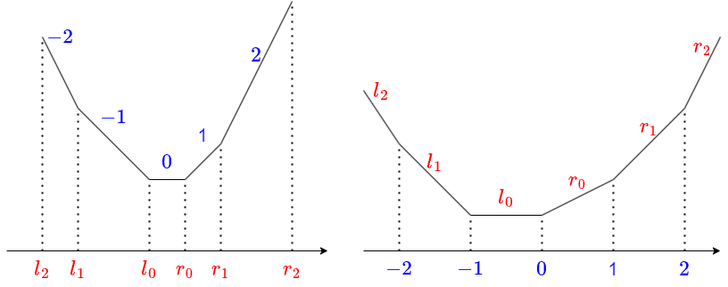
### slope trick 的凸共轭

在 slope trick (1) 解説編 中，我们对满足如下性质的、形如分段线性凸函数，加速了一些操作：

- 斜率的绝对值都是小的整数

本文考虑凸共轭也是一个能用 slope trick 处理的函数（即满足如下性质的分段线性凸函数）：

- 斜率变化点的坐标的绝对值都是小的整数

以下设 $f$ 满足该性质。通过把对 $f$ 的操作，经凸共轭转换成对 $f^{\star}$ 的操作，再用 $f^{\star}$ 上的 slope trick 来加速对 $f$ 的操作，这一方法就称为 slope trick 的凸共轭。

在 slope trick 中，我们用如下数据来管理分段线性凸函数 $F$：

- $F$ 的最小值
- 最小值左侧斜率变化点全体 $L$（用优先队列维护）
- 最小值右侧斜率变化点全体 $R$（用优先队列维护）

因此，在 slope trick 的凸共轭中，我们用如下数据来管理分段线性凸函数 $f$：

- $f(0)$
- 各非负整数 $n$ 对应的 $[n,n+1]$ 上的斜率所排成的序列 $(R_0, R_1, \ldots)$（用优先队列维护）
- 各非负整数 $n$ 对应的 $[-(n+1),-n]$ 上的斜率所排成的序列 $(L_0, L_1, \ldots)$（用优先队列维护）

### 可实现的操作

来确认可以加速的操作。以下用 $N$ 表示当前维护的优先队列的元素个数。

#### 取得 $f(0)$：$O(1)$ 时间

因为直接维护了 $f(0)$，这是显然的。

#### 加常数函数：$O(1)$ 时间

只需加到 $f(0)$ 上。

#### 取得 $\min_{x}\bigl(f(x){}-{}px\bigr)$，特别是取得 $\min_xf(x)$：$O(N\log N)$ 时间

这等价于计算 $-f^{\star}(p)$。由 slope trick (1) 解説編，

$$f^{\star}(p) = {\min}_{f^{\star}} + \sum_{l\in L}(l-p)_+ + \sum_{r\in R}(p-r)_+$$

成立，且 $\min_{f^{\star}} = -f(0)$，于是即可。slope trick 中取得最小值很容易但计算 $f(0)$ 很难；而在 slope trick 凸共轭中，取得 $f(0)$ 容易但取得最小值难。

#### 平移 $f(x) \gets f(x\pm 1)$：$O(\log N)$ 时间

直接考虑 $f$ 的图像也可以，但这里也兼作练习，利用极小卷积与凸共轭。

取 $g$ 满足

$$g(x) = \begin{cases}0 & (x=1) \\ \infty & (x\neq 1)\end{cases}$$

则有 $f(x+1) = \bigl(f\mathop{\Box}g\bigr)(x)$。因此，只要能在凸共轭侧完成“加上 $g^{\star}$”的操作即可。

由 $g^{\star}(p) = p$ 成立，于是只需考虑 $f^{\star}(p) \gets f^{\star}(p) + p$ 这样的操作。

- 设 $L$ 的最大值为 $L_0$。这在操作前后都是 $f^{\star}$ 取最小的点。
- 给 $f^{\star}$ 的最小值加上 $L_0$。也就是给 $f(0)$ 加上 $L_0$。
- 把 $L_0$ 从 $L$ 弹出，移入 $R$。

这样就好了。$f(x)\gets f(x-1)$ 的情况，考虑在凸共轭侧加上 $-p$，同理可做。

对于坐标变化很小的平移，重复上述操作即可。坐标很大的平移（在 slope trick 中很简单）在 slope trick 的凸共轭中却不好处理。

#### 加 $cx$, $c(x-0)_+$, $c(0-x)_+$：$O(1)$ 时间

这不用取凸共轭、直接按 $f$ 考虑就显然。给 $R$ 全体加上 $c$，或给 $L$ 全体加上 $-c$ 即可。

与平移结合，对绝对值小的整数 $a$ 就能加上 $c(x-a)_+$ 等。另外，把两者都做，就能加上 $c|x|$ 形的函数。

slope trick 中没法处理对较大的 $c$ 加 $c|x|$ 之类，但在 slope trick 的凸共轭中，即使 $c$ 很大也很简单。

#### 滑动最小值函数 $f(x) \gets \min_{y\in [x-b,x-a]}f(y)$：$O((|a|+|b|)\log N)$ 时间

用极小卷积来导出计算方法。

取

$$g(x) = \begin{cases}0 & (x\in [a,b])\\ \infty & (x\notin [a,b])\end{cases}$$

则有把 $f$ 变成 $f\mathop{\Box} g$ 的操作正是所求。因此，考虑给 $f^{\star}$ 加上 $g^{\star}$ 的操作。

$g^{\star}$ 是在 $x=0$ 前后斜率由 $a$ 变为 $b$ 的折线。它可以写成 $ax + (b-a)(x-0)_+$ 等，所以可用 slope trick 对 $f^{\star}$ 的基本操作 $O(|a|+|b|)$ 次来完成。

### 问题例

- JAG 2017 autumn：J – Farm Village （解説記事）
- yukicoder：No. 2114 01 Matching （解説記事）
- SEERC 2020：A. Archeologists （提出）
