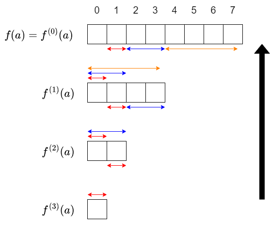
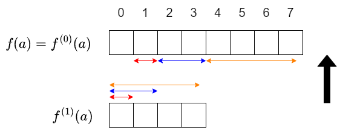
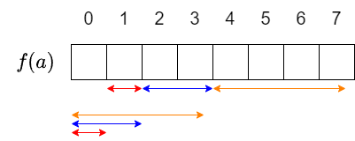
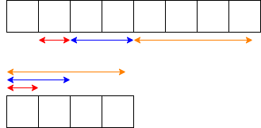
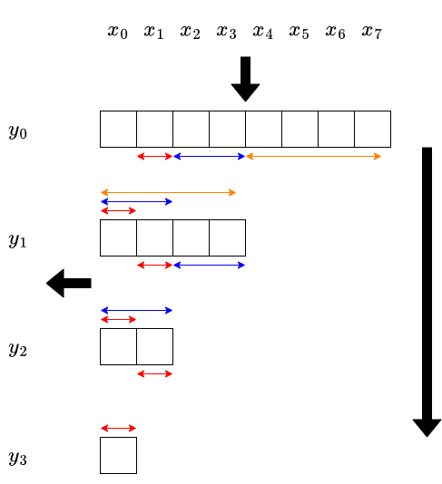

# 集合幂级数讲解（maspy 博客中文翻译）

> **作者（原文）**：maspy（[maspypy.com](https://maspypy.com/)）
> **来源分类页**：[https://maspypy.com/category/%e9%9b%86%e5%90%88%e3%81%b9%e3%81%8d%e7%b4%9a%e6%95%b0](https://maspypy.com/category/%e9%9b%86%e5%90%88%e3%81%b9%e3%81%8d%e7%b4%9a%e6%95%b0)
> **说明**：本文件由分类页中列出的博客文章链接下载后翻译整理而成。数学公式（$...$ 与 $$...$$）保持原样，未作改动。

---

## 目录

- [集合幂级数 (1) 子集卷积（subset convolution）](#sp1-subset-convolution)
- [集合幂级数 (2) 与多项式的复合](#sp2-poly-composite)
- [集合幂级数相关 (3) 集合幂级数的 Power Projection](#sp3-power-projection)
- [集合幂级数相关 (4) 例题](#sp4-examples)

---

## 集合幂级数 (1) 子集卷积（subset convolution）

> 本系列目录：
> - （1）subset convolution　← 本篇
> - （2）与多项式的复合
> - （3）集合幂级数的 Power Projection
> - （4）例题

### 记号准备

设 $n$ 为非负整数。固定一个环 $K$（若不熟悉代数，把 $K=\mathbb{Z}$（全体整数）来理解即可），并设 $K$ 中运算的计算量为 $O(1)$。

把 $0$ 以上 $2^n-1$ 以下的非负整数，按通常方式与 $\{0,1,\ldots,n-1\}$ 的子集等同起来，并对非负整数使用如下“集合”记号：

- $\emptyset$：空集，对应 $0$。
- $s\cap t$：$s$ 与 $t$ 的交集，对应按位运算 $s \mathrel{\&} t$。
- $s\cup t$：$s$ 与 $t$ 的并集，对应按位运算 $s \mid t$。
- $s\subset t$：$s$ 是 $t$ 的子集，等价于 $s = s \mathrel{\&} t$ 或 $t = s \mid t$。
- $s = t \amalg u$：$s = t\cup u$ 且 $\emptyset=t\cap u$，即 $s$ 是 $t,u$ 的不交并。
- $|s|$：集合 $s$ 的元素个数，对应按位运算 $\mathrm{popcount}(s)$。（它也用作绝对值符号，但本文认为不会造成混淆。）

另外，把由 $K$ 的元素组成的长度为 $2^n$ 的数列的全体记作 $K^{2^n}$。

### 子集卷积、集合幂级数

对 $K$ 中元素的数列 $a = (a_0, \ldots, a_{2^{n}-1})$ 与 $b = (b_0, \ldots, b_{2^{n}-1})$，用下式定义它们的子集卷积（subset convolution）$c = (c_0, \ldots, c_{2^n-1})$：

$$c_k = \sum_{k = i\amalg j}a_ib_j$$

把这个关系写成 $a\star b = c$，就定义了 $K^{2^n}$ 上的二元运算 $\star\colon K^{2^n}\times K^{2^n}\longrightarrow K^{2^n}$。

$\star$ 是结合的，即对 $a,b,c \in K^{2^n}$ 有 $(a\star b)\star c = a\star(b\star c)$。要证明这一点，只需说明对任意 $s$ 两边的第 $s$ 个分量相等即可。注意到左边与右边的第 $s$ 个分量，都是对满足 $s = t_1\amalg t_2\amalg t_3$ 的所有三元组 $(t_1, t_2, t_3)$ 的 $a_{t_1}b_{t_2}c_{t_3}$ 求和（把 $t_3$ 为常数的项归拢相加得到左边，把 $t_1$ 为常数的项归拢相加得到右边），即可验证。

在 $K^{2^n}$ 上，以“分量wise 的加法与数乘”为加法与数乘、以 subset convolution 为乘法，这样得到的东西称为集合幂级数（set power series）。（关于称呼在这里有一点讨论。）只有第 $0$ 项为 $1$ 的数列给出乘法单位元。

用代数的语言来说，$(K^{2^n}, +, \star)$ 是一个 $K$ 代数（结构映射 $K\longrightarrow K^{2^n}$ 为 $x\longmapsto (x,0,0,\ldots)$）。

### 与多项式的关系、多项式记法

准备 $n$ 个变量 $x_0, \ldots, x_{n-1}$，对集合 $s$ 记 $x^s = \prod_{i\in s}x_i$。进而把数列 $a = (a_0, a_1, \ldots, a_{2^n-1})$ 改记为

$$a(x) = \sum_{s=0}^{2^n-1} a_sx^s.$$

这时，subset convolution $a\star b$ 可以用多项式如下描述：

- 计算多项式之积 $a(x)b(x)$。但是，凡是能被某个 $x_i^2$ 整除的项都忽略掉。

用代数的语言来说，全体集合幂级数同构于多项式环的商环 $K[x_0, \ldots, x_{n-1}]/(x_0^2, \ldots, x_{n-1}^2)$。例如 https://judge.yosupo.jp/problem/polynomial_composite_set_power_series 的题面，就是用这种方法把集合幂级数视作多项式来描述的。

配合这个记法，使用如下记号：也把 $a$ 的第 $s$ 项 $a_s$ 写作 $[x^s]a$。

使用多项式记法时，请注意由“集合与非负整数的等同”带来的混淆。例如，把 $a(x) = \sum_s a_sx^s = a_0 + a_1x_0 + a_2x_1 + a_3x_1x_2$ 写成 $a_0 + a_1x^1 + a_2x^2 + a_3x^3$ 按上面的定义并不算错，但 $x^2$ 不可解释为 $x\star x$ 或 $x\cdot x$ 等。

### 计算例・补充

取 $n=2$，处理长度为 $2^2=4$ 的数列。

$a = (0,1,2,3)$，$b = (4,5,6,7)$。

- $a + 2b = (8,11,14,17)$，$3a-b = (-4,-2,0,2)$。（分量wise 的加法与数乘）
- $a\star b = c$ 时，$c = (0,4,8,28)$。（例如 $c_2=0\cdot 6+2\cdot 4$，$c_3=0\cdot 7 + 1\cdot 6 + 2\cdot 5 + 3\cdot 4$ 等。）
- $a + 10 = (10,1,2,3)$（由于 $(1,0,0,0)$ 是单位元，第 $0$ 个元素作为“常数项”，有时也记作 $(10,0,0,0) = 10$。）
- $b^2 = b\star b = (16,40,48,116)$。（同一数列的 $k$ 个 $\star$ 定义为 $k$ 次幂。）
- $a^{10} = 0$。（由 $[x^0]a = 0$ 与 $n < 10$ 易知。）

### subset convolution 的计算

对 $a, b\in K^{2^n}$，subset convolution $a\star b$ 可以在 $\Theta(n^22^n)$ 时间内算出。若照定义式直接计算则需要 $\Theta(3^n)$ 时间，因此需要巧妙的计算方法。

先来说明 Bitwise OR Convolution。

### 泽塔变换・莫比乌斯变换

在竞技编程中很有名，也容易搜索到，所以此处省略细节。（请注意，“泽塔变换”“莫比乌斯变换”是定义在偏序集上的概念，同一个词在不同语境下所指内容可能不同。）

对 $a\in K^{2^n}$，用 $[x^s]\zeta a = \sum_{t\subset s}a_t$ 定义 $\zeta a \in K^{2^n}$。称 $\zeta\colon K^{2^n}\longrightarrow K^{2^n}$ 为泽塔变换（zeta transform）。

把 $\zeta$ 的逆变换写作 $\mu$，称为莫比乌斯变换（Mobius transform）。

给定 $a$ 时，$\zeta a$ 与 $\mu a$ 都可以在 $\Theta(n2^n)$ 时间内算出。

### Bitwise OR Convolution

对 $a, b\in K^{2^n}$，用 $[x^s]c = \sum_{s = t_1\cup t_2}a_{t_1}b_{t_2}$ 定义它们的 Bitwise OR Convolution $c\in K^{2^n}$。

它与 subset convolution 很相似，但请注意这里没有 $t_1\cap t_2 = \emptyset$ 的限制。

Bitwise OR Convolution 可以在 $O(n2^n)$ 时间内算出，做法如下：

考虑 $\zeta c$ 是怎样的数列。

$$[x^s]\zeta c = \sum_{t\subset s}c_t = \sum_{t_1\cup t_2\subset s}a_{t_1}b_{t_2} = \sum_{t_1\subset s}a_{t_1}\sum_{t_2\subset s}b_{t_2} = (\zeta a)_s (\zeta b)_s$$

于是 $\zeta c$ 可以在 $\Theta(n2^n)$ 时间内算出，再对它做莫比乌斯变换就能在 $\Theta(n2^n)$ 时间内得到 $c$。

### subset convolution

利用它来计算 subset convolution。

把数列 $a = (a_0, a_1, \ldots, a_{2^{n}-1})$ 换成“一元多项式（变量为 $X$）的数列” $a'$，定义为 $a'_s = a_s X^{|s|}$。例如 $n=2$ 时 $a' = (a_0, a_1X, a_2X, a_3X^2)$。对 $b$ 也同样地考虑 $b'$。

设 $c'$ 为 $a'$ 与 $b'$ 的 Bitwise OR Convolution。（此时环不是 $K$ 而是多项式环 $K[X]$，但同样可以定义与计算。）即对每个 $s$ 有

$$c'_s = \sum_{s=t_1\cup t_2} a'_{t_1}b'_{t_2} = \sum_{s = t_1\cup t_2}a_{t_1}b_{t_2}X^{|t_1|+|t_2|}.$$

对满足 $s = t_1\cup t_2$ 的 $t_1, t_2$，有 $t_1\cap t_2 = \emptyset \iff |t_1|+|t_2|=|s|$，因此取 $c'_s$ 中 $X^{|s|}$ 的系数就得到 $c_s$。

总之，subset convolution $c = a\star b$ 可按以下步骤计算：

- 把 $a, b$ 的各个元素替换为一元多项式 $a_sX^{|s|}$、$b_sX^{|s|}$，然后分别计算它们的泽塔变换 $\zeta a$、$\zeta b$。
- 对每个 $s$ 计算 $X$ 的多项式之积 $(\zeta a)_s(\zeta b)_s$，并对得到的数列做莫比乌斯变换。
- 从结果数列 $c'$ 的各个元素 $c'_s$ 中取出 $X^{|s|}$ 的系数，作为 $c_s$。

前面说泽塔・莫比乌斯变换的计算量是 $\Theta(n2^n)$，但这里操作对象是次数不超过 $n$ 的多项式，所以重新考虑后如下：

- 泽塔・莫比乌斯变换：需要对次数不超过 $n$ 的多项式做 $\Theta(n2^n)$ 次加减法，为 $\Theta(n^22^n)$ 时间。
- 每个 $s$ 处的多项式之积：多项式乘法可在 $O(n^2)$ 时间内完成，总共 $O(n^22^n)$ 时间。

综上，subset convolution 可在 $\Theta(n^22^n)$ 时间内完成。

这里出现的、在附加了“集合大小（秩）的乘法”之后再做泽塔/莫比乌斯变换的操作，称为**带秩泽塔变换、带秩莫比乌斯变换**（ranked zeta / Mobius transform）。

### 实现例

https://judge.yosupo.jp/submission/137660

### 参考文献

- (arXiv) Fourier Meets Mobius: Fast Subset Convolution
- Elegia さん：https://codeforces.com/blog/entry/92183
- 37zigen さん：https://37zigen.com/subset-convolution/
- suisen さん：https://suisen-kyopro.hatenablog.com/entry/2023/04/07/041318
- Library Checker 相关题目：
  - https://judge.yosupo.jp/problem/bitwise_and_convolution
  - https://judge.yosupo.jp/problem/subset_convolution
  - https://judge.yosupo.jp/problem/polynomial_composite_set_power_series
  - https://judge.yosupo.jp/problem/exp_of_set_power_series
  - https://judge.yosupo.jp/problem/hafnian_of_matrix

> 本篇出现了 Bitwise OR Convolution；把数列反转后，它与 Bitwise And Convolution 相对应。

## 集合幂级数 (2) 与多项式的复合

> 本系列目录：
> - （1）subset convolution
> - （2）与多项式的复合　← 本篇
> - （3）集合幂级数的 Power Projection
> - （4）例题

### 与 EGF 的复合（问题的形式化）

对 $K$ 中元素的数列 $f_0, f_1, \ldots$，把如下形式的式子称为 $f$ 的指数型母函数（EGF, exponential generating function）：

$$f(x) = \sum_{k=0}^{\infty} f_k\frac{x^k}{k!}$$

请注意，$f$ 是形式幂级数，而不是集合幂级数。

考虑在 $a \in K^{2^n}$ 的常数项为 $0$ 时，求 $f(a) = \sum_{k=0}^{\infty} f_k\frac{a^k}{k!} \in K^{2^n}$ 的问题。另外，在 $[x^0]a=0$ 的限制下，对 $k > n$ 有 $a^k=0$，所以实际上只需考虑有限和 $\sum_{k=0}^n$。

本文在 $K$ 是环的前提下对集合幂级数做了形式化。因此，即使把 $f(a)$ 的定义取为有限和 $\sum_{k=0}^n$，仍不充分，还需要处理“$k!$ 不一定有乘法逆元”这一点。

对非负整数 $k$ 与集合幂级数 $a$，可以很好地定义与 $\frac{a^k}{k!}$ 相当的东西。利用 $a_0 = 0$，对集合 $s$ 有 $[x^s]a^k$ 可如下表示：

- $[x^s]a^k$ 是遍历 $s$ 到非空集合的划分 $s = \coprod_{i=1}^{k}t_i$ 的 $\prod_{i}a_{t_i}$ 之和。

请注意，在这样的集合划分中，当 $i\neq j$ 时成立 $t_i\neq t_j$（由 $t_i\cap t_j = \emptyset$ 与 $t_i\neq \emptyset$ 可知）。

由此，从一个划分通过重排下标得到的 $k!$ 个划分全都互不相同，$[x^s]a^k$ 就表现为“把同一个值加 $k!$ 次”的形式。于是，修正为“对每个划分只加一次（即不重复加仅交换了下标的划分）”再来做上述计算，就可以定义 $\frac{a^k}{k!}$。例如可如下表示：

- $[x^s]\frac{a^k}{k!}$ 是遍历 $s$ 到非空集合的划分 $s = \coprod_{i=1}^{k}t_i$（其中 $t_1 < \cdots < t_k$）的 $\prod_{i}a_{t_i}$ 之和。

至此定义了 $\frac{a^k}{k!}$。（这里用了容易引发误解的符号，但我们并没有定义“把集合幂级数除以 $k!$ ”的操作，而只定义了 $\frac{a^k}{k!}$ 这个集合幂级数。）

### 与 EGF 的复合的计算

说明对指数型母函数 $f(x) = \sum_{k=0}^{\infty}f_k\frac{x^k}{k!}$ 与集合幂级数 $a$（其中 $[x^0]a=0$），在 $\Theta(n^22^n)$ 时间内计算 $f(a)$ 的方法。

对 $0\leq d\leq n$，用 $f^{(d)}(x) = \sum_{k=0}^{\infty} f_{k+d}\frac{x^k}{k!}$ 定义指数型母函数 $f^{(d)}$。（这与 $d$ 阶导数的记号是一致的。）

计算步骤可用下图表示（图中取 $n=3$）。问题“求 $f^{(d)}(a)$ 的前 $2^{n-d}$ 项”从 $d=n$ 开始按降序求解。

为简单起见，只解说由 $f^{(1)}(a)$ 求 $f^{(0)}(a)$ 的部分（其余部分同理），即图中由下式表示的部分。

首先，对 $k>0$ 有 $\frac{a^k}{k!}$ 的常数项为 $0$，所以 $f(a)$ 的常数项就是 $f$ 的常数项 $f_0$。从那里往后按如下步骤计算：

- 用 $f^{(1)}(a)$ 的第 $0$ 项，计算 $f(a)$ 的第 $1$ 项。
- 用 $f^{(1)}(a)$ 的第 $0,1$ 项，计算 $f(a)$ 的第 $2,3$ 项。
- 用 $f^{(1)}(a)$ 的第 $0,1,2,3$ 项，计算 $f(a)$ 的第 $4,5,6,7$ 项。

下面说明“由 $f^{(1)}(a)$ 的前 $2^m$ 项，计算 $f(a)$ 的第 $2^m$ 项到第 $2^{m+1}-1$ 项”的方法。

对 $2^m\leq s < 2^{m+1}$，$\frac{a^k}{k!}$ 的第 $s$ 项可写作：考虑把 $s$ 划分为 $k$ 个子集 $t_1, \ldots, t_k$（$t_1 < \cdots < t_k$）。

$[x^s]\frac{a^k}{k!}$ 是对所有这样的划分 $(t_1, \ldots, t_k)$ 的 $\prod_i a_{t_i}$ 之和。

这里因为 $m\in s$，所以对这样的组成立 $m\in t_k$。$(t_1, \ldots, t_{k-1})$ 是 $s-t_k$ 到 $k-1$ 个非空子集的划分。由此可得

$$[x^s]\frac{a^k}{k!} = \sum_{m\in t, t\subset s} [x^{s-t}]\frac{a^{k-1}}{(k-1)!}\cdot [x^{t}]a.$$

这与 subset convolution 非常相似；事实上，把 $s, t$ 换成 $s' = s-\{m\}, t' = t-\{m\}$ 后，右边就可表示为 $\frac{a^{k-1}}{(k-1)!}$ 与 $a$ 的某个“切片”的 subset convolution。

对两边乘以 $f_k$ 再对 $k$ 求和，就得到如下计算方法：

- $f^{(1)}(a)$ 的前 $2^m$ 项，与 $a$ 的第 $2^m$ 项到第 $2^{m+1}-1$ 项的 subset convolution，等于 $f(a)$ 的第 $2^m$ 项到第 $2^{m+1}-1$ 项。

恰当实现以上步骤即可计算 $f(a)$。

整体计算量为 $\Theta(n^22^n)$ 时间。复杂度分析简而言之：整个过程要计算 $2^{n+1}-1$ 个（即图中格子数）值，而每个值平均花费 $O(n^2)$ 时间。

### 实现的常数因子等

若按 $d$ 降序计算，可以使用常见的 dp 表维度压缩技巧：不必为每个 $d$ 准备一维数组（整体二维数组），而用两个一维数组就足够。不过由于所用数列的长度呈指数增长，相比于一般的二维数组上的 dp，收益被认为较小。

由于反复把 $a$ 的同一部分用于 subset convolution，同一数列的带秩泽塔变换会被需要多次。通过只做这一次也能改善常数因子，但从 https://judge.yosupo.jp/problem/polynomial_composite_set_power_series 的实现来看，收益似乎也不大。

### 与 exp 的复合的计算

设 $f(x) = \exp x = \sum_{k=0}^{\infty} \frac{x^k}{k!}$，即对所有 $k$ 都有 $f_k = 1$ 的情形，考虑计算 $f(a) = \exp a$。

这种情况可以利用“对任意 $d$ 都有 $f^{(d)} = f$”，从而实现与计算量常数因子都更轻。

实现例：https://judge.yosupo.jp/submission/137452

### 与多项式的复合的计算

设 $f(x) = \sum_{k=0}^d f_kx^k$ 为多项式，$a$ 为集合幂级数（不一定满足 $[x^0]a = 0$）。

请注意，由 $[x^0]a \neq 0$ 并不能推出 $a^n\neq 0$，因此 $k>n$ 的系数也会影响结果。另外，形式幂级数与集合幂级数的复合一般是不考虑的。

计算 $f(a)$ 的问题，可按如下方式归约到 EGF 与集合幂级数的复合：

设 $c = [x^0]a$。用 $g(x) = f(x+c)$ 定义多项式 $g$，则 $g(a-c) = f(a)$。由于 $[x^0](a-c) = 0$，可把 $g$ 表示为 EGF 再代入 $a-c$，从而适用上面解说的算法。

$g(x)$ 的计算即 $f(x+c)$，变成 Polynomial Taylor Shift 的计算；但只需把 $g$ 算到 $n$ 次，所以对每个 $k$ 只计算 $(x+c)^k$ 到 $n$ 次部分，即可在 $O(nd)$ 时间内算得。

实现例：https://judge.yosupo.jp/submission/137667

或者，利用多项式的 Taylor 展开 $f(c+x) = \sum_{k=0}^{\infty}f^{(k)}(c)\frac{x^k}{k!}$，可知 $f^{(k)}(c)$ 给出了 $f(c+x)$ 这个 EGF 的系数，因此也可以考虑直接计算它。

### 参考文献

- Elegia さん：https://codeforces.com/blog/entry/92183
  - 本篇处理的算法与此处介绍的几乎相同，但在以下几点变更・补充了形式化与讨论：
    - 说明了分母 $\frac{1}{k!}$，确认了 EGF 的复合可在任意环上定义，并相应更改了计算方法的推导。
    - 叙述了把“与多项式的复合”归约到“与 EGF 的复合”的讨论（较简单）。
- Library Checker：
  - https://judge.yosupo.jp/problem/exp_of_set_power_series
  - https://judge.yosupo.jp/problem/polynomial_composite_set_power_series

## 集合幂级数相关 (3) 集合幂级数的 Power Projection

> 本系列目录：
> - （1）subset convolution
> - （2）与多项式的复合
> - （3）集合幂级数的 Power Projection　← 本篇
> - （4）例题

### 转置映射与转置原理

转置映射的简单说明是“写成矩阵后变成转置矩阵的东西”，但我不擅长把映射写成矩阵，所以用线性映射的语言写一下。

#### 转置映射（抽象定义）

设 $K$ 为环，$M, N$ 为自由模，$F\colon M\longrightarrow N$ 为 $K$ 线性映射。此时由 $\phi\mapsto \phi\circ F$ 确定了一个 $K$ 线性映射 $F^{T}\colon \mathrm{Hom}_K(N, K) \longrightarrow \mathrm{Hom}_K(M, K)$。这称为 $F$ 的转置映射。

这就是抽象的定义。

#### 转置映射（按分量定义）

设 $K$ 为环，$F\colon K^n\longrightarrow K^m$ 为 $K$ 线性映射。$F$ 的转置映射 $F^{T}\colon K^m\longrightarrow K^n$ 是由下式唯一确定的线性映射：

设 $(x_1, \ldots, x_m)\in K^m$。对 $f_1, \ldots, f_n \in K^n$ 令 $(g_1, \ldots, g_m) = F(f_1, \ldots, f_n)$，则对任意 $(f_i)$ 都存在唯一的 $(y_1, \ldots, y_n)$ 使得 $\sum_jx_jg_j = \sum_iy_if_i$。把它记为 $F^{T}(x_1, \ldots, x_m)$。

因此，“计算 $F^{T}(x_1, \ldots, x_m)$”这个问题，可以看作是“把 $\sum_j x_jg_j$ 这个表达式表示成 $\sum_i y_if_i$ 的形式”。也可以理解为“求 $\sum_j x_jg_j$ 中各 $f_i$ 的贡献”。

请注意，$F$ 与 $F^T$ 的定义域与到达域是互换的，但这与“逆映射”完全不同，要加以区分。

#### 转置原理

粗略地说，转置原理是指下面两个问题拥有同等计算量的算法：

- 以 $f = (f_1, \ldots, f_n)$ 为输入、输出 $F(f) = (g_1, \ldots, g_m)$ 的问题
- 以 $x=(x_1, \ldots, x_m)$ 为输入、输出 $F^{T}(x) = (y_1, \ldots, y_n)$ 的问题

原则上，从 $F$ 的算法导出 $F^{T}$，只需把 $F$ 的算法的所有算术运算依次列举并转置即可；但若算法复杂，这种机械的推导会很费力。实际上，通常是把算法分解到比“算术运算单位”稍大一些的步骤，对每个步骤的转置问题（不使用转置原理）求解来导出。本文也用这样的步骤来导出复合的转置映射的计算方法。

### 多项式与集合幂级数的复合的转置（形式化）

https://github.com/yosupo06/library-checker-problems/issues/975

上面这个问题可以看作“多项式 $f$ 与集合幂级数 $a$ 的复合”的转置，下面说明其理由。

“以 $f, a$ 为输入、输出 $f(a)$”这个映射不是线性映射。说到“与多项式的复合的转置”时，转置前考虑的是如下的问题：

- 固定集合幂级数 $a$。输入多项式 $f$，输出 $f(a)$。

映射 $F\colon f\longmapsto f(a)$ 是线性映射（例如对多项式 $f_1, f_2$ 有 $(f_1+f_2)(a)=f_1(a)+f_2(a)$）。

因此可以考虑这个问题的转置。（另一方面，固定 $f$ 而考虑 $a\longmapsto f(a)$ 并不是线性映射，无法考虑转置映射。）

转置问题如下：

- 固定集合幂级数 $a$。给定数列 $(x_0, \ldots, x_{2^{n}-1})$，对任意多项式 $f(x) = \sum_{k}f_kx^k$ 输出满足 $\sum_s x_s [x^s]f(a) = \sum_k y_kf_k$ 的 $(y_k)$。

$[x^s]f(a)$ 中 $f_k$ 的贡献当然是 $[x^s]a^k$，于是变成：

- 固定集合幂级数 $a$。给定数列 $(x_0, \ldots, x_{2^{n}-1})$，计算由 $y_k = \sum_{s}x_s [x^s]a^k$ 确定的数列 $(y_k)$。

这是“求集合幂级数的幂（power）的系数数列的线性组合”的问题，可以看作 Power Projection 这个问题的特殊情况。

### 由 EGF 实现的 Power Projection

在 $f$ 是 EGF 时计算 Power Projection。重新形式化如下：

- 给定集合幂级数 $a$ 与长度为 $2^n$ 的数列 $x$。对 EGF $f = \sum_k f_k\frac{x^k}{k!}$ 考虑式 $X = \sum_s x_s[x^s]f(a)$。求 $X$ 中各个 $f_k$ 的贡献。

由转置原理，这个问题应在 $\Theta(n^22^n)$ 时间内可解。下面导出具体算法。转置映射可以通过沿原映射的计算步骤逆向追溯来求得，大致是如下的计算步骤。

更具体地说，对上图中每个格子，求它对 $X$ 的贡献。给定最上面一行的每个格子对 $X$ 的贡献，只要求出最左边一列的格子对 $X$ 的贡献即可。

取出“由某一行计算下一行”的部分。给定“上一行的各个格子以何种系数贡献到某个值 $X$”，只要求出“下一行的各个格子贡献到 $X$ 的系数”即可。这只需把红箭头・蓝箭头・橙箭头各自迁移的贡献分别相加即可。

这些迁移中的每一个，都是与作为输入给定的数列 $a$ 的某个切片做 subset convolution。因此，只要能做好下面这件事就够了：

- 给定集合幂级数 $c$ 与数列 $x$。计算“$c$ 的 subset convolution”这个映射（$a\longmapsto a\star c$）的转置映射作用在 $x$ 上的像。

也就是说，设 $b = a\star c$，求满足 $\sum_{s}x_sb_s = \sum_{s}y_sa_s$ 的数列 $(y_s)$。利用 subset convolution 的定义做式子变形，左边可写成 $\sum_{t_1\cap t_2 = \emptyset}x_{t_1\amalg t_2}a_{t_1}c_{t_2}$，于是取出 $a_s$ 的系数就得到所求的 $y_s = \sum_{s\cap t = \emptyset}x_{s\amalg t}c_t$。

适当换成补集后可知，$\mathrm{reverse}(y)$ 是 $\mathrm{reverse}(x)$ 与 $c$ 的 subset convolution。

因此可知，$c$ 的 subset convolution 的转置映射，按 reverse・与 $c$ 的 subset convolution・reverse 这个顺序计算即可求得。

总结以上，例如可以按如下方式实现：

实现例：https://maspypy.github.io/library/setfunc/power_projection_of_sps.hpp

### 与多项式的复合的转置

与多项式 $f$ 的集合幂级数 $a$ 的复合，在 $c=[x^0]a$ 时可按如下步骤计算：

- 把 $g(x) = f(x+c)$ 算到 $n$ 次。
- 把 $g$ 改写为 EGF（系数乘以 $k!$）。
- 计算与 $a-c$ 的复合。

关于 EGF 与 $a-c$ 的复合，前面已经解说了转置映射的计算方法。逐个系数的 $k!$ 倍也容易对应。剩下的课题如下：

- 计算由多项式 $f$ 得到 $g(x) = f(x+c) \bmod x^n$ 这个映射的转置。

由 $f$ 得到 $g$ 的映射可写为 $g_j = \sum_{i}\binom{i}{j}f_ic^{i-j}$。于是 $\sum_{j} x_jg_j = \sum_{i,j}\binom{i}{j}f_ic^{i-j}x_j$，取出各 $f_i$ 的贡献可知转置映射由 $y_i = \sum_{j}\binom{i}{j}c^{i-j}x_j$ 计算（对每个 $i$ 可在 $O(n)$ 时间内算得）。

实现例：https://judge.yosupo.jp/submission/202898

### 参考文献

- Elegia さん：https://codeforces.com/blog/entry/92183
  - 叙述了可由转置原理导出本篇所处理问题的解法。
- ryuhe1 さん：https://qiita.com/ryuhe1/items/c18ddbb834eed724a42b
  - 对转置原理有详细记述。
- noshi91 さん：https://noshi91.hatenablog.com/entry/2023/04/05/023553
- Library Checker：https://judge.yosupo.jp/problem/power_projection_of_set_power_series

## 集合幂级数相关 (4) 例题

> 本系列目录：
> - （1）subset convolution
> - （2）与多项式的复合
> - （3）集合幂级数的 Power Projection
> - （4）例题　← 本篇

### Distinct Multiples (ABC 236 Ex)

https://atcoder.jp/contests/abc236/tasks/abc236_h

如用户题解所述，可用集合幂级数的 $\exp$ 在 $O(N^22^N)$ 时间内解出。

### Connectivity 2 (ABC 213 G)

https://atcoder.jp/contests/abc213/tasks/abc213_g

可在 $O(N^22^N)$ 时间内解出。设集合幂级数 $f, g$ 为：

- $f_s$：$G$ 中以 $s$ 为顶点集的子图个数
- $g_s$：$G$ 中以 $s$ 为顶点集的连通子图个数

$f$ 容易计算，$g$ 是所要求的东西。

以 $s$ 为顶点集、恰有 $k$ 个连通分量的子图有 $\frac{g^k}{k!}$ 个，且 $f = \exp g$。因此由 $g = \log f$ 可求得 $g$。也就是说，只需计算 $\log(1-x) = -\sum_{k>0}\frac{x^k}{k}$ 与 $1-f$ 的复合即可。

### Lights Out on Connected Graph (ARC 105 F)

https://atcoder.jp/contests/arc105/tasks/arc105_f

可在 $O(n^22^n)$ 时间内解出。

略加思考（或运用名知识）后，问题变成：数出 $G$ 的“连通二分图”生成子图的数量。

同样地，考虑“去掉连通性”的问题，找到与 $\exp$ 的关系。仅仅说“二分图”是不够的，所以要稍加技巧。

考虑两种颜色 $A, B$。把图 $G$ 的顶点用 $A,B$ 染色，使得同色顶点之间不相邻，称之为着色二分图。考虑如下集合幂级数：

- $f$：以 $s$ 为顶点全集的子集。把 $s$ 的各顶点染成 $A$ 或 $B$ 之一，并选出 $G$ 的一些边，在 $s$ 上构成着色二分图的方法数记为 $f_s$。
- $g$：在上面计数中，仅统计 $s$ 整体连通的方法数，记为 $g_s$。

于是易知 $f = \exp g$。而所求为 $\frac12 g = \frac12 \log f$，所以只要能计算 $f$ 即可。

来计算 $f$。考虑对顶点的染色方式，就变成 subset convolution 的形式。设 $s$ 内部的边数为 $h_s$，则 $f_s = \sum_{s = t_A \amalg t_B} 2^{h_s – h_{t_A} – h_{t_B}}$，因此可把 $2^{-h_s}$ 当作集合幂级数再平方来算出 $f$。

### Hierarchical Phylogeny (Xmas Contest 2020)

https://atcoder.jp/contests/xmascon20/tasks/xmascon20_h

可归约到集合幂级数的 sqrt。请参照官方题解。

### We Love Forest (ABC 253 Ex)

https://atcoder.jp/contests/abc253/tasks/abc253_h

Nyaan さん的用户题解中说明了 $O(N^22^N)$ 时间的解法。该题解中的“枚举 $g_S$”，使用的是从集合幂级数 $g$ 的 $[0, 2^m)$ 部分用 $\exp$ 求 $[2^m, 2^{m+1})$ 部分的方法。

“$\frac{G(X)^t}{t!}$ 的 $[X^V]$ 的枚举”是“与 EGF 的复合的转置”的形式，因此可在 $O(N^22^N)$ 时间内计算。

### 关于匹配计数的问题

- Hafnian of Matrix（Library Checker）
- Fast as Ryser (Yuhao Du Contest 7)
- Fast as Fast as Ryser (Xmas Contest 2022)

Hafnian of Matrix 是“以邻接矩阵形式给出图，数出完全匹配的数量”的问题。

解法在 Xmas Contest 2022 的题解中有详细说明，这里简单写个概要。

首先在匹配计数中，图的顶点数可取为偶数（添加孤立点即可）。

匹配是指选出若干条边，使每个顶点的度数恰为 $0$ 或 $1$。若在此基础上添加 $(0,1), (2,3), \ldots$ 这样的边，则每个顶点的度数变为 $1$ 或 $2$，于是连通分量只可能是路径或环。

考虑关于“所添加边的集合”的集合幂级数，让它承载“由添加边构成的连通分量为 path 或 cycle 的匹配选法数”。

有 $i$ 个 path、$j$ 个 cycle 的匹配计数，对应集合幂级数 $\frac{path^i}{i!}\frac{cycle^j}{j!}$。由于 path 的个数等于度数为 $1$ 的顶点数的 $2$ 倍，这对应于“数出大小为 $N/2-i$ 的匹配”。

若关心对象是“完全匹配”，则只需计算 $\sum_{j}\frac{cycle^j}{j!} = \exp (cycle)$（Hafnian, Ryser）。在 Xmas Contest 2022 中需要按大小分别数出匹配，因此要考虑对每个 $i$ 的 $\exp (cycle)\cdot \frac{path^i}{i!}$，这可利用“与 EGF 的集合幂级数的复合的转置”来计算。

### 染色多项式

https://ja.wikipedia.org/wiki/グラフ彩色#彩色多項式

Library Checker（大概迟早会加入）

已知对简单图 $G$ 用颜色 $1,2,\ldots,k$ 做点染色的方法总数，是关于 $k$ 的多项式，称为染色多项式。当 $|G|=n$ 时它是 $n$ 次以下的多项式，因此求出 $k=0, 1, \ldots, n$ 处的值即可还原染色多项式。

用 $k$ 种颜色的点染色，等价于“划分到 $k$ 个独立集”。于是，若集合幂级数 $a$ 按“$s$ 是否为独立集”取 $a_s = 1, 0$ 等来定义，则对每个 $k$ 求 $[x^{2^n-1}]a^k$ 的问题。这可以用“多项式与集合幂级数的复合的转置”来计算。

综上，$n$ 个顶点的图的染色多项式可在 $\Theta(n^22^n)$ 时间内计算。

相关：https://atcoder.jp/contests/abc294/tasks/abc294_h

### Balance Scale (ABC 306 Ex)

若没有等号，就是 DAG 计数。DAG 计数可用“图的计数”中解说的、关于 source component 个数的巧妙容斥原理的方法。

设所求图的集合幂级数为 $G$。

设 $F$ 为：把由等号关系缩并顶点后得到的 DAG、且其 source component 个数为 $0$ 的图的数量的集合幂级数（自然，只有空集处取 $1$）。考虑用容斥原理对它列式。设把 source component 缩并前的顶点全体记为 $T$，则缩并后的 source component 个数，等于“把给定图诱导到 $T$ 上时的连通分量个数”，记作 $\mathrm{comp}(T)$。在 $T$ 的顶点之间要写上等号，在 $T$ 与 $S\setminus T$ 之间连接的边上要从 $T$ 这侧看写下 $<$ 的不等号。于是得到

$$F(S) = \sum_{T\subset S}(-1)^{\mathrm{comp}(T)}G(S\setminus T).$$

由 $F=1$ 可知，$G$ 是集合幂级数 $(-1)^{\mathrm{comp}(S)}$ 的 inv。这既可以像 subset convolution 那样按“带秩泽塔变换 → 逐点 inv → 带秩莫比乌斯变换”的顺序计算，也可以作为与 $\frac{1}{1+F}=1-F+F^2-\cdots$ 的复合来计算。

总之本题可在 $O(N^22^N)$ 时间内解出。

解答例：https://atcoder.jp/contests/abc306/submissions/52005605
